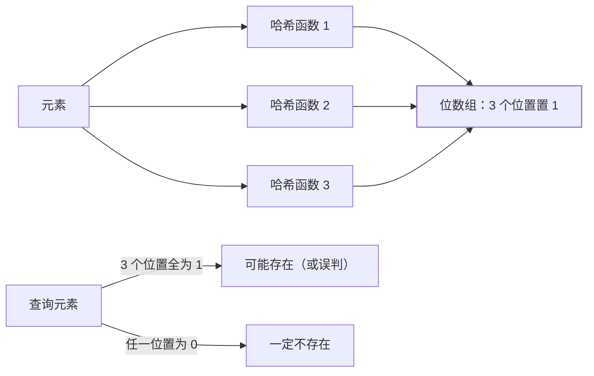

"判断一个元素**是否在集合里**"——用 Set 是本能答案，但十亿个 URL 的
Set 要几十 GB。**布隆过滤器（Bloom Filter）**用极小的空间回答这个问题，
代价是：**可能误判存在（假阳性），但绝不会误判不存在**——缓存穿透防护、
URL 去重、垃圾邮件过滤的公共底座。

## 原理：位数组 + k 个哈希函数

- **插入**：k 个哈希函数各算出一个位数组下标，全部置 1；
- **查询**：k 个位置**全为 1 → 可能存在**（可能被其他元素的位污染）；
  **任一为 0 → 一定不存在**（这个位从没被置过）——"不存在"的判断
  是**绝对可靠**的；
- 这就是缓存穿透防护的原理（缓存篇）：把全量 key 放入布隆过滤器，
  查不到的直接拒绝——**恶意请求在布隆层就被挡住，不打到 DB**。

## 参数选择：误判率的数学

误判率 ≈ (1 - e^(-kn/m))^k，其中 m = 位数组大小、k = 哈希函数个数、
n = 元素数。**最优 k = (m/n)·ln2**（此时误判率 ≈ (0.6185)^(m/n)）：

| m/n（位数/元素） | 最优 k | 误判率 |
| --- | --- | --- |
| 8 | 6 | ~2.2% |
| 10 | 7 | ~0.8% |
| 16 | 11 | ~0.04% |

- 每 元素 10 bit + 7 个哈希 → 误判率 <1%——**内存效率是 Set 的
  数十倍**（Set 存完整 URL 字符串）；
- 参数选择是**内存与误判率的权衡**——按业务容忍度定 m/n 比。

## 不能删除：结构性限制与变体

多个元素的哈希位**共享**位数组——删元素 A 的位可能影响元素 B 的
判断。解法：

- **Counting Bloom Filter**：位数组改计数器数组（删除 = 计数减 1），
  空间 ×4~8；
- **Cuckoo Filter**：布谷鸟哈希，支持删除且空间效率更高——新场景
  优选；
- **定期重建**：全量元素重新插入新过滤器——简单粗暴（数据量可控时）。

## 高频追问速答

- **布隆过滤器说"存在"就一定存在吗？** 不一定（假阳性）；说"不存在"
  就一定不存在（无假阴性）——**方向性是理解布隆的钥匙**：它适合
  "防穿透/去重"（只依赖"不存在"的判断），不适合"必须精确存在"的
  场景。
- **和 Set 怎么选？** 数据量小（<百万）用 Set（精确+可删）；数据量大
  且容忍误判 → 布隆（省数十倍内存）——**内存预算决定选型**。
- **RedisBloom 是什么？** Redis 的布隆过滤器模块（BF.ADD/BF.EXISTS
  命令）——不用自己实现位数组，且支持 Counting 变体（CF 命令）。

## 小结

- 布隆过滤器 = 位数组 + k 个哈希：**"不存在"绝对可靠、"存在"可能
  误判**——方向性决定适用场景。
- 参数公式：m/n = 10、k = 7 是 <1% 误判的常用起点；空间效率是
  Set 的数十倍。
- 不能删除是结构性限制——Counting/cuckoo/定期重建按数据量选变体。
