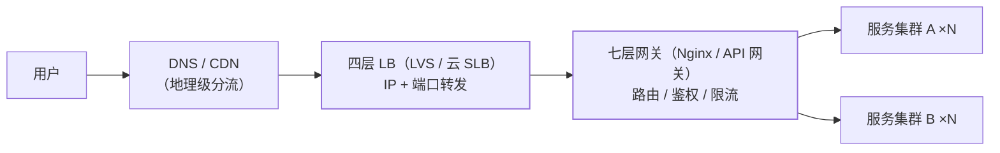

## 为什么需要它

单机容量到顶后把机器加成 N 台，随之而来的问题是：**用户的请求交给
谁？** 负载均衡（LB）就是站在集群前面的"分发员"——统一入口 + 分发
规则 + 剔除坏节点，让 N 台机器对外表现为一台。



生产上负载均衡是**分层的**，每层干粗细不同的活，不是二选一。

## 部署层级：从粗到细

| 层级 | 代表 | 特点 | 适用 |
|---|---|---|---|
| DNS 轮询 | 域名多 A 记录 | 零成本，但**生效慢（TTL 缓存）、无健康检查**、只能粗分流 | 地理级/机房级入口 |
| CDN | 各云厂商 | 静态资源就近分发，顺带挡 DDoS | 静态内容 |
| 硬件 LB | F5、A10 | 性能极强、贵 | 金融/大厂机房 |
| 四层软件 | **LVS**、DPVS、云 SLB | 只转发不解析，吞吐高 | 集群流量入口 |
| 七层软件 | **Nginx**、HAProxy、API 网关 | 解析应用层，可按内容路由 | 域名/路径级分流 |
| 客户端 LB | Ribbon / Spring Cloud LoadBalancer | 去中心化，从注册中心拉列表自己选 | 微服务内部调用 |

## 四层 vs 七层（最高频）

本质区别一句话：**四层只看"IP + 端口"，七层还要解开应用层报文**。

| 维度 | 四层（传输层） | 七层（应用层） |
|---|---|---|
| 转发依据 | 源/目的 IP + 端口 | URL、Header、Cookie、域名 |
| 工作时机 | TCP 握手前即可转发（可能只改 NAT） | 必须先完成握手并解析协议 |
| 性能 | 高（字节级转发） | 低于四层（解析开销） |
| 能力上限 | 无法感知内容，只能按连接分发 | 内容路由、灰度、限流、改写 Header、动静分离 |
| 典型 | LVS、云 SLB | Nginx、HAProxy、Spring Cloud Gateway |

记忆口诀：**四层转发，七层代理**。四层是"门卫按门牌号指路"，七层
是"前台听完你的来意再带你去具体部门"。

## LVS 三种模式（八股高频）

LVS（Linux Virtual Server）是四层 LB 的教科书实现，三种报文处理
模式必考：

| 模式 | 原理 | 优点 | 短板 |
|---|---|---|---|
| NAT | LB 改写目标 IP，**进出流量都过 LB** | 支持任意 OS、可跨网段 | LB 是带宽瓶颈 |
| **DR**（直接路由） | 改写**帧 MAC**，真实服务器**直接回包给客户端** | 吞吐最高，LB 只进不出 | 要求同二层（同机房），LB 与 RS 同 VIP（hidden） |
| TUN | 加 IP 隧道头，RS 跨机房直接回包 | 可跨机房 | 需隧道支持，多一封装开销 |

核心考点：DR 模式为什么快——**响应流量不走 LB**，互联网"请求小、
响应大"，把出方向卸掉就消除了瓶颈。

## 分发算法

| 算法 | 规则 | 注意点 |
|---|---|---|
| 轮询 RR | 依次发 | 默认；机器异构时失衡 |
| 加权轮询 WRR | 按权重比例 | 用 hash 派生实现平滑加权（Nginx smooth WRR） |
| 源地址哈希 | hash(客户端IP) 定节点 | 同客户端固定打一台——**天然会话保持**，节点变化重排 |
| 最少连接 LC | 谁连接数少给谁 | 动态，适合长连接（如 WebSocket） |
| 最快响应 | 探测响应时间 | 需持续度量 |
| 一致性哈希 | 哈希环 + 虚拟节点 | 扩缩容只迁移相邻段，见[一致性哈希](/distributed/basic/theory/02-consistent-hashing/) |

Nginx 视角一行看懂：

```nginx
upstream backend {
    least_conn;                      # 或 round_robin（默认）/ ip_hash / hash $uri consistent
    server 10.0.0.1 weight=3 max_fails=2 fail_timeout=10s;
    server 10.0.0.2 weight=1;
    server 10.0.0.3 backup;          # 备节点，全员挂了才顶上
}
```

## 健康检查：算法成立的前提

- **主动探测**：LB 定期对节点发 TCP/HTTP 探针，连续失败即摘除，
  恢复后自动加回（Nginx 开源版靠 passive `max_fails`，Plus/HAProxy
  有主动 health check）。
- **被动剔除**：真实请求失败计数达标即摘。
- 探测要"宽进严出"：摘除快、回归慢，避免抖动节点反复横跳。
- K8s 环境里这部分职责交给 Service + readinessProbe，思想同源。

## 会话保持的代价

源哈希/粘性 Cookie 能让"同一用户固定打一台"，保住单机 Session，
但破坏了均衡、节点宕机丢会话、扩缩容重排——**正解是会话外置**，
服务无状态化，详见下一篇[分布式会话](/distributed/intermediate/cluster/02-session-sharing/)。

## 小结

- LB 分层落地：DNS/CDN 管地理级 → 四层管连接 → 七层管内容 →
  微服务内部用客户端 LB。
- 四层转发七层代理：转发依据和解析深度是一切区别的根源。
- LVS 三模式记 DR：改 MAC、响应直连，是"请求小响应大"场景的最优解。
- 算法按特征选：异构加权、长连接最少连接、扩缩容敏感用一致性哈希；
  一切算法的前提是健康检查可靠。

## 延伸阅读

- [Nginx 官方文档：HTTP 负载均衡](http://nginx.org/en/docs/http/load_balancing.html)
- [LVS 项目主页（Linux Virtual Server）](http://www.linuxvirtualserver.org/)
- [HAProxy 官方文档](https://docs.haproxy.org/)
- [Nginx 平滑加权轮询算法解析](https://tenfy.github.io/2018/11/12/smooth-weighted-round-robin/)
