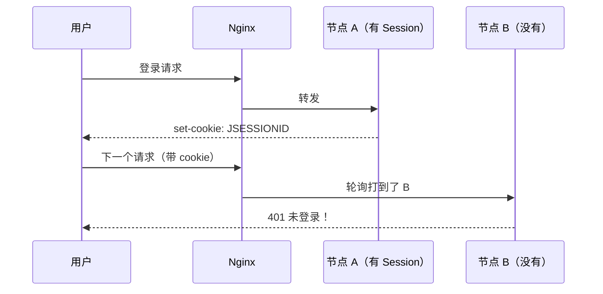
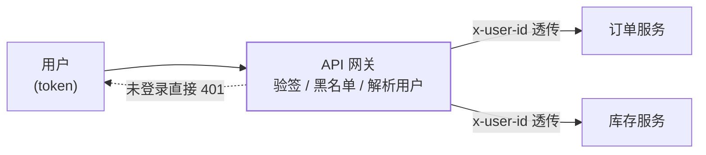

## 问题：登录态去哪了

单机时代登录态存在本机 Session 里。上集群后，用户下一次请求可能
被[负载均衡](/distributed/intermediate/cluster/01-load-balancing/)打到
另一台——**那台机器上没有他的 Session，直接被踢回登录页**。



四种解法的思路分别是"别换机器""大家都有""放到外面""别放在
服务端"。

## 四种方案对比

| 方案 | 做法 | 优点 | 缺点 |
|---|---|---|---|
| 1. 粘性会话 | ip_hash / 粘性 Cookie 固定路由 | 零改造 | 破坏均衡、宕机丢会话、扩缩容重排 |
| 2. Session 复制 | 节点间广播同步（Tomcat 集群） | 各节点都有，切换无感 | 内存冗余、广播风暴，只适合小集群 |
| **3. 集中存储** | Session 外置 Redis（Spring Session） | 主流；应用无状态，扩缩容自由 | 多一次网络 IO；Redis 要做 HA |
| 4. 客户端 Token | JWT 等自包含令牌 | 服务端完全无状态 | **无法主动失效**（注销/踢人难） |

方案 3 改动最小（容器层替换 Session 实现，业务代码零感知），是存量
系统的默认选择；方案 4 服务端彻底无状态，是多端/开放 API 的首选。

## JWT：结构与陷阱

JWT 是三段 Base64URL 用点连接：`Header.Payload.Signature`。

```
eyJhbGciOiJIUzI1NiJ9.eyJzdWIiOiIxMDAxIiwiZXhwIjoxNzA1MDAwMDAwfQ.xxxx
   {"alg":"HS256"}    {"sub":"1001","exp":1705000000}      HMAC 签名
```

- 签名保证**不可篡改**，但 Payload 只是 Base64 编码——**不是加密**，
  别往里塞敏感信息。
- 校验只需本地验签，**不查存储**——这就是"无状态"的来源，也是
  一切麻烦的来源。

### 注销与续期（必考追问）

令牌发出去就收不回：用户点退出、改密码、封号、被盗号，短有效期
内 token 依然有效。工程解法是组合拳：

1. **短 access + 长 refresh**：access 15 分钟，过期用 refresh 换新；
   refresh 存服务端可撤销。
2. **黑名单**：注销时把 `jti` 写入 Redis（TTL = 剩余有效期），校验时
   多查一次——本质上是把"无状态"又拉回半分有状态，诚实面对即可。
3. **版本号**：用户表存 `token_version`，签发时写入 claims，改密码
   时 +1，旧 token 全部失效。

**结论**：JWT 不是不能用，而是"随时可撤销"和"完全无状态"二选一，
绝大多数系统都偷偷选了前者（黑名单/版本号），这是面试时该说透的点。

## 网关统一鉴权

登录态校验上收到网关，微服务自身不再关心"你是谁"，只信任网关
透传的用户头：



注意配套：内网要**剥离外部伪造的 `x-user-id` 头**，只信任网关注入。

## 选型

- 内部管理系统、已有 Redis：**Spring Session + Redis**，省心。
- 多端（App/小程序/Web）、开放 API：**JWT（短 access + refresh）**，
  需要踢人就加黑名单或版本号。
- 高安全（支付后台）：不信任任何自包含令牌，用不透明 token + 服务端
  会话存储（opaque token），反正要查一次存储，不如查得彻底。

## 小结

- 集群下 Session 失效的根源是**状态绑定在了单机**，四种方案对应
  四个去处：固定路由、广播复制、外置存储、塞给客户端。
- 主流是外置 Redis；要极致无状态选 JWT，但要立刻回答"怎么注销"。
- JWT 的 Payload 不加密；注销靠短过期 + refresh + 黑名单/版本号组合。
- 网关统一鉴权 + 头透传是微服务的标准姿势，记得防伪造头。

## 延伸阅读

- [Spring Session 官方文档](https://docs.spring.io/spring-session/reference/)
- [JWT 官方介绍](https://jwt.io/introduction)
- [RFC 6265：HTTP State Management Mechanism（Cookie）](https://datatracker.ietf.org/doc/html/rfc6265)
