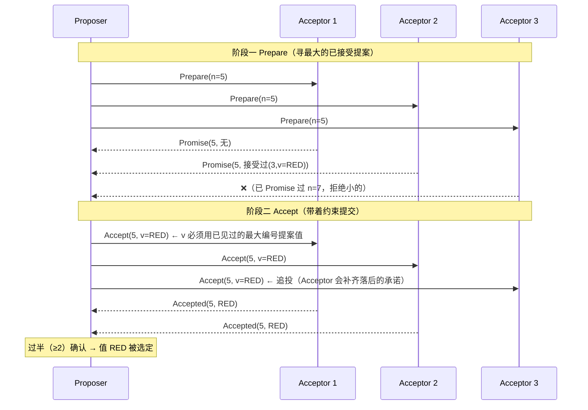
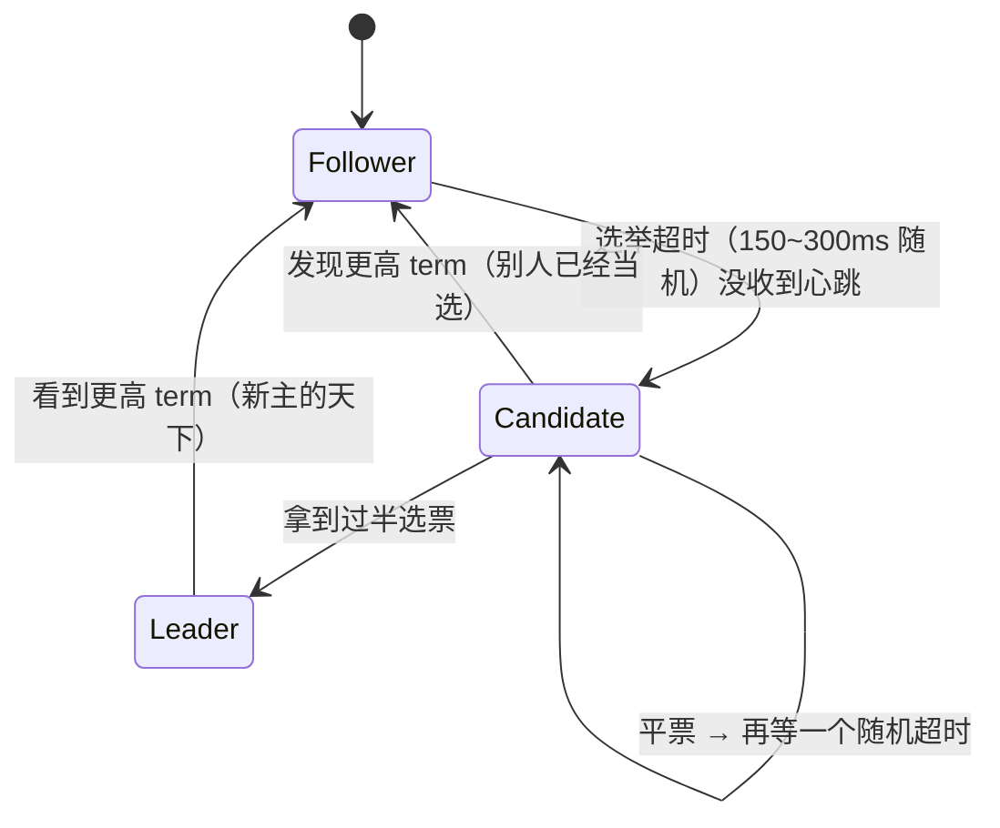
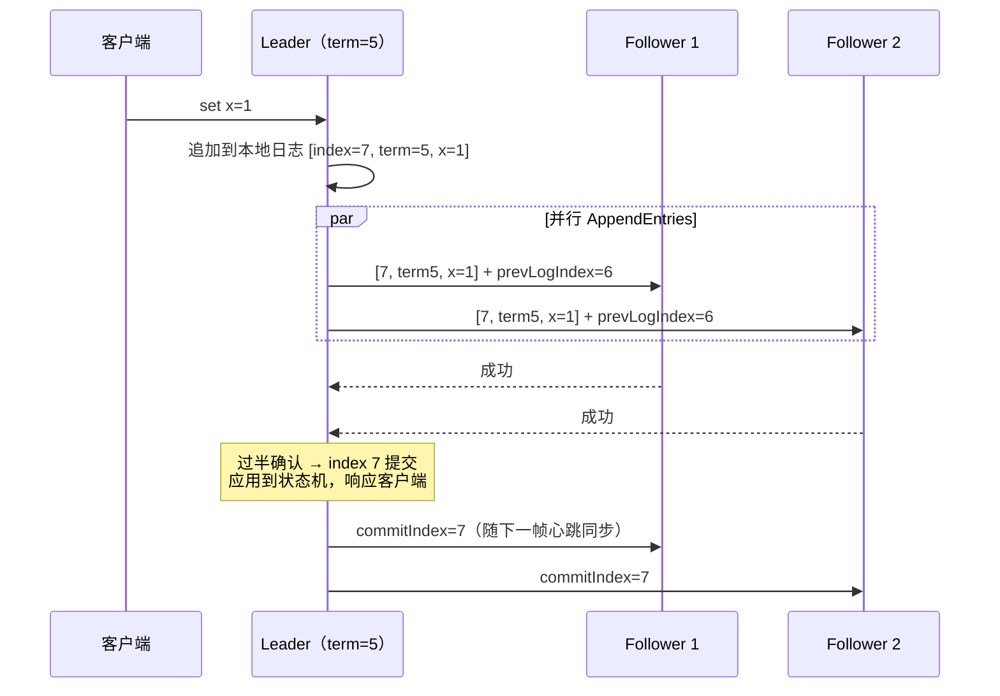

## 共识问题：为什么难

目标：N 个节点对**一个值**达成一致（不可反悔）。敌人不是宕机，是**异步
网络的不确定性**：消息会丢、会延迟、会乱序，甚至"发送方死了但消息还在
路上"。FLP 不可能定理证明了：异步网络 + 一个节点可能宕机时，**不存在
总能终止的确定性共识算法**——所以实用算法（Paxos/Raft）靠"多数派 +
随机超时"绕开理论死角，工程上"以极高概率快速收敛"。

## 多数派（quorum）：一切的数学根基

奇数节点 N，决议只需 **N/2 + 1** 个节点确认：

```
5 节点集群：一次决议至少 3 节点确认
任意两个"过半集合"必有交集 → 交集里的节点见过旧决议 → 新决议不会
推翻已确认的决议
```

这就是容忍度的来源：**3 节点容忍 1 台宕机，5 容忍 2，2F+1 容忍 F**。
同时解释了"为什么集群要奇数"：4 节点也只容忍 1 台（过半是 3），第 4
台买来只增加同步开销不加容错。

## Basic Paxos：两阶段确认

角色：Proposer（提提案）、Acceptor（投票决议）、Learner（学习结果）。



两条铁律（Acceptor 的记性）：

1. **Prepare 阶段**：一旦 Promise 过编号 n，不再接受 **< n** 的 Prepare。
2. **Accept 阶段**：一旦接受过提案，后续 Prepare 的应答必须**带上已接受
   的最大编号提案值**——Proposer 第二阶段必须改用它。

正是第 2 条保证了"已决议的值不会被后来的提案偷偷改掉"（活锁的风险
由"编号递增 + 随机退避"缓解——两个 Proposer 互相抬价僵持时，谁先
退一步谁赢）。

Paxos 的问题不在正确性，在**可理解性与可工程化**（角色混乱、多决议
扩展成 Multi-Paxos 后无标准实现）——于是有了 Raft。

## Raft：以"强领导者"简化一切

Raft 把共识拆成三块独立子问题：**领导者选举、日志复制、安全性**。

### 领导者选举（任期 term）



- **term（任期）是逻辑时钟**：单调递增，任期内的决议在本任期内有效；
  任何节点见到更高 term 立刻"俯首称臣"——**新旧主不可能同时作恶**，
  这是防脑裂的根基。
- **随机选举超时**（150~300ms）错开起跑线，避免选票分裂的死循环——
  就是 FPL 绕不开的"随机化"。

### 日志复制



关键设计：

- **连续性校验**：AppendEntries 携带"前一条日志的位置"，Follower 对
  不上就拒绝——日志像链表一样环环相扣，Leader 会**往前回退**逐条对齐。
- **只以 Leader 日志为准**：Follower 冲突的日志直接被覆盖——合法性由
  "选举限制"兜底。

### 安全性：为什么新主不会丢已提交的日志

选举限制：**只有日志"最新"（比较最后一项的 term 和 index）的候选者能
拿到过半票**。已提交 = 已复制到过半节点 → 过半节点里必有"日志最新"
的那批 → 当选者**必然包含**所有已提交日志——新主永远不缺数据，跟随者
永远向新主看齐。这条约束是 Raft 正确性的灵魂。

### 脑裂对比：为什么 Raft 不怕

网络分区把 5 节点劈成 3 + 2：3 的一侧能选出新主（过半）；2 的一侧
旧主**无法提交任何写入**（凑不齐过半确认），最多服务只读。分区恢复后，
少数派看到更高 term，日志被新主对齐补齐——**两主并存的时间窗内，旧
主写不进任何东西**，一致性无伤。

## 工程现场

| 系统 | 共识实现 | 用途 |
|---|---|---|
| ZooKeeper | ZAB（Raft 同族） | 元数据/选主/分布式锁 |
| etcd | **Raft** | Kubernetes 的唯一真相源 |
| Nacos（永久实例） | 内置 Raft（JRaft） | 配置/CP 注册 |
| Kafka（KRaft，3.x+） | Raft 变体（Pull 模式） | 取代 ZooKeeper 管理元数据 |
| TiKV | Multi-Raft（分片各选各的主） | 存储 |

## 小结

- 多数派交集是正确性的根：2F+1 容 F，集群要奇数。
- Paxos 两阶段：Prepare 锁承诺、Accept 带约束提交——正确但难懂难实现。
- Raft 用"强 Leader + term + 随机超时 + 选举限制"达到同等正确性，
  成为工业标准；脑裂由"少数派永远过不了半"化解。
