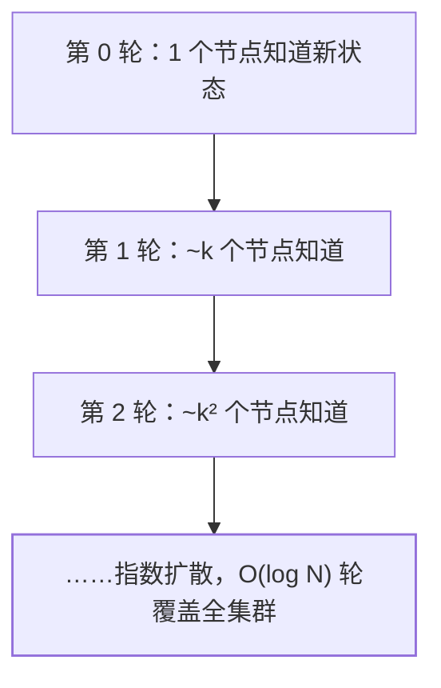

## 解决什么问题

集群没有中心节点时，**"谁活着、数据怎么分布"这些元数据在谁手上？**
要么外挂一个强一致协调者（ZK/etcd），要么让节点之间互相传播——
Gossip（流言/流感协议）选后者：**每个节点周期性随机找几个节点
交换状态，像流感一样指数扩散**，最终全集群达成一致视图。

## 三种交互方式

| 方式 | 交互 | 特点 |
|---|---|---|
| Push | 自己把状态推给对方 | 新节点信息新时高效；接近收敛时大量冗余 |
| Pull | 拉取对方的状态 | 自己信息旧时高效 |
| Push-Pull | 先推再拉，一轮交换双方增量 | 收敛最快，通用默认 |

收敛快，但**永远不停**：协议没有"全员已知道"的全局信号，所以
反熵循环持续运行，用持续冗余消灭最后的漏网之鱼。

## 两种用途（面试重点）

1. **谣言传播（rumor mongering）**：新事件（节点加入、槽位变更）
   快速扩散——追求速度，传播到一定"免疫力"就停。
2. **反熵（anti-entropy）**：周期性全量/增量对账，修复节点间的
   状态差异——追求最终一致。Cassandra 的读修复、 hinted handoff
   都是反熵思想的落地。

## 优缺点一表流

| 优点 | 缺点 |
|---|---|
| 去中心化，无单点 | **最终一致**：传播有延迟，期间各节点视图不同 |
| 扩展性好，log N 收敛 | 消息冗余（重复传播浪费带宽） |
| 天然容错，部分节点挂了不影响 | 元数据随节点数膨胀，单条消息变大 |
| 实现简单，无需外部依赖 | 随机传播不可控，不适合强一致场景 |

## 落地案例

| 系统 | 用法 |
|---|---|
| **Redis Cluster** | 节点间 PING/PONG 交换槽位图与节点状态；主观下线（自己觉得它挂了）靠 gossip 传播，**过半主节点确认才升级客观下线**——gossip + quorum 混合 |
| Cassandra | 环形哈希 + gossip 同步节点状态；一致性哈希见[一致性哈希](/distributed/basic/theory/02-consistent-hashing/) |
| Consul | SWIM 协议（gossip 的改良版）做成员关系与故障检测 |
| Bitcoin | 区块与交易的 P2P 广播 |

## Redis Cluster 为什么选 Gossip 而不是 ZK

- **可用性优先（AP）**：不依赖外部组件，集群自己就能活；ZK 挂了
  整个集群的元数据服务就瘫。
- 代价：槽位图最终一致——迁移期间的 `MIGRATING/IMPORTING` 状态
  短暂不一致，靠 ASK/MOVED 重定向容错。
- 也是 16384 槽 + 官方建议 ≤1000 节点的原因之一：**每个节点保存
  全量槽位图，gossip 消息体积随节点数膨胀**，太大了传播不动。

## 与强一致元数据的对比

| 维度 | Gossip（Redis Cluster） | 中心协调（ZK/etcd，见 KRaft 的 Kafka） |
|---|---|---|
| 一致性 | 最终一致 | 线性一致（过半写） |
| 可用性 | 分区时半区仍可用 | 过半存活才可服务 |
| 部署复杂度 | 零外部依赖 | 多养一套 CP 集群 |
| 规模上限 | 元数据膨胀受限 | 协调者吞吐受限 |

没有谁更好：**内聚的存储集群（自己管自己）爱用 Gossip，微服务
生态的协调场景（注册中心、选主）爱用 CP 组件**。

## 小结

- Gossip = 周期性随机对等传播 + 指数收敛，push/pull/push-pull 三种
  交互，反熵循环永不停。
- 两大用途：谣言传播（快扩散）、反熵（慢对账）——最终一致是它的
  天花板，也是它的护城河。
- Redis Cluster 是最常考的落地：gossip 同步 + quorum 判定客观下线，
  用"不要外部依赖"换"元数据短暂不一致"。

## 延伸阅读

- [Redis Cluster 规范（官方，gossip 细节）](https://redis.io/docs/latest/operate/oss_and_stack/management/scaling/)
- [SWIM: Scalable Weakly-consistent Infection-style Membership（论文）](https://www.cs.cornell.edu/projects/Quicksilver/public/SWIM/paper.pdf)
- [Cassandra 架构官方文档（gossip 与反熵）](https://cassandra.apache.org/doc/latest/cassandra/architecture/dynamo.html)
