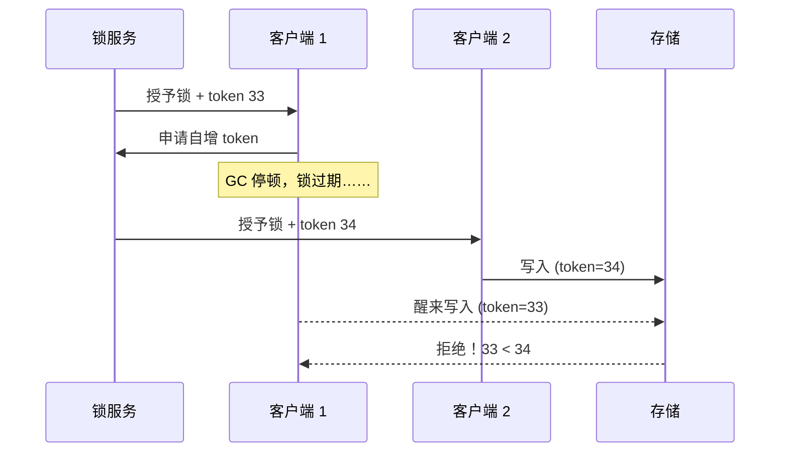

## 什么时候需要分布式锁

单机锁（`synchronized`/`ReentrantLock`）只能管住自己 JVM 内的线程。
服务部署成多实例后，**"同一时刻只有一个执行者"这个约束跨了进程**，
就需要一个所有实例都认的第三方仲裁者来记"锁在谁手上"。

典型场景：定时任务防多实例重复跑、缓存击穿时防止并发重建
（见 [Redis 缓存问题](/redis/intermediate/usage/02-cache-problems/)）、
防超卖的辅助手段、防重复提交的拦截层。

仲裁者只有四种主流选择：**数据库、Redis、ZooKeeper、etcd**。

## 数据库锁：朴素的第一版

```sql
-- 方式一：唯一约束抢占（insert 成功即拿锁，删记录即释放）
insert into dist_lock(lock_key, owner) values('order:sync', 'node-1');
-- 方式二：悲观锁
select * from dist_lock where lock_key='order:sync' for update;
```

- 优点：实现零依赖、**可靠性由 DB 事务保证**，天然不会"过期歧义"。
- 缺点：性能差（锁表）、无自动过期（持锁者宕机后死锁，要靠定时
  清理或 `owner` 心跳列兜底）、可用性受制于 DB 单点。
- 定位：并发量小的后台任务凑合用，**不推荐作为通用方案**。

## Redis 锁：性能之选

标准姿势一把梭（缺一不可）：

```bash
SET lock:order:sync <uuid-token> NX PX 30000
```

- `NX`：不存在才设置（互斥）；`PX 30000`：**原子地**带上过期时间
  （防宕机死锁——setnx 和 expire 分两条命令是经典事故题）。
- value 用唯一 token：**释放锁必须是 Lua 原子操作**，先比对是不是
  自己的 token 再删，防止删掉别人的锁（业务超时后锁过期、别的
  实例已持有）。

```lua
if redis.call("get", KEYS[1]) == ARGV[1] then
    return redis.call("del", KEYS[1])
else
    return 0
end
```

Redisson 把这些都封装了：可重入、自动续期**看门狗**（后台线程每
1/3 过期时间续期一次，业务没跑完锁不会提前失效）。

### 主从切换丢锁（必考）

Redis 锁写在主上，异步复制到从——**主挂了、从提升、新主上没有这
把锁**，第二个客户端就能成功加锁，互斥被打破。

RedLock 想用多个独立 Redis 实例过半加锁解决它，但 Martin Kleppmann
论证其在时钟跳变/GC 停顿下仍不安全，antirez 反驳——**这场争论的
结论比方案更重要：Redis 锁是"效率锁"（防重复干活），不是"正确性锁"
（防数据错乱）**。要正确性，靠下一节的 fencing token 或换 CP 系统。

## ZooKeeper / etcd 锁：正确性之选

### ZK 临时顺序节点

```
/locks/order-sync
  ├── lock-0000000001   ← seq 最小者持锁
  └── lock-0000000002   ← 只监听 01 的删除事件
```

1. 各客户端创建**临时顺序节点**；
2. 序号最小者获得锁，其余**只监听前一个节点**（避免惊群）；
3. 前驱被删 → 下一个序号上位。

精髓在**临时节点与会话绑定**：客户端宕机 = 会话断 = 节点自动消失
= 锁自动释放，**不存在"过期时间设多少"的两难**；写走 ZAB 过半
提交，主从切换不丢锁。代价：性能低于 Redis（写要过半共识），
且**时钟/会话抖动也可能丢锁**（GC 停顿超会话超时，ZK 依然会释放
你的锁——绝对安全不存在）。

### etcd：K8s 同款底座

`clientv3 concurrency` 包：`Revision` 全局单调递增当序号 + 事务
（Compare 保证原子创建）+ `Lease` 租约续期当临时性。语义上和 ZK
锁同构，好处是与 K8s 生态共用一套 etcd，且 gRPC 性能好。

## 四种实现对比

| 维度 | 数据库 | Redis(+Redisson) | ZooKeeper | etcd |
|---|---|---|---|---|
| 性能 | 差 | **最好** | 中 | 中 |
| 自动释放 | 无（要自己清） | 过期时间 + 看门狗 | 会话断开即释放 | Lease 到期/续租 |
| 主从切换安全 | 看部署 | **可能丢锁** | 不丢（过半写） | 不丢（Raft） |
| 公平性 | 无 | 无 | **顺序队列，公平** | 顺序（Revision） |
| CAP 取舍 | — | AP（复制异步） | CP | CP |
| 实现复杂度 | 低 | 低（Redisson） | 中（监听管理） | 中 |

选型口诀：**效率优先 Redis，正确优先 ZK/etcd，兜底永远靠幂等和
存储端校验**。

## Fencing Token：把正确性交给存储端

无论哪种锁，都有一个无解窗口：持锁者 GC 停顿/网络卡顿 → 锁过期
被别人拿走 → 旧持有者醒来继续写。锁服务自己分不清谁新谁旧，**让
存储端来分辨**：



token 由锁服务**单调递增**发放，存储层记录见过的最大 token，
**拒绝更小的写**。这才是分布式锁正确性的终解——锁只是发令牌的，
拦人的是数据本身。

## 小结

- 四种实现本质都是"在第三方仲裁处抢占一个标记"：数据库靠约束、
  Redis 靠 SET NX PX、ZK/etcd 靠有序节点/Revision + 临时租约。
- Redis 锁三板斧：原子 SET NX PX、唯一 token + Lua 释放、看门狗
  续期；但要清楚它是效率锁，主从切换可能丢锁。
- ZK/etcd 锁用临时性替代过期时间，CP 路线更稳，性能次之。
- 追求正确性上 fencing token：锁发号，存储拒旧；再兜一层幂等
  （见[接口幂等性设计](/distributed/intermediate/coordination/02-idempotency/)）。

## 延伸阅读

- [How to do distributed locking（Martin Kleppmann）](https://martin.kleppmann.com/2016/02/08/how-to-do-distributed-locking.html)
- [Is Redlock safe?（antirez 的回应）](http://antirez.com/news/101)
- [Redis 分布式锁官方模式文档](https://redis.io/docs/latest/develop/use/patterns/distributed-locks/)
- [ZooKeeper 官方 Recipes：Locks](https://zookeeper.apache.org/doc/current/recipes.html)
- [Redisson 看门狗与分布式锁实现（Redis 方向详解）](/redis/intermediate/usage/03-distributed-lock/)
