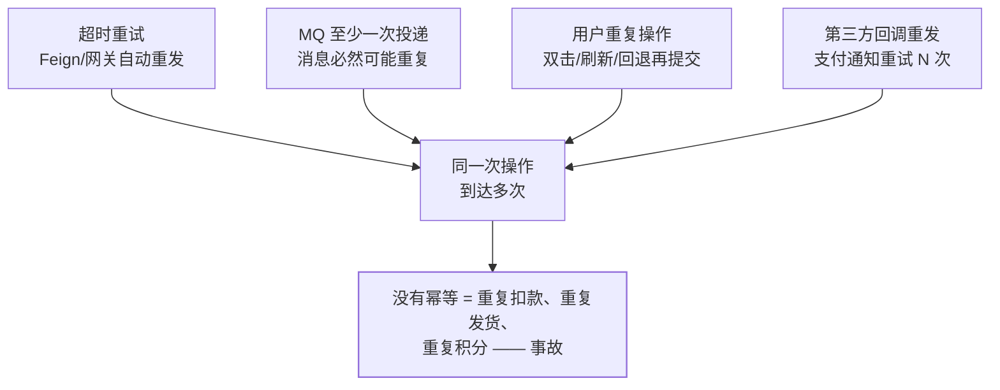
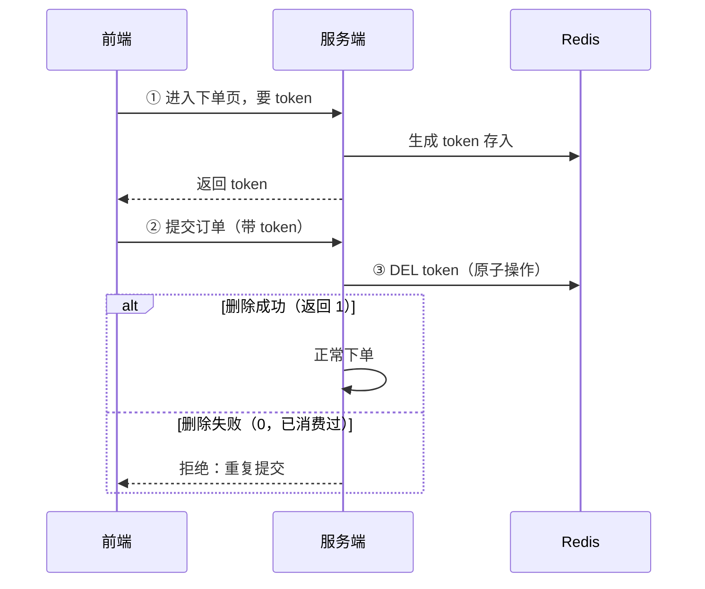

## 定义：执行 N 次 = 执行 1 次

幂等（Idempotence）：**同一操作执行一次和执行多次，对系统的影响
相同**。先给常见操作做个自检：

| 操作 | 幂等？ | 原因 |
|---|---|---|
| `select` | ✅ 天然 | 只读 |
| `delete ... where id=?` | ✅ 天然 | 删完再删没影响 |
| `update set status='PAID' where id=?` | ✅ 条件赋值 | 设成固定值，重复执行结果不变 |
| `update set stock=stock-1` | ❌ | 每执行一次都扣一次 |
| `insert` | ❌ | 重复插入重复数据 |
| 先查后写（check-then-act） | ❌ | 并发窗口内两次都通过检查 |

## 为什么分布式系统绕不开

单机时代偶发的重复点击，到了分布式会被放大成**系统性重复**：



关键认知：**重试是保可用性的必然选择，重放就必然存在**——所以
幂等不是可选项，是分布式系统的默认要求。

## 六种方案

| 方案 | 做法 | 适用 | 局限 |
|---|---|---|---|
| 1. 数据库唯一索引 | 业务唯一号加唯一约束，重复插入报错 | 防重复下单、流水防重 | 只防"插入"，范围窄，但是**最后防线** |
| 2. Token 机制 | 先领一次性令牌，提交时原子消费 | 表单防重复提交 | 多一次交互，要处理时序 |
| 3. 分布式锁 | `setnx(业务号)` 抢锁再执行 | 消费防重、任务防重跑 | 锁不可靠（见[锁选型](/distributed/intermediate/coordination/01-distributed-lock-compare/)），要兜底 |
| 4. 乐观锁版本号 | `where version=?` 带版本更新 | 状态字段更新 | 冲突高时重试多 |
| 5. 状态机 | `where status='上一状态'` 条件更新 | 订单/审批流等有状态的 | 仅限有明确状态流转的场景 |
| 6. 去重表/流水表 | 消费前 insert 业务流水号 | MQ 消费幂等 | 表会大，要归档 |

### Token 机制（面试标准答案）



要点：**必须用 DEL 的返回值（或 Lua）做原子判断**——"先 GET 判断
再 DEL"两步之间有并发窗口，两个请求都能通过检查。

### 状态机 + 乐观锁（一行 SQL 的幂等）

```sql
update orders
set status = 'PAID', pay_time = now()
where id = 1001 and status = 'UNPAID';   -- 影响行数 = 0 → 重复回调，直接忽略
```

条件更新把"重复执行无害"交给了数据库行锁，是支付回调防重的
标准写法。

### 去重表（MQ 消费幂等）

```sql
create table consume_record (
  biz_no varchar(64) primary key,   -- 唯一业务号：orderId + 事件类型
  created_at datetime
);
-- 消费前先 insert：成功说明没处理过；唯一冲突说明重复消息，ack 掉
insert ignore into consume_record(biz_no) values('order:1001:paid');
```

## 分层防御：组合拳

没有单一方案包打天下，生产上是纵深防御：


- 前端手段**只能算体验优化，不能算安全**——绕过 UI 的请求有的是。
- 越靠后的防线越可靠：哪怕锁失效、token 丢了，唯一索引也会让重复
  数据插不进去。

## 高频追问

- **"先查后写"为什么不幂等？** 并发下两个请求都在别人写入前完成
  检查（check-then-act 竞态），所以要原子化判断（DEL 返回值、唯一
  约束、条件更新）。
- **delete 天然幂等，那"删除+插入"的更新呢？** 不幂等——中途失败
  再重试可能出现只有插入没有删除的中间态，要用业务键 upsert 或
  状态机。
- **幂等和分布式锁什么关系？** 锁是**手段**（把并发串行化），幂等是
  **目的**（重复执行无害）；锁可能失效，幂等必须不依赖锁也成立。

## 小结

- 幂等 = 执行 N 次等于 1 次；分布式里的重试/重复投递让它从"锦上
  添花"变成"必答题"。
- 六种方案记层次：唯一索引与条件更新（DB 级最可靠）→ token 与
  去重表（业务级）→ 分布式锁（拦截级）。
- 核心套路只有一个：**给操作挂一个唯一业务号，然后原子地判断
  "处理过没有"**——DEL 返回值、唯一约束、`where status=` 都是它的
  变体。

## 延伸阅读

- [Idempotence（Wikipedia）](https://en.wikipedia.org/wiki/Idempotence)
- [Stripe API 幂等键设计（工业界范本）](https://docs.stripe.com/api/idempotent_requests)
- [分布式事务中的消费幂等（同方向事务篇）](/distributed/intermediate/transaction/01-distributed-transaction/)
