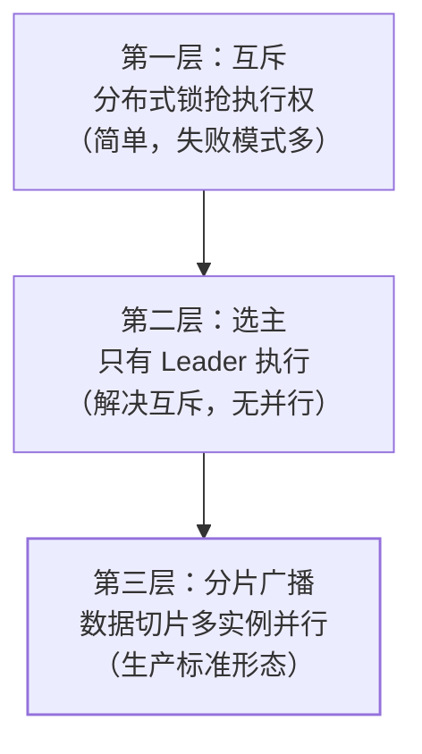

## 问题：任务在 5 台实例上各跑了一遍

单机 `@Scheduled` 上集群后，每台实例到点都会执行——发 5 份
通知、扣 5 次库存。**"到点执行一次"的语义在集群里消失了**，
分布式定时任务要解决的就是把"一次"找回来。

三层解法，可靠性递增：

## 第一层：分布式锁兜底

执行前抢锁（[锁选型](/distributed/intermediate/coordination/01-distributed-lock-compare/)），
抢到的跑，其他跳过：

- **优点**：改造最小，业务代码包一层 `tryLock` 即可。
- **缺点**：锁的可靠性问题全盘继承（主从切换丢锁→双跑、GC 停顿
  →锁过期后旧实例继续跑）；任务跑一半实例宕机，锁过期后另一台
  从头再跑一遍——**任务必须是幂等的**，否则没法兜底。
- 定位：小规模、低频任务够用；**幂等是这一层的生命线**。

## 第二层：选主模式

借用注册中心（ZK/etcd）选主：**只有 Leader 执行**，Leader 挂了
重新选——把"每台都跑"收敛为"一台跑"。

- 比"每台抢锁"多了全局视图（知道谁活着），双跑窗口只剩主从
  切换瞬间。
- 依然是**单点吞吐**：任务大到一个实例跑不完就没救。
- ZK 临时节点/etcd Lease 是选主的底座（见
  [etcd Lease](/etcd/basic/core/02-etcd-lease-txn-watch/)）。

## 第三层：分片广播（生产标准）

调度中心把任务**按数据切片**广播给所有实例，每台处理自己那片：
`total=10万，实例 2/5 负责 id % 5 == 2 的行`。

- **水平扩展**：实例越多切得越细，跑得越快——这是前两层没有的
  能力。
- **失败隔离**：一台挂了，它的分片可被重分片/重跑。
- **仍需幂等**：分片重试、重分片都可能让一条数据被处理两次——
  唯一业务号 + 去重（[幂等篇](/distributed/intermediate/coordination/02-idempotency/)）是
  所有层共同的最后防线。

## 框架在做什么：XXL-JOB / Elastic-JOB 思想

自己造调度器要处理一堆细节，框架把"调度"与"执行"分离：

| 组件 | 职责 | 自建的坑 |
|---|---|---|
| 调度中心 | 时间触发、分片计算、失败重试、监控告警 | 时钟不同步导致多触发（引[时钟篇](/distributed/advanced/consistency/04-time-order/)） |
| 执行器 | 注册到调度中心、领分片、执行、回报状态 | 实例上下线感知、任务堆积 |
| 控制台 | cron 配置、手动触发、分片参数、日志 | 配置散落各实例改不动 |

高频追问顺带收口：

- **错过触发（misfire）**：实例宕机/发布期间错过触发点——框架
  提供"立即补跑一次/忽略/对齐下次"策略；补跑前想清楚任务幂等性。
- **任务执行超时**：单实例执行太长触发重试 → 双跑——超时时间
  要大于 P99 执行时长，配合分片缩短单次跑批体量。
- **时钟依赖**：调度按调度中心时钟，执行器本地时间只做日志
  （引[时钟与顺序](/distributed/advanced/consistency/04-time-order/)）。

## 选型速答

| 场景 | 方案 |
|---|---|
| 单实例内部小任务，偶尔漏跑无所谓 | 单机注解 + 分布式锁兜底 |
| 任务必须执行且可并行处理数据 | 分片广播框架（XXL-JOB/Elastic-JOB/PowerJob） |
| 复杂依赖编排（A 完成后跑 B） | 工作流调度（DolphinScheduler/Airflow） |

## 小结

- 三层解法：锁兜底 → 选主单跑 → 分片广播并行，可靠性与复杂度
  递增；生产任务调度直接上分片框架。
- **幂等贯穿所有层**：锁会丢、主会切、分片会重——没有幂等，
  任何调度方案都只是"大概率不重复"。
- misfire 策略与超时时间是框架选型后最先要配的两个参数。

## 延伸阅读

- [XXL-JOB 官方文档（分片广播）](https://www.xuxueli.com/xxl-job/)
- [分布式锁选型（同站）](/distributed/intermediate/coordination/01-distributed-lock-compare/)
- [接口幂等性设计（同站）](/distributed/intermediate/coordination/02-idempotency/)
