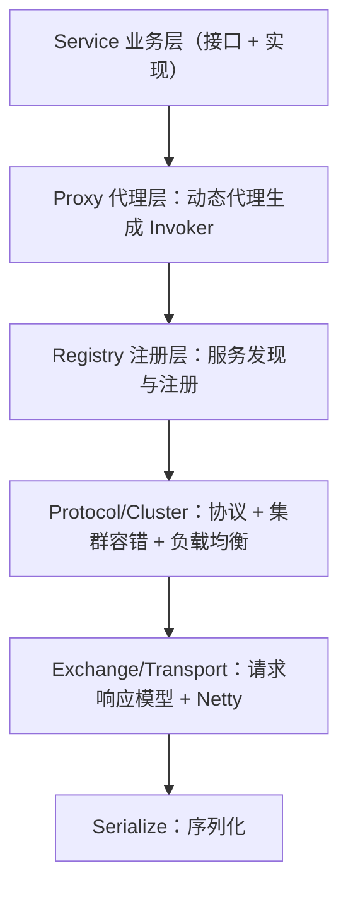

## 本地调用与远程调用的鸿沟

本地方法调用 = 压栈跳转，纳秒级、类型安全、失败即异常。远程调用
隔着网络：参数要**跨机器序列化**、目标地址要**动态发现**、网络会
**超时丢包**。RPC 框架的全部使命，就是把这条复杂链路藏起来，让
你"像调本地方法一样调远程"。

## 一次 RPC 的完整链路

面试时能把这八步讲全，比背"RPC 是远程过程调用"高一个档次。

## 四件套细节

| 组件 | 干什么 | 常见实现/考点 |
|---|---|---|
| 动态代理 | 把 `userService.getUser(1)` 变成一次网络请求 | JDK 动态代理（接口）/CGLib；Feign 同理，见 [OpenFeign 篇](/java/advanced/springcloud/04-openfeign-loadbalancer/) |
| 序列化 | 对象 ↔ 字节 | 见下表 |
| 协议 | 定界 + 路由信息：魔数、长度、序列化类型、请求 ID | Dubbo 协议头、gRPC 跑在 HTTP/2 上；**请求 ID 是异步收发配对的关键** |
| 传输 | 长连接 + IO 多路复用 | Netty（NIO）；对比 HTTP 短连接的握手开销 |

序列化选型对比（高频）：

| 协议 | 体积 | 速度 | 跨语言 | 可读性 | 备注 |
|---|---|---|---|---|---|
| JSON | 大 | 中 | ✅ | ✅ | 调试友好，通用接口默认 |
| JDK 原生 | 大 | 慢 | ❌ | ❌ | 不推荐（安全漏洞史 + 不跨语言） |
| Hessian2 | 中 | 快 | ✅ | ❌ | Dubbo 传统默认 |
| Kryo | 小 | 极快 | ❌ | ❌ | Java 内部高性能场景 |
| **Protobuf** | 极小 | 极快 | ✅ | ❌ | gRPC 标准，IDL 先行 |

## Dubbo 架构分层（必考）

Dubbo 把上面四件套拆成十大层，面试记住**三层视角**即可：

配套的五个角色记住:Provider（提供者）、Consumer（消费者）、
**Registry（注册中心）**、Monitor（监控）、Container（容器）。

### 为什么 Dubbo 重新造 SPI 而不用 JDK SPI

JDK SPI 一次性实例化并加载**全部**实现类，浪费且无法按需选择。
Dubbo SPI 支持**按名字取实现**（`getExtensionLoader(...).getExtension("dubbo")`）、
自适应扩展（`@Adaptive` 运行时根据 URL 参数决定用哪个实现）、
扩展点自动注入（IOC）——**微内核 + 插件**架构的教科书。

## HTTP vs RPC（选型八股）

| 维度 | HTTP/REST | RPC（Dubbo/gRPC） |
|---|---|---|
| 语义 | 资源 + 动词，面向开放 API | 接口 + 方法，面向内部调用 |
| 性能 | 文本协议 + 可能短连接，较重 | 二进制协议 + 长连接，通常更快 |
| 跨语言/生态 | 天然通用，浏览器直连 | 需 IDL/客户端库（gRPC 靠 protobuf 跨语言） |
| 服务治理 | 靠网关 | 框架内置：注册发现、负载均衡、熔断 |

经验法则：**对外用 REST，对内用 RPC**；两者都是 HTTP 可承载
（gRPC = HTTP/2 + Protobuf），"HTTP 比 RPC 慢"要精确到协议与
连接方式层面讨论。

## 小结

- RPC 八步链路：代理 → 发现/负载均衡 → 序列化 → 协议 → 传输 →
  解码 → 反射调用 → 回包，四件套各答一句就能撑起整道题。
- 序列化默认记 Protobuf（小、快、跨语言），JSON 胜在可读与通用。
- Dubbo = 十层架构 + SPI 自适应扩展，微内核插件化的代表。
- 对外 REST、对内 RPC；注册中心与容错的组件实战见 SpringCloud
  分类（[注册中心篇](/java/advanced/springcloud/02-registry/)、[Sentinel 篇](/java/advanced/springcloud/05-sentinel/)）。

## 延伸阅读

- [Dubbo 官方架构文档（分层与 SPI）](https://cn.dubbo.apache.org/zh-cn/overview/core-features/design/)
- [gRPC 指南（HTTP/2 + Protobuf）](https://grpc.io/docs/what-is-grpc/introduction/)
- [OpenFeign 与客户端负载均衡（SpringCloud 篇）](/java/advanced/springcloud/04-openfeign-loadbalancer/)
