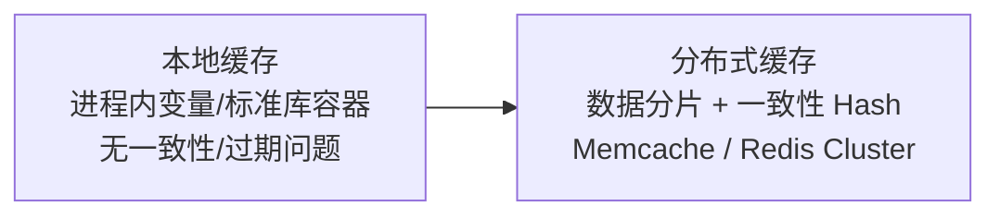

## 先想清楚："三高"各指什么

- **高并发**：多进程/线程同时访问同一资源时，系统仍能**正确**
  处理多个请求——正确性（隔离、同步）是前提，吞吐是目标；
- **高性能**：处理快、耗能少。度量指标：响应时间、吞吐量、TPS、
  并发用户数。计算密集型与 I/O 密集型要分开考虑；
- **高可用**：减少停工时间，服务持续可用——通常以几个 9 衡量
  （99.99% = 年停机 53 分钟）。

三高没有绝对数字：**流量只要造成压力、影响性能，就是你的
"高并发"**。水平扩展（Scale Out）加机器看似万能，但前提是
架构每一层都支持水平扩展——难点在架构设计，不在加机器。

一个清醒的观察：缓存、消息队列、CAS……这些"牛逼架构"大多源自
操作系统与体系结构。新技术多是新瓶装旧酒，底层思想才经得起
时间洗礼。

## 武器一：缓存——空间换时间

**有效的根基是访问局部性（二八定律）**：80% 的访问集中在 20%
的热点数据上。没有热点（访问完全随机）的数据不适合缓存——
还没二次访问就被挤出，反而多了维护开销。

**适合**：读多写少（商品详情）、计算耗时大且实时性要求低
（周更排行榜）。**不适合**：写多读少、强一致要求、完全随机访问。

分类与演进：

**更新策略**是缓存的核心套路：

| 策略 | 做法 | 特点 |
|---|---|---|
| Cache-Aside | 读：miss 回源并回填；写：先更 DB 再使缓存失效 | 最常用；**使用者手动维护**，不透明 |
| Read Through | miss 时由**缓存组件内部**回源 | 对应用透明 |
| Write Through | 写缓存同时同步写 SoR，DB 成功才返回 | 一致性强，写慢 |
| Write Back | 只写缓存即返回，异步刷 SoR，可合并写 | 写极快；**可能丢数据**（CPU Cache/OS page cache 同款） |

（SoR = System of Record，即数据库。CPU 的 L1/L2/L3 对程序
完全透明，就是 Cache-As-SoR 的极致实现。）

## 武器二：预处理与延后处理——压缩实时链路

同一思想的两面：**把实时链路上的事剥离，要么提前、要么延后**，
缩短关键路径。

**预处理**案例：支付宝发杭州消费券，需判断"是否杭州常驻居民"。
实时调外部微服务判定，高并发下会把依赖服务拖挂且 RPC 耗时高
——提前把千万级杭州用户 ID 灌进 Redis，请求到来直接查缓存，
非杭州用户秒级拦截。CPU 指令预取、Linux 预读算法（page cache）
同款思想。

**延后处理**案例：集五福开奖显示"奖金稍后到账"。转账 = A 减钱
+ B 加钱的原子事务，实时做数据库 TPS 必然是瓶颈；产品层一句
提示，把事务挪到低峰期批量处理。COW（写时复制）也是延后——
fork 只复制虚拟地址空间，真正写时才拷贝物理页。

## 武器三：池化——创建提前、销毁延后

线程、内存、连接的创建/销毁都涉及系统调用或网络 I/O。**池化 =
用容器保存资源复用，把创建提前、销毁延后**（本质是预处理/延后
处理的资源版）。

- **内存池**：先申请大块备用，用时切分、还时归还——对抗碎片
  与系统调用开销（业界实现 tcmalloc/jemalloc）；
- **线程池**：管理器 + 工作线程 + 任务接口 + 任务队列四件套，
  请求来了从池里取线程；
- **连接池**：一条无池 SQL = TCP 三次握手 + MySQL 权限认证
  （密钥交换）+ 执行 + 四次挥手；有池则只剩"执行"。HTTP
  Keep-Alive 是连接池的变体（单连接复用）。

## 武器四：异步（回调）

同步 = KFC 点餐后反复去问"好了没"，期间啥也干不了；异步 = 拿
号牌等叫号，中途自由活动。耗时任务同步化会拉长任务耗时、降低
并发度；异步化用回调通知结果。代价是回调层级深了会陷入
Callback Hell（解法：Promise/Future/协程，站内 Stream 与
CompletableFuture 笔记有展开）。

## 武器五：消息队列——流程异步化 + 削峰

上游生产者把消息发进队列，下游消费者按自己节奏消费。三大收益：
**异步**（实时链路只写到 MQ 即返回，后续流程延后）、**解耦**
（上下游互不感知）、**削峰**（秒杀洪峰先进队列，消费者以稳定
速率消化）。与前四件武器一脉相承——都是"让实时链路变短"。

## 小结

- 三高指标各异，但武器同源：**缓存**（空间换时间，前提是热点）、
  **预处理/延后**（压缩实时链路）、**池化**（资源复用）、
  **异步**（不阻塞等待）、**MQ**（异步 + 解耦 + 削峰）。
- 每一件都能在 OS 里找到原型：CPU Cache、预取、COW、进程池、
  中断——系统设计就是把计算机科学的经典思想做工程化放大。
- 动手前先问：数据有热点吗？实时链路上哪些步骤可以搬走？
  这是选武器的第一判断。

## 延伸阅读

- [高并发、高性能、高可用的问题解决方案——CSDN](https://lebron.blog.csdn.net/article/details/134843674)——本篇母本，含缓存策略图解与池化细节
- 站内关联：[缓存架构模式](file:///workspace/src/content/docs/redis/intermediate/usage/01-cache-patterns.md)（Cache-Aside 落地与一致性）、[线程池详解](file:///workspace/src/content/docs/java/intermediate/concurrent/02-thread-pool.md)、[为什么需要消息队列](file:///workspace/src/content/docs/middleware/basic/mq/01-why-mq.md)
