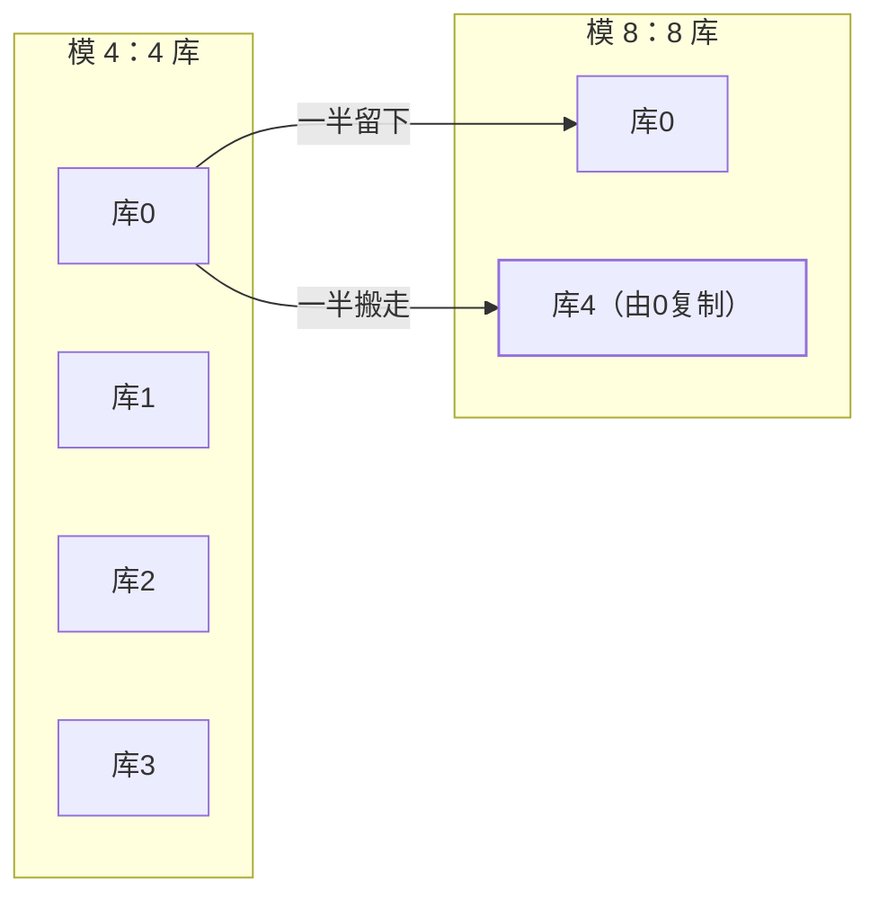
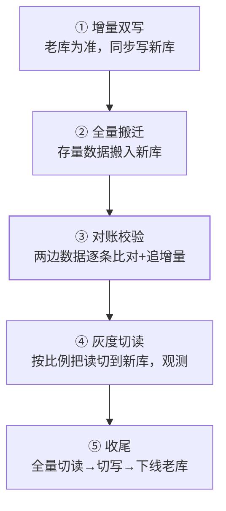

## 第一步：先确认真的需要分

分片是**不可逆的复杂度投资**，先排除"伪需求"：

| 信号 | 对策 |
|---|---|
| 单表数据量大但写入低 | 索引优化、归档冷数据、只读库——**先调优再拆** |
| 读压力大 | 读写分离 + 缓存（见 [双写一致性](/distributed/advanced/consistency/02-cache-consistency/)） |
| 真写入瓶颈：单机写入到顶 | **这才需要分库**（写分片） |
| 单表行数过大拖慢 DDL/备份 | 分表（同库内拆）通常够用 |

经验阈值：MySQL 单表 2000 万行 / 20GB 上下开始警惕（B+ 树层高与
缓冲池命中率问题），但**以压测为准，不是拍数字**。

## 拆分姿势与路由算法

垂直（按业务拆库、按字段冷热拆表）先于水平——垂直拆不改访问
逻辑。水平拆分后，**路由规则**是核心选型：

| 路由 | 规则 | 优点 | 短板 |
|---|---|---|---|
| Range（按范围） | id 1~1000万 → 片0 | 范围查询友好 | **热点**：新数据全写最后一片 |
| Hash（取模） | hash(key) % N | 均匀 | 扩容要大规模搬数据 |
| 查表法 | 路由表记录 key→片 | 灵活可迁移 | 多一次查询/缓存路由表 |
| 一致性哈希 | 哈希环 + 虚拟节点 | 扩缩容只动相邻段 | 见 [一致性哈希](/distributed/basic/theory/02-consistent-hashing/) |

**分片键选择原则：让最高频的查询带上它**——绝大多数查询应单分片
命中。订单系统用 `buyer_id` 还是 `seller_id`？看谁查得多，另一方
用异构索引（宽表/ES）补。

### 基因法：一份数据两个分片键

订单既要按 buyer_id 又要按 seller_id 查——把 buyer_id 的低 4 位
"基因"嵌进订单号（雪花 ID 的低位段，见 [分布式 ID](/distributed/intermediate/transaction/02-distributed-id/)），
seller 查询用基因位路由到同一批分片：

```
订单ID = 雪花ID | (buyer_id % 16)     ← 低 4 位携带分片基因
路由   = 取订单ID低 4 位 / 取 buyer_id 低 4 位 → 同一分片
```

买家、卖家两条查询路径都能单分片命中，不用引入跨片查询。

## 扩容：翻倍扩容

取模路由扩容的代价是把"模 N"改"模 2N"——**每个分片的一半数据
正好落在自己的新分片上**：



翻倍时每片只需把自己的一半数据迁移到对应新片（而不是全局洗牌），
配合路由配置双写窗口灰度切换。这也是"分库数一开始就设成 2 的幂"
的原因。

## 不停机迁移四步法（必考）



- 双写期间**写冲突以老库为准**，新库失败记录补偿（不要让迁移
  影响线上写）。
- 对账工具跑在低峰，差异追平才算过关；切读比例按 1% → 10% →
  100% 灰度。
- **回滚预案**：切读阶段随时可回老库；切写之后老库还要观察期
  （只读保留），别急着下线。

## 分片之后的代价清单

分片买走的是容量，付账的是查询与事务：

- **跨片分页**：`limit 100000, 20` 要各片取前 100020 条归并——
  深翻页禁用，改"游标/下一页带 max id"或 ES 异构。
- **跨片聚合**：count/sum 各片算完再汇总；跨片 join 基本阵亡，
  用冗余字段/宽表/服务层组装替代。
- **跨片事务**：回到[分布式事务](/distributed/intermediate/transaction/01-distributed-transaction/)
  的世界——尽量按分片键把一个业务的写圈在同一片。
- **自增 ID 失效**：全局唯一 ID 方案接棒（雪花/号段）。

## 小结

- 先调优再分片；分片键让高频查询单片命中，多维度查询用基因法
  或异构索引。
- 路由算法按查询形态选：范围查询 Range、均匀写 Hash、扩容敏感
  一致性哈希；初始分片数设 2 的幂为翻倍扩容铺路。
- 不停机迁移五步：双写 → 全量 → 对账 → 灰度切读 → 切写下线，
  全程可回滚。
- 分片的账单：跨片分页/聚合/join/事务全面变贵——能用钱（升配）
  解决的先别用架构解决。

## 延伸阅读

- [MySQL 分库分表与主从复制（同站 MySQL 视角）](/mysql/advanced/performance-ha/02-replication-sharding/)
- [ShardingSphere 官方文档（分片策略与柔性事务）](https://shardingsphere.apache.org/document/current/cn/overview/)
- [一致性哈希（同站基础篇）](/distributed/basic/theory/02-consistent-hashing/)
