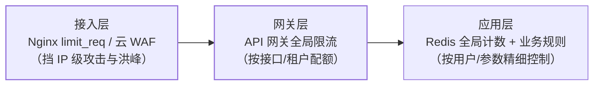

## 先把单机算法一句话带过

计数器、滑动窗口、漏桶（匀速）、令牌桶（突发容忍）四种形态的
原理与实现细节在 [Sentinel 篇](/java/advanced/springcloud/05-sentinel/)
已展开，不重复。这一篇回答算法之外的问题：**部署成 50 台实例后，
"每秒 1000 次"这个限制放在哪、谁来数？**

## 单机限流为什么不够

- **全局阈值失真**：单机阈值 × N ≠ 全局阈值。突发流量倾斜时，
  一台被打满提前触发限流，其他机器还闲着。
- **扩缩容要改配置**：实例数变化后单机阈值全部要重算。
- **有些配额本质是全局的**：第三方 API 限你 100 QPS、库存只允许
  每秒 500 件——这些数在全局只有一个。

所以需要**所有实例共同认可的计数器**——分布式限流的本质是
"把计数器放到共享存储，并保证计数原子性"。

## 三层布防



越靠外拦得越便宜，越靠内控得越细——**粗的挡在外面，细的留在
里面**，不要让所有流量都打到 Redis 才发现超了。

## Redis + Lua：标准实现

原子性是命门："读计数 → 判断 → 自增"三步分开写就有并发窗口，
Lua 脚本把它们捏成一个原子操作：

```lua
-- 滑动窗口：zset 按时间戳记录每次请求
local key, now, window, limit = KEYS[1], tonumber(ARGV[1]), tonumber(ARGV[2]), tonumber(ARGV[3])
redis.call('ZREMRANGEBYSCORE', key, 0, now - window)   -- 清出窗口外的旧请求
local count = redis.call('ZCARD', key)
if count < limit then
    redis.call('ZADD', key, now, now .. '-' .. math.random())
    redis.call('PEXPIRE', key, window)
    return 1                                            -- 放行
end
return 0                                                -- 限流
```

令牌桶同理（Lua 里算应补充的令牌数再扣减），Redis 官方仓库有
参考实现。要点：**TTL 一定要加**（防 key 残留）、阈值判断与写入
必须同脚本。

## 性能账与预扣模式

每个请求都跑一次 Redis Lua，意味着 Redis 承受与业务同量级的
QPS，且多一次网络往返（~1ms）。折中方案是**批量预扣**：

- 每实例一次从 Redis 取一批令牌（如 100 个），本地内存慢慢消费，
  用完或到期再取——Redis QPS 降为 1/100。
- 本地令牌的代价是**实例间短暂不均**（一台预扣没用完，另一台
  已经被限），属于精度换性能的权衡。
- Sentinel 的集群流控模式（token server/client）就是这个思路的
  框架化版本。

## 热点参数限流

同一个接口，`/product?id=10086`（爆款）和 `id=9527`（长尾）的
容量完全不同。按**参数值维度**分别计数限流（Sentinel 热点参数
规则、网关层按 path+arg 哈希），比接口级阈值精细一档。

## 被限之后：优雅地说不

| 策略 | 行为 | 适用 |
|---|---|---|
| 快速失败 | 直接返回 429 + Retry-After | 默认推荐，让调用方尽早重试 |
| 排队等待 | 漏桶式排队，慢慢放行 | 上下游可容忍延迟（如消息类） |
| 降级返回 | 返回兜底数据/默认值/缓存旧值 | 体验优先的场景 |

配套纪律：**阈值从压测得来并留 20% 余量**；分级设置（全局 →
接口 → 用户）；限流触发要有**监控告警**——限流是保护动作，但也
是容量信号，长期贴近阈值就该扩容而不是靠限流硬扛。

## 小结

- 单机限流管全局失真，分布式限流 = 共享存储里的原子计数器
  （Redis + Lua 是标准解）。
- 三层布防：接入层挡洪峰、网关层管配额、应用层做精细规则；
  预扣令牌用精度换性能。
- 被限的姿势要设计：429 + Retry-After 是礼貌，降级兜底是体验，
  监控告警是容量信号。

## 延伸阅读

- [Redis 官方 Rate Limiter 模式（含 Lua 实现）](https://redis.io/docs/latest/develop/use/patterns/rate-limiter/)
- [Nginx limit_req 官方文档](http://nginx.org/en/docs/http/ngx_http_limit_req_module.html)
- [Sentinel 集群流控文档](https://sentinelguard.io/zh-cn/docs/cluster-flow-control.html)
- [限流算法四种形态（Sentinel 篇，同站）](/java/advanced/springcloud/05-sentinel/)
