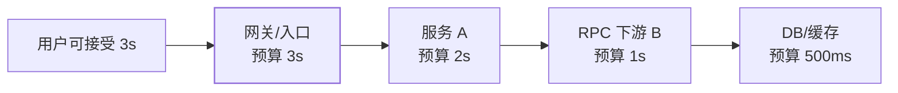
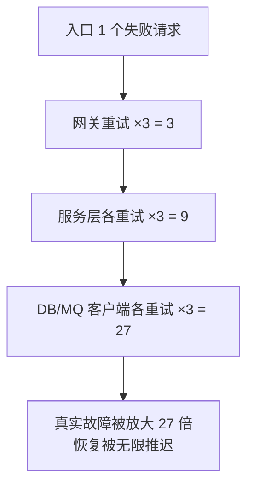

## 为什么这两个参数决定生死

超时和重试是分布式调用最不起眼、杀伤力最大的两个旋钮：

- **没有超时**：下游一卡，线程池被无限等待拖满，故障顺着调用链
  向上传导（雪崩，见 [Sentinel 篇](/java/advanced/springcloud/05-sentinel/)）。
- **乱重试**：故障时刻，失败请求被层层重试放大成洪峰，把本来
  还剩一口气的系统彻底压死（重试风暴）。

原则先行：**超时必须有，重试必须有纪律**。

## 超时：预算制

连接超时（建立 TCP，~500ms 足够暴露网络问题）与读超时（等待
响应，按接口 P99 定）要分开设。核心方法论是**预算制**：给整条
调用链一个总预算，逐层分配、逐层递减：



- **上层超时 > 下层超时之和**是底线——否则下游还没返回，上游已经
  放弃，白干（层叠超时的典型错配）。
- 超时发生后要**取消传播**（ThreadLocal 标记 / context cancel）：
  通知下游"别算了"，把资源还回去。
- 每个接口的超时从**监控的 P99** 来，不是拍脑袋的统一默认值。

## 重试：三道门槛

不是所有失败都值得重试。发起一次重试前过三道闸：

1. **幂等**：这次操作重发一次有没有副作用？查询天然可以，扣款
   必须先有幂等机制（见[接口幂等性设计](/distributed/intermediate/coordination/02-idempotency/)）——
   **重试的前提是幂等，不是相反**。
2. **错误可重试**：网络超时、503、限流 429（按 `Retry-After` 等）
   → 重试有意义；参数错误 400、业务拒绝（余额不足）→ 重试多少次
   结果一样，别试。
3. **退避 + 抖动**：立刻重试等于对刚失败的节点补刀。指数退避
   （1s → 2s → 4s）叠加**随机抖动**，避免所有客户端同步踩踏：

```java
long base = 500;                       // 毫秒
long delay = (long) (base * Math.pow(2, attempt)   // 指数退避
        * (0.5 + ThreadLocalRandom.current().nextDouble())); // 加抖动
```

## 重试风暴：放大的数学

故障时刻每层都"好心地"重试 3 次，放大是乘法级的：



叠加**层叠重试错配**（上层在下层还在重试时也开始自己的重试），
洪峰在故障期反复回灌。三道防护：

1. **重试预算**（Google SRE 思路）：重试流量占比超过 10% 就地
   停止重试——故障越严重重试越少，保住恢复窗口。
2. **只在最合适的一层重试**：客户端/SDK 层离失败最近、上下文
   最全；网关层重试要克制（一般只对 GET 幂等请求）。
3. **熔断联动**：连续失败触发熔断（三态循环见 Sentinel 篇）后，
   重试直接短路为快速失败，别再敲门。

## 高频追问速答

- connect 超时为什么设短？——TCP 握手失败暴露的是网络/机器问题，
  重试也救不了，快速失败换节点。
- read 超时为什么不全局统一？——接口耗时分布差异巨大，按各自
  P99 定；统一值要么太松拖死线程，要么太紧误杀慢请求。
- 重试次数多少合适？——0~2 次；超过 2 次的重试成功率断崖式
  下降，且加剧拥塞。
- 重试在哪一层做？——优先客户端/框架层；多层都配重试时必须
  全局算预算，否则就是风暴。

## 小结

- 超时预算逐层递减，上层 > 下层之和；超时后要取消传播。
- 重试三门槛：幂等、可重试错误、退避加抖动；缺一道就别重试。
- 故障期的放大是乘法：重试预算 + 单层重试 + 熔断联动，把"好意"
  关进笼子。

## 延伸阅读

- [Google SRE Book：Handling Overload（重试与预算）](https://sre.google/sre-book/handling-overload/)
- [Exponential Backoff And Jitter（AWS 架构博客）](https://aws.amazon.com/blogs/architecture/exponential-backoff-and-jitter/)
- [接口幂等性设计（同站）](/distributed/intermediate/coordination/02-idempotency/)
- [Sentinel 熔断降级（同站）](/java/advanced/springcloud/05-sentinel/)
