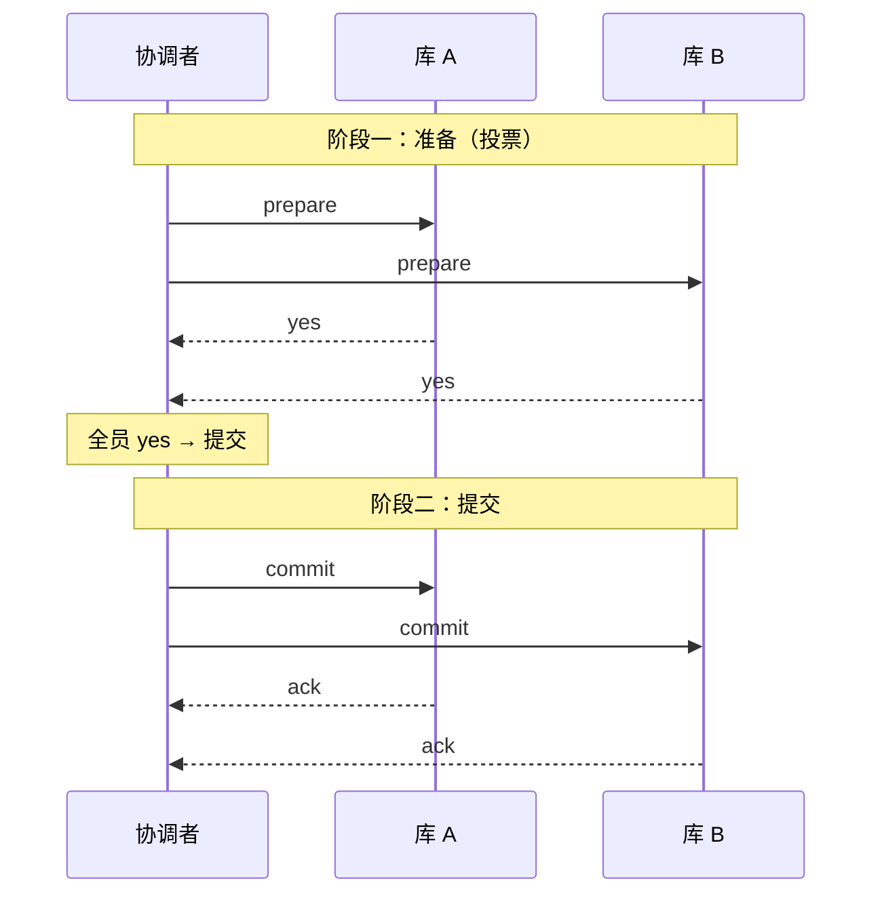
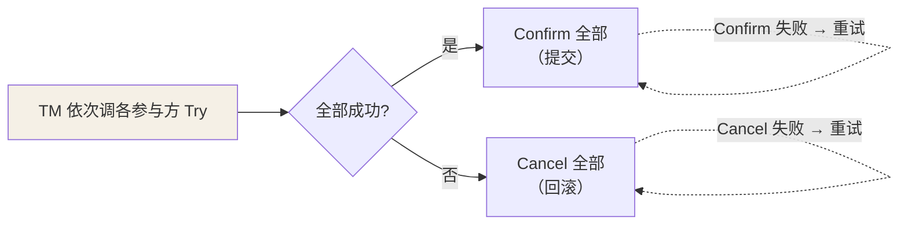
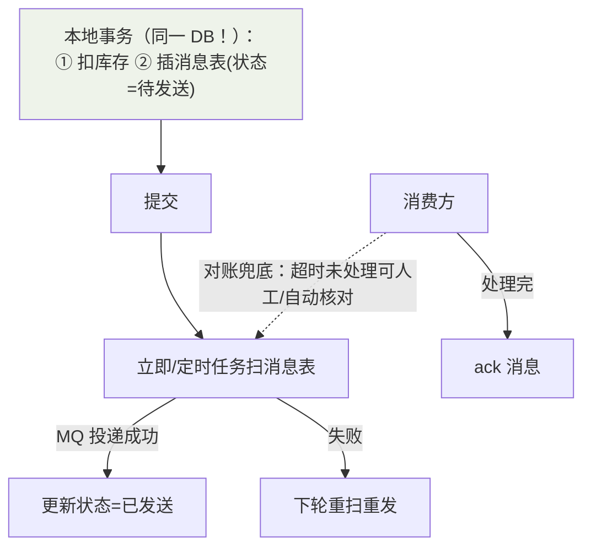
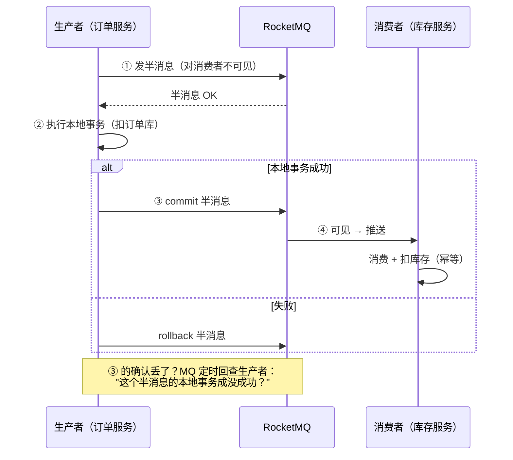
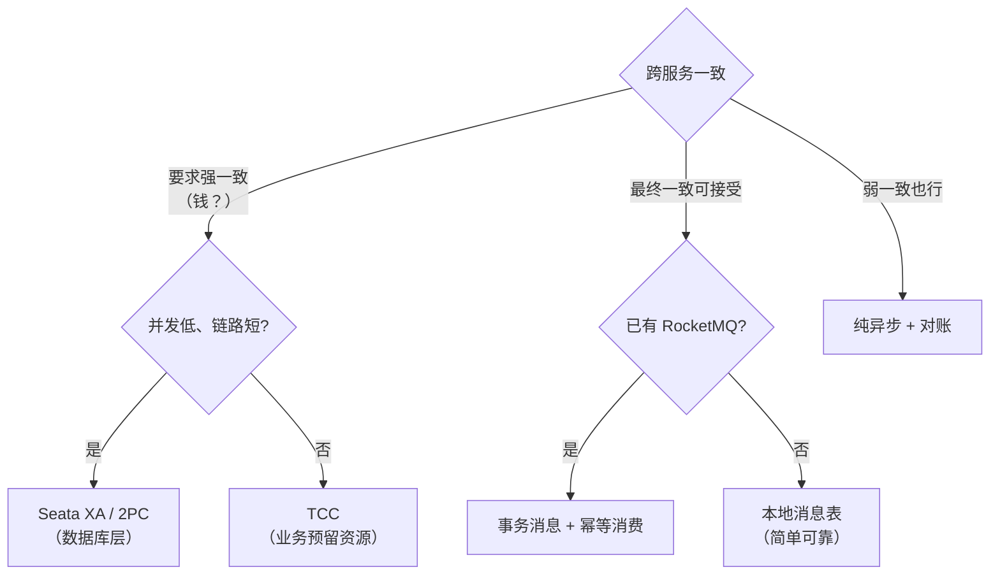

## 先选一致性档位

| 档位 | 含义 | 典型业务 | 方案 |
|---|---|---|---|
| 强一致 | 任意时刻两边一致（或失败） | 转账扣款 | 2PC / Seata XA |
| 最终一致 | 短暂不一致，必收敛 | 下单锁库存、积分 | **TCC / 消息事务** |
| 弱一致 | 尽量，丢就丢（可重试） | 浏览数/点赞数 | 异步补数据/不处理 |

**大多数互联网业务只需要最终一致**——用消息表/异步补偿就够，别上来就
XA。

## 2PC（两阶段提交）

协调者（TM） + 参与者（RM）：



致命缺陷：

1. **同步阻塞**：prepare 到 commit 之间，所有参与者锁着资源干等。
2. **协调者单点**：它恰好在"决定 commit 但还没广播"时挂掉，参与者
   卡死在锁资源状态。
3. **二阶段网络分裂**：协调者的 commit 只到达一半参与者——数据不一致
   窗口存在。

3PC 把提交拆成 CanCommit → PreCommit → DoCommit 并加超时，参与者能
在协调者失联时"按约定自行超时提交"——缓解阻塞，但**不保证一致性**
（超时决策可能与协调者意图相反），工程界几乎不用，知道它"想干嘛"即可。

## TCC：Try-Confirm-Cancel

把事务控制权**上移到业务层**，每个参与方实现三个方法：

```java
// 库存服务
public interface StockTcc {
    boolean tryDeduct(String orderId, int count);  // Try：冻结库存（可用 -N，冻结 +N）
    boolean confirm(String orderId);                // Confirm：扣掉冻结（冻结 -N）—— 幂等
    boolean cancel(String orderId);                 // Cancel：解冻归还（可用 +N）—— 幂等
}
```



- **无长时间锁**：Try 只做资源预留（冻结额度/预扣库存），粒度由业务定。
- **代价**：每个参与方三套代码 + **三大拦路虎**：
  - 空回滚：Try 没到（网络丢），Cancel 先到 → Cancel 要能识别"没 Try 过"
    而不是报错（靠事务控制表）。
  - 幂等：Confirm/Cancel 至少一次重试 → 重复调用不能重复扣（状态机）。
  - 悬挂：Cancel 先执行完，迟到的 Try 才到 → Try 要检查"已 Cancel"拒绝
    执行（同靠控制表）。

生产口的 TCC 都是**框架代劳这些坑**（Seata TCC / Hmily / ByteTCC），
业务只写三个方法。

## 本地消息表：朴素而可靠

核心：**把"发消息"变成一个本地事务**，靠定时扫表补偿。



```sql
-- 消息表跟业务同库，事务原子性由本地数据库保证
create table local_message (
  id bigint primary key,
  payload json not null,
  status tinyint default 0,      -- 0 待发送 1 已发送 2 已消费
  retry_count int default 0,
  next_retry_time datetime
);
```

优点：无框架依赖、纯 DB 保证可靠。缺点：业务表耦合消息表、定时扫描
有延迟。

## RocketMQ 事务消息：把扫表换成"半消息 + 回查"



与本地消息表殊途同归（都靠**本地事务 + 可靠投递 + 幂等消费**），区别
是回查由 MQ 发起，业务方只实现 `checkLocalTransaction`——省掉扫表
基建，但要引入 RocketMQ 且消费方**必须幂等**。

**消费方幂等的通用解**：唯一业务号 + 去重表/Redis SETNX——消息可能
重复投递（At Least Once），"处理过的单号直接 ack"。

## Seata：一框架三模式

| 模式 | 原理 | 侵入性 | 一致性 |
|---|---|---|---|
| AT（默认招牌） | 代理 JDBC：**自动生成前后镜像 undo log**，全局提交删镜像、回滚反向补偿 | **零侵入**（@GlobalTransactional） | 最终一致 |
| TCC | 手写三接口（见上） | 高 | 最终一致 |
| Saga | 长事务编排：正向服务 + 补偿服务 | 中 | 最终一致 |

AT 模式流程：一阶段本地事务提交 + 记 undo log（快照）→ 二阶段全局
提交（异步删 log，很快）或回滚（**用 undo log 反向补偿**）。写隔离靠
全局锁（同一行全局事务串行改）——**代价是全局锁的竞争与回滚窗口的
弱一致**。

```java
@GlobalTransactional          // 一行注解开启全局事务
public void createOrder() {
    orderMapper.insert(order);    // 本地事务 1（undo log 自动记录）
    stockClient.deduct(...);      // 远程调用 → 库存服务本地事务 2
    pointClient.add(...);         // 远程调用 → 积分服务本地事务 3
}
```

## 选型决策树



## 小结

- 2PC 强一致但阻塞 + 单点；3PC 理论改良，实际没人用。
- 最终一致三件套：TCC（业务侵入换粒度）、本地消息表（朴素可靠）、
  MQ 事务消息（回查免扫表）——核心都是"本地事务锚定 + 幂等 + 补偿"。
- Seata AT 零侵入是国产生态最爱；消费端幂等是所有方案的前置条件。

## 延伸阅读

- [分布式事务 Seata 及其三种模式详解（Seata 官方博客）](https://seata.io/zh-cn/blog/seata-at-tcc-saga.html)
- [分布式事务最终一致性常用方案（CSDN）](https://blog.csdn.net/weixin_33750452/article/details/86112964)
- [分布式事务的四种解决方案（hhbbz Blog）](https://hhbbz.github.io/2018/09/06/%E5%88%86%E5%B8%83%E5%BC%8F%E4%BA%8B%E5%8A%A1%E7%9A%84%E5%9B%9B%E7%A7%8D%E8%A7%A3%E5%86%B3%E6%96%B9%E6%A1%88/)
- [分布式系统事务一致性（博客园）](https://www.cnblogs.com/luxiaoxun/p/8832915.html)
