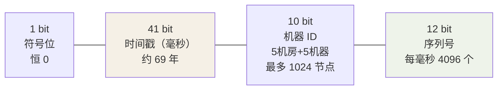

## 分库分表后，自增主键的死穴

单库 `auto_increment` 没问题；**分库后每个库独立自增**——两个库同时
发出 id=1001，全局主键撞车（分库分表篇的直接续篇）。UUID 呢？能保证
全局唯一，但作为 MySQL 主键是灾难：

| 维度 | UUID v4 | 要求 |
|---|---|---|
| 长度 | 36 字符（128bit） | 越短越好（所有二级索引都存主键） |
| 顺序 | **完全随机** | B+ 树要**趋势递增**（见下） |

随机主键的伤害链：插入位置随机 → 每页都可能被写 → **页分裂**（新行
挤进已满页，旧页拆两个半满页）→ 树变高、缓存命中率掉、写入放大。而
趋势递增的 id 永远追加在最右页，几乎无分裂——**所以好 ID 的三要素：
全局唯一、趋势递增、紧凑**。

## 雪花算法（Snowflake）

64bit 切三段：



```java
public class Snowflake {
    private final long epoch = 1735689600000L;     // 2025-01-01 起算，延长可用年限
    private final long workerId;
    private long sequence = 0;
    private long lastTs = -1;

    public synchronized long nextId() {
        long ts = System.currentTimeMillis();
        if (ts < lastTs) throw clockBack();        // 时钟回拨！见下
        if (ts == lastTs) {                        // 同一毫秒：序列号 +1
            sequence = (sequence + 1) & 4095;
            if (sequence == 0) ts = waitNextMillis(lastTs);  // 序列耗尽等下一毫秒
        } else {
            sequence = 0;
        }
        lastTs = ts;
        return ((ts - epoch) << 22) | (workerId << 12) | sequence;
    }
}
```

- 单机**每毫秒 4096 个**、理论峰值 400w+/s，足够绝大多数场景。
- 趋势递增（时间在高位）、紧凑（8 字节）、**不依赖第三方**（对比号段）。

### 时钟回拨：雪花最著名的坑

NTP 校时把系统时间往回调 → 生成的 id **可能重复**（同机器同毫秒同
序列号）。防御梯度：

1. **小回拨（< 几十 ms）**：等待追平再发。
2. **中等回拨**：上次时间戳扩展位/备用位兜底，或抛错让调用方重试。
3. **拒绝依赖系统时钟**：美团 Leaf-snowflake 用 **ZooKeeper 的时间戳
   校准**——启动时从 ZK 拿上次发号时间，取 max(系统时间, 上次+1)，
   单调性自持。

### 机器 ID 分配

手工配 = 运维噩梦（重复即事故）。自动化：**启动时去 ZK/DB 注册领号**
（临时顺序节点），优雅关闭归还，宕机由租约超时回收。

## 号段模式（Leaf-segment）

从 DB **批量领一段**缓存在本地：

```sql
create table leaf_alloc (
  biz_tag varchar(64) primary key,   -- 业务标签：订单/用户/...
  max_id bigint not null,            -- 已分配到的最大值
  step int not null                  -- 每次领多少：如 1000
);
-- 发号：update leaf_alloc set max_id = max_id + step where biz_tag='order';
-- 返回 (max_id - step, max_id] 这 1000 个号，内存中慢慢发
```

- DB 压力 = 1/step（每次领 1000 个，DB 只被碰一次）。
- **双 buffer 优化**：当前号段用到 10% 时**异步**预取下一段——换段零
  停顿，DB 抖动也有缓冲。
- 优点：纯数字、严格递增、无时钟依赖。缺点：**DB 挂了发不出号**（可
  接受：多 Leaf 节点共享 DB 的短暂不一致）、重启浪费号（无所谓）。

## 方案对比

| | UUID | 雪花 | 号段/Leaf | DB 自增步长（每库设置不同起点+相同步长） |
|---|---|---|---|---|
| 全局唯一 | ✅ | ✅（机器号不重复前提下） | ✅ | ✅（扩容复杂） |
| 趋势递增 | ❌ 随机 | ✅ | ✅ 严格 | ⚠️ 库间不保证 |
| 长度 | 36 字符 | 8 字节 | 8 字节 | 8 字节 |
| 依赖 | 无 | 时钟 + 机器号管理 | DB 可用性 | DB |
| 适用 | 追踪 ID/日志链路 | **通用主键首选** | 严格递增需求（按 id 排序敏感） | 小规模固定分片 |

工程默认答案：**雪花（配好机器号管理）**；要严格连续/递增选号段；
UUID 留给 trace_id 这种不做索引的追踪场景。

## 小结

- 分布式主键三要素：全局唯一、趋势递增、紧凑——随机主键的代价是
  B+ 树页分裂。
- 雪花 = 时间戳 + 机器 + 序列；时钟回拨是最大坑，ZK 校准是工业解。
- 号段模式用"批量预领 + 双 buffer"把 DB 压力降到 1/step，换来严格递增。

## 延伸阅读

- [一文搞定分布式系统 ID 生成方案（微信公众号长文）](https://mp.weixin.qq.com/s?__biz=MzUyMDA4OTY3MQ==&mid=2247488671&idx=2&sn=22d8ad4b33138e92d980dcb06f493c0b)
