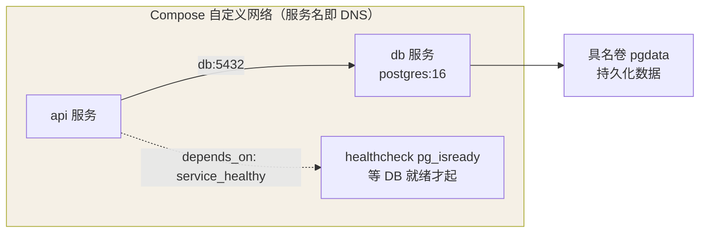

一个 `compose.yml` 描述多容器应用：服务、网络、卷、依赖顺序，一条命令拉起整套环境。

## 典型 compose.yml

```yaml
services:
  api:
    build: .
    ports:
      - "8080:3000"
    environment:
      DATABASE_URL: postgres://app:secret@db:5432/app
    depends_on:
      db:
        condition: service_healthy
    volumes:
      - ./.env:/app/.env:ro
    restart: unless-stopped

  db:
    image: postgres:16-alpine
    environment:
      POSTGRES_USER: app
      POSTGRES_PASSWORD: secret
      POSTGRES_DB: app
    volumes:
      - pgdata:/var/lib/postgresql/data
    healthcheck:
      test: ["CMD-SHELL", "pg_isready -U app"]
      interval: 5s
      retries: 5

volumes:
  pgdata:
```

## 关键点



- **服务名即 DNS 名**：`api` 通过 `db:5432` 直连（Compose 自动建好自定义网络）
- `depends_on` 只保证**启动顺序**；等依赖就绪要配合 `healthcheck` + `condition: service_healthy`
- `build: .` 与 `image:` 二选一或并用（build 产物打上 image 指定的 tag）
- 顶层 `volumes` 声明的具名卷由 Compose 统一管理，`down -v` 才会删
- 环境差异用 override 文件：`docker compose -f compose.yml -f compose.dev.yml up`

## 常用命令

| 命令 | 作用 |
|---|---|
| `docker compose up -d` | 后台拉起全部服务 |
| `docker compose ps` | 查看服务状态 |
| `docker compose logs -f api` | 跟踪某服务日志 |
| `docker compose exec api sh` | 进入服务容器 |
| `docker compose build --no-cache api` | 重建镜像 |
| `docker compose up -d --build api` | 代码更新后重建并滚动该服务 |
| `docker compose down` | 停止并删除容器与网络（`-v` 连卷删） |
| `docker compose config` | 校验并展开最终配置 |

## 版本字段说明

- `version` 字段在 Compose V2 已**废弃**，写了只会收到警告——新文件直接省略
- 旧资料里的 `docker-compose`（带横线）是 V1 Python 实现，现在统一用 `docker compose` 插件子命令

## 要点备忘

- Compose 面向**单机**编排；跨机器集群编排请直接上 Kubernetes / Swarm
- 项目隔离：默认以目录名为项目前缀（`ascension-api-1`），`-p` 可显式指定
- 敏感信息不要写进 yml，用 `.env` 文件或 secrets；`.env` 记得进 `.gitignore`
- 起不来先 `docker compose logs` + `docker compose ps` 定位是哪个服务挂了
