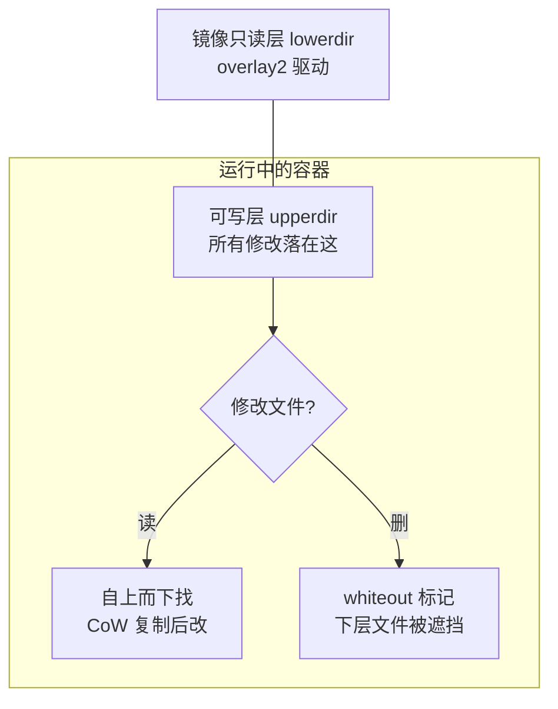
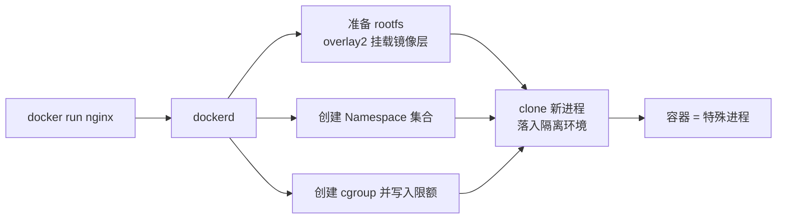

一句话：**容器 = 受 Namespace 隔离、受 Cgroups 限制、运行在 UnionFS 上的普通进程**。

## Namespace：隔离「看得见什么」

| Namespace | 隔离内容 | 容器效果 |
|---|---|---|
| `pid` | 进程编号 | 容器内进程从 PID 1 开始 |
| `net` | 网络栈（网卡/端口/路由表） | 独立 IP 与端口空间 |
| `mnt` | 挂载点 | 独立文件系统视图 |
| `uts` | 主机名 | 容器有自己的 hostname |
| `ipc` | 信号量/共享内存 | 进程间通信隔离 |
| `user` | UID/GID 映射 | 容器内 root ≠ 宿主 root |
| `cgroup` | cgroup 视图 | 容器只见自己的 cgroup |

```bash
# 容器本质演示：不装任何东西也能"手搓"一个隔离环境
unshare --pid --net --mount --uts --fork chroot $PWD/rootfs /bin/sh
```

## Cgroups：限制「能用多少」

控制 CPU、内存、IO、进程数等资源配额：

```bash
docker run --memory=512m --cpus=1.5 nginx
# 等价于向 cgroup 写入：
# /sys/fs/cgroup/<路径>/memory.max = 536870912
# /sys/fs/cgroup/<路径>/cpu.max = "150000 100000"
```

- `--memory` 超限时 OOM killer 直接杀进程（容器退出码 137）
- `--cpus=1.5` 表示最多 1.5 核（cgroup v2 的 `cpu.max` 带宽限制）

## UnionFS：决定「文件怎么叠」



- 主流驱动是 **overlay2**：`lowerdir`（镜像层）+ `upperdir`（可写层）+ `merged`（合并视图）
- 写时复制（CoW）：修改只读层文件时先复制到可写层再改，所以同一镜像起 N 个容器也不占 N 份磁盘
- 验证：`docker inspect web --format '{{json .GraphDriver.Data}}'` 可看到三层路径

## 三者如何协作



## 要点备忘

- 面试标准答案：容器共享宿主**内核**，虚拟机有独立内核——所以 Windows 容器跑不了 Linux 镜像
- 容器内 PID 1 需要正确转发信号并回收僵尸进程，否则 `docker stop` 超时被强杀；官方镜像多用 `tini` 或 `--init` 兜底
- `docker exec` 进容器看到的是**同一个**进程在宿主上的普通 PID：`ps aux | grep nginx` 能在宿主找到
- 安全提示：`--privileged` 等于放弃 Namespace 隔离，仅调试用
