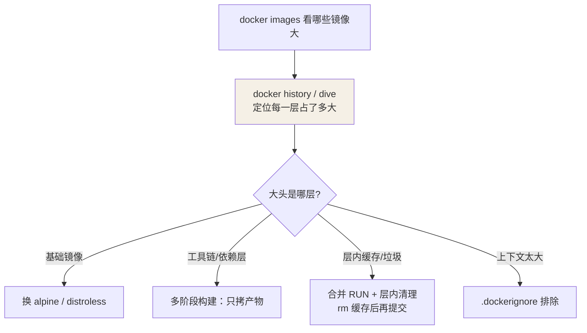

## 镜像瘦身

先从"分析"切入——**先定位体积大头，再对症下药**，而不是盲目套手段：



| 手段 | 效果 | 说明 |
|---|---|---|
| 换基础镜像 | 通常最大头 | `node:22`(1GB) → `node:22-alpine`(约150MB) |
| 多阶段构建 | 砍掉工具链 | 编译器/构建依赖不进最终镜像 |
| 合并 RUN + 清理缓存 | 消除层内垃圾 | 同一层安装后立即 `rm` 缓存 |
| `.dockerignore` | 减上下文/意外文件 | 排除 node_modules、.git、dist |
| distroless 镜像 | 无 shell 无包管理器 | 只含运行时，攻击面最小 |

```bash
docker images                            # 对比体积
docker history myapp:v1                  # 找出哪层最大
dive myapp:v1                            # 逐层分析（推荐工具）
```

## 安全基线

**1. 不以 root 运行**

```dockerfile
RUN addgroup -S app && adduser -S app -G app
USER app
```

**2. 密钥零硬编码**

- Dockerfile 里的 `ENV SECRET=...` 会永久留在镜像层里，`docker history` 可见
- 构建期敏感数据用 BuildKit secrets：`RUN --mount=type=secret,id=kvt cat /run/secrets/kvt`
- 运行期配置用 `-e`、卷挂载或编排平台的 secrets 机制注入

**3. 固定版本与摘要**

```dockerfile
# 松 -> 紧
FROM nginx              # ❌ latest 漂移
FROM nginx:1.27         # ✅ 版本固定
FROM nginx:1.27@sha256:abcd...   # ✅✅ 内容寻址，防仓库篡改
```

**4. 镜像扫描**

```bash
docker scout cves myapp:v1     # Docker 官方扫描
trivy image myapp:v1           # 常用第三方
```

CI 中把「高危漏洞阻断」做成流水线门禁。

## 供应链检查清单

- [ ] 基础镜像来自官方/可信仓库，pin 到 digest
- [ ] 依赖来自锁文件（`--frozen-lockfile`），可复现构建
- [ ] 镜像内无 secret（`docker history` + 扫描确认）
- [ ] `USER` 非 root，只开放必要端口
- [ ] 有 CI 扫描门禁，镜像有签名（cosign）更佳

## 要点备忘

- 优化的第一步永远是 `docker history` / `dive` 找出大头，再对症下药
- alpine 注意 musl libc 与 glibc 的兼容问题（少数 Python/Node 原生模块需重编译）
- 删除层内文件不会减小体积——文件仍在下层；必须回到产生它的那一层去清理
