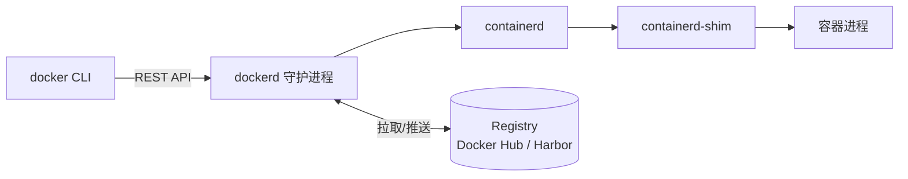
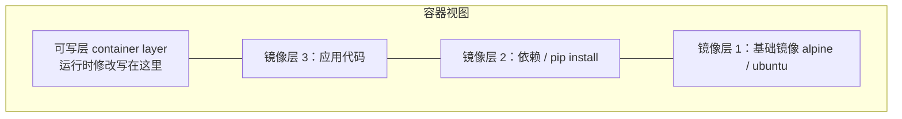
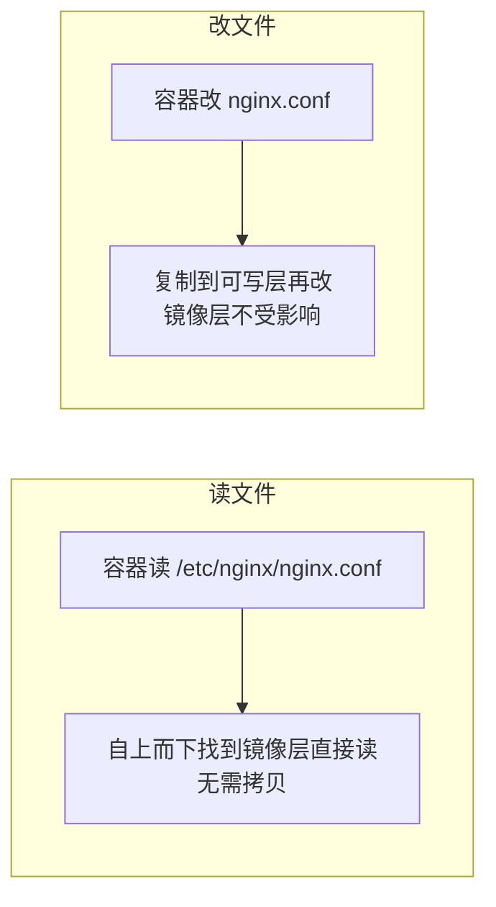
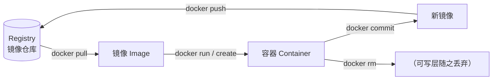

## 三大核心概念

| 概念 | 类比 | 说明 |
|---|---|---|
| 镜像 Image | 类 / 模板 | 只读的分层文件系统 + 配置，用于创建容器 |
| 容器 Container | 实例 | 镜像的运行时实例，可启停、可写（写时复制） |
| 仓库 Registry | 应用商店 | 存放镜像的地方，如 Docker Hub、Harbor |

核心关系：**拉取镜像 → 运行成容器 → 修改后可 commit 回镜像**。

## 容器 vs 虚拟机

| | 容器 | 虚拟机 |
|---|---|---|
| 隔离级别 | 进程级（共享宿主内核） | 硬件级（独立内核） |
| 启动速度 | 秒级 | 分钟级 |
| 体积 | MB 级 | GB 级 |
| 性能损耗 | 接近原生 | 虚拟化开销 |
| 隔离强度 | 较弱（内核共享） | 强 |

一句话：容器是**带隔离的进程**，不是轻量虚拟机。

## Docker 架构



- `docker` 命令只是客户端，实际干活的是 `dockerd`
- dockerd 调度 containerd，containerd 通过 shim 管理每个容器进程
- 镜像以**分层结构**存储，多镜像可共享底层只读层，节省磁盘

## 镜像分层模型



- 每个 Dockerfile 指令生成一层，层是只读的
- 容器启动时在顶部加一个**可写层**，删除文件只在可写层打标记（whiteout）
- 层可被多个镜像共享，这也是「镜像很大但拉取很快」的原因

### 写时复制：镜像和容器的分界

关键机制是 **CoW（Copy-on-Write）**——容器"读"还是读镜像层，只有"写"才
需要操作：



这就是"同一镜像起 10 个容器、改各自配置互不干扰、也不占 10 份磁盘"的原因
——**每个容器只多一份可写层**，镜像只存一份。

```bash
# 用命令亲眼验证分层与共享
docker history nginx            # 看每一层的构建记录与大小
docker image inspect nginx      # 分层信息；RoLayer/RootFS
```

## 仓促踩坑与最佳实践

**1. 忘结对 `--rm`，容器堆积**

一次性调试容器不 `--rm`，日积月累一堆 Exited 容器占空间：
`docker ps -a` 里的死容器记得清，`docker container prune` 可批量清理。

**2. 改镜像却看不到变化**

改了代码、build 出来的还是旧镜像，九成是**构建缓存**或**旧 tag 指向**：
```bash
docker build --no-cache -t myapp:v2 .   # 强制无缓存重建
docker tag myapp:v2 myapp:latest        # 明确打新 tag
```

**3. `latest` tag 是个坑**

`latest` 会被反复覆盖，线上没 pin 住某版本，回滚时不知道"上一个 latest"
是哪个。生产应固定 tag 或 digest，见镜像优化篇。

**4. 容器里看不到代码/日志**

排查先确认挂载对不对，别怀疑环境：
```bash
docker exec -it web sh             # 进容器看
docker logs --tail 100 web         # 看日志
docker inspect web --format '{{range .Mounts}}{{.Source}} -> {{.Destination}}{{"\n"}}{{end}}'
```

## 概念之间怎么流动：一句话讲清生命周期



> 主线就三件事：**拉取镜像 → 跑成容器 → 需要持久化的数据进数据卷**。
> 容器可写层随容器删除而消失，这决定了"数据必须放卷"的铁律。

## 要点备忘

- 镜像是静态定义，容器是动态运行；同一镜像可起任意多个容器。
- 分层 + CoW ：读共享镜像层，写复制到可写层——多容器不占多份镜像。
- 容器消亡时可写层随之丢弃——需要持久化的数据必须放**数据卷**。
- `docker history` / `docker image inspect` 是看懂分层的第一工具。
- Registry 中 `nginx:1.27` 里 `1.27` 是 tag，`nginx` 是仓库名；`latest` 别进生产。

## 延伸阅读

- [10 张图带你深入理解 Docker 容器和镜像（DockOne.io）](http://dockone.io/article/783)——分层与 CoW 的图解版，配本篇"镜像与容器"一节食用
