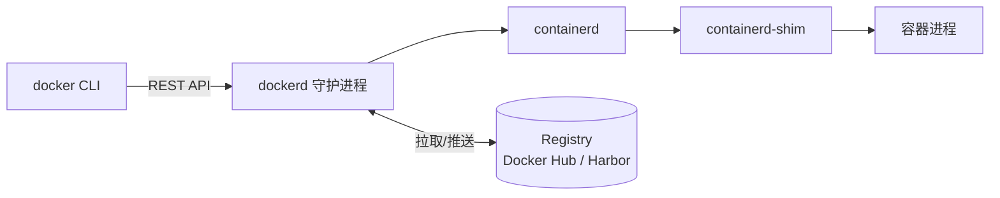
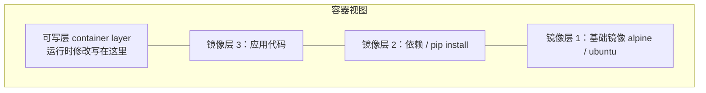

## 三大核心概念

| 概念 | 类比 | 说明 |
|---|---|---|
| 镜像 Image | 类 / 模板 | 只读的分层文件系统 + 配置，用于创建容器 |
| 容器 Container | 实例 | 镜像的运行时实例，可启停、可写（写时复制） |
| 仓库 Registry | 应用商店 | 存放镜像的地方，如 Docker Hub、Harbor |

核心关系：**拉取镜像 → 运行成容器 → 修改后可 commit 回镜像**。

## 容器 vs 虚拟机

| | 容器 | 虚拟机 |
|---|---|---|
| 隔离级别 | 进程级（共享宿主内核） | 硬件级（独立内核） |
| 启动速度 | 秒级 | 分钟级 |
| 体积 | MB 级 | GB 级 |
| 性能损耗 | 接近原生 | 虚拟化开销 |
| 隔离强度 | 较弱（内核共享） | 强 |

一句话：容器是**带隔离的进程**，不是轻量虚拟机。

## Docker 架构

- `docker` 命令只是客户端，实际干活的是 `dockerd`
- dockerd 调度 containerd，containerd 通过 shim 管理每个容器进程
- 镜像以**分层结构**存储，多镜像可共享底层只读层，节省磁盘

## 镜像分层模型

- 每个 Dockerfile 指令生成一层，层是只读的
- 容器启动时在顶部加一个**可写层**，删除文件只在可写层打标记（whiteout）
- 层可被多个镜像共享，这也是「镜像很大但拉取很快」的原因

## 要点备忘

- 镜像是静态定义，容器是动态运行；同一镜像可起任意多个容器
- 容器消亡时可写层随之丢弃——需要持久化的数据必须放**数据卷**
- Registry 中 `nginx:1.27` 里 `1.27` 是 tag，`nginx` 是仓库名
