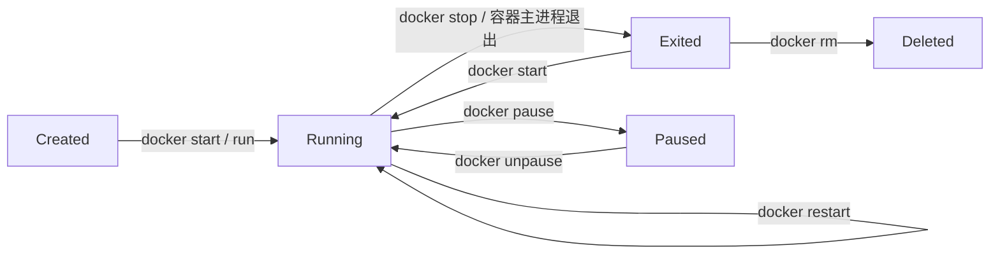
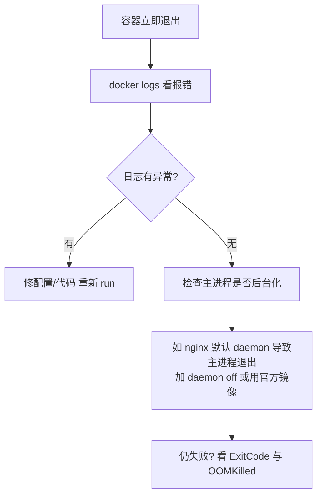

## 容器状态流转



- 容器的生死由**主进程**（PID 1）决定：主进程退出，容器即退出
- `docker stop` 先发 `SIGTERM`（默认等 10s），超时再发 `SIGKILL`；`docker kill` 直接 `SIGKILL`
- 让容器常驻：前台跑一个不退出的进程（如 `nginx -g "daemon off;"`、`tail -f /dev/null` 占位）

## 退出码排查

| 退出码 | 含义 | 常见原因 |
|---|---|---|
| 0 | 正常退出 | 主进程任务完成 |
| 1 | 应用错误 | 代码抛异常、配置错误 |
| 125 | dockerd 自身错误 | run 参数不合法 |
| 126 | 命令不可执行 | 权限不足 |
| 127 | 命令找不到 | 镜像里没装这个程序 |
| 137 | 被 SIGKILL | OOM 被杀或 `docker kill` |
| 143 | 被 SIGTERM | 正常 `docker stop` |

```bash
docker ps -a --filter "status=exited"   # 看退出容器
docker inspect web --format '{{.State.ExitCode}} {{.State.OOMKilled}}'
```

## 调试三板斧

**1. 看日志**——容器「闪退」时先看这里：

```bash
docker logs --tail 100 -t web
```

**2. 进容器**——确认文件、配置、网络是否如预期：

```bash
docker exec -it web sh          # 镜像若没有 bash 就用 sh
```

**3. 查元数据**——端口映射、挂载、环境变量、IP 一网打尽：

```bash
docker inspect web --format '{{json .NetworkSettings.Ports}}'
docker inspect web --format '{{range .Mounts}}{{.Source}} -> {{.Destination}}{{"\n"}}{{end}}'
```

## 容器起不来排查流程



## 要点备忘

- 容器退出不等于删除，`docker ps -a` 里的Exited 容器可以 `docker start` 复活（可写层数据还在）
- 需要查看已退出容器的文件：`docker cp web:/path .` 仍可用
- `docker run --rm` 适合一次性任务（跑完即删），别用于需要排查的服务容器
