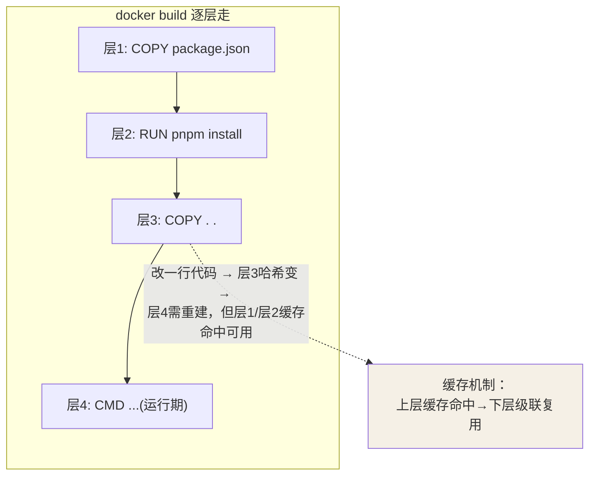
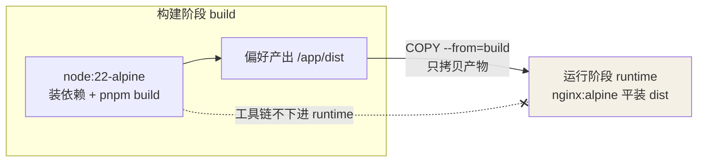

## 核心指令一览

| 指令 | 作用 | 示例 |
|---|---|---|
| `FROM` | 基础镜像（必须是第一条） | `FROM node:22-alpine` |
| `WORKDIR` | 设定工作目录 | `WORKDIR /app` |
| `COPY` | 拷贝文件进镜像 | `COPY package.json ./` |
| `RUN` | 构建期执行命令 | `RUN pnpm install --frozen-lockfile` |
| `ENV` | 环境变量 | `ENV NODE_ENV=production` |
| `ARG` | 构建期参数 | `ARG VERSION=1.0` |
| `EXPOSE` | 声明端口（仅文档作用） | `EXPOSE 3000` |
| `CMD` | 默认启动命令（可被覆盖） | `CMD ["node", "server.js"]` |
| `ENTRYPOINT` | 入口命令（不易覆盖） | `ENTRYPOINT ["nginx", "-g", "daemon off;"]` |

## 分层与缓存

每条指令生成一层，**docker build 从上到下逐层检查缓存：某层失效，其下所有层全部重建**：



所以**依赖层要放在代码层之前**：`package.json` 一变才触发重装依赖；光改业务
代码只重跑 COPY 之后的层，秒级构建。

```dockerfile
# ✅ 好：依赖层与代码层分离，改代码不触发重装依赖
COPY package.json pnpm-lock.yaml ./
RUN pnpm install --frozen-lockfile
COPY . .

# ❌ 坏：改任何一行代码都导致 pnpm install 重跑
COPY . .
RUN pnpm install
```

配合 `.dockerignore` 排除 `node_modules`、`.git`、`dist` 等，减少上下文传输并避免缓存污染。

## CMD vs ENTRYPOINT

| | CMD | ENTRYPOINT |
|---|---|---|
| 作用 | 默认参数/命令 | 固定入口 |
| `docker run img args` | args **替换** CMD | args **追加**给 ENTRYPOINT |
| 典型组合 | 提供 `ENTRYPOINT` 的默认参数 | 定义主命令 |

组合用法：`ENTRYPOINT ["java", "-jar", "app.jar"]` + `CMD ["--spring.profiles.active=prod"]`，运行时可只覆盖 profile。

## 多阶段构建

编译期工具链不进最终镜像，产物体积大幅缩小：



```dockerfile
# ---- 构建阶段 ----
FROM node:22-alpine AS build
WORKDIR /app
COPY . .
RUN pnpm install --frozen-lockfile && pnpm build

# ---- 运行阶段 ----
FROM nginx:alpine
COPY --from=build /app/dist /usr/share/nginx/html
```
要点：最终镜像**只含 nginx + 构建产物**，node 及其 dev 依赖全被丢弃——这就是
多阶段把镜像从"几百 MB"压到"几十 MB"的原理。

## 最佳实践

- 镜像选 `alpine` / `slim` 变体；`latest` tag 不进生产
- 合并 RUN 减少层数：`RUN apt-get update && apt-get install -y curl && rm -rf /var/lib/apt/lists/*`
- 同一层内安装后立即清理缓存，否则清理层无法缩小下层体积
- 不要把密码写进 Dockerfile / ENV，改用运行时注入（`-e` 或 secret 挂载）
- 非特权用户运行：`USER appuser`
- 尽量让构建可复现：锁文件 + 固定版本 tag + `--frozen-lockfile`

## 要点备忘

- `RUN` 是**构建期**，`CMD/ENTRYPOINT` 是**运行期**，面试高频
- `COPY` 与 `ADD`：优先 COPY；ADD 仅在需要自动解压 tar 或远程 URL 时使用
- `EXPOSE` 只是声明，真正生效靠 `docker run -p` 的映射
