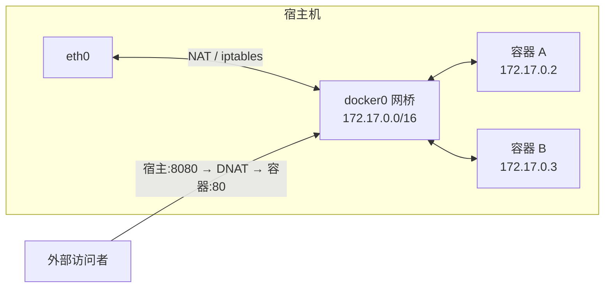

## 四种网络模式

```bash
docker run --network <mode> ...
```

| 模式 | 说明 | 场景 |
|---|---|---|
| `bridge`（默认） | 容器接到 `docker0` 虚拟网桥，NAT 上网 | 绝大多数情况 |
| `host` | 直接共用宿主网络栈，无隔离 | 追求性能、需要监听宿主端口 |
| `none` | 只有 loopback，完全断网 | 安全敏感的离线任务 |
| `container:<name>` | 共享另一容器的网络栈 | k8s Pod 的雏形、sidecar 模式 |

## bridge 模式工作原理



- 每个容器分到一个 bridge 网段内的 IP（`docker inspect` 可查）
- 容器访问外网走 SNAT；外部访问容器需 `-p` 发布端口（本质是 iptables DNAT 规则）
- 同一 bridge 网络内的容器可以直接通过**容器名**互访（内置 DNS），跨默认 bridge 不行

## 自定义网络（推荐）

```bash
docker network create app-net

docker run -d --name db --network app-net -e POSTGRES_PASSWORD=secret postgres
docker run -d --name api --network app-net -p 8080:3000 myapp
```

- 自定义 bridge 自带 DNS：`api` 里直接连 `db:5432`，IP 变了也不受影响
- 默认 `bridge` 网络**不支持**按名互访（只能用过时的 `--link`），所以服务互连一律用自定义网络
- `docker network connect app-net extra` 可让运行中容器再加一个网络

## 常用命令

```bash
docker network ls
docker network inspect app-net        # 看网段、网关、容器 IP
docker network create/rm app-net
docker network prune
```

容器内排查网络：`docker exec api ping db`、`wget -qO- db:5432`（镜像一般没 curl）。

## 要点备忘

- `-p 8080:80` 顺序是**宿主:容器**，别记反
- 容器间通信用容器名 + 自定义网络；不要硬编码容器 IP（重启会变）
- `host` 模式下 `-p` 失效（直接监听宿主端口），端口冲突风险自负
- `docker inspect <c> --format '{{.NetworkSettings.Networks}}'` 是查 IP 的正路
