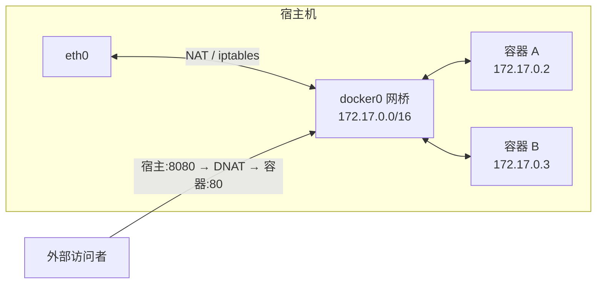
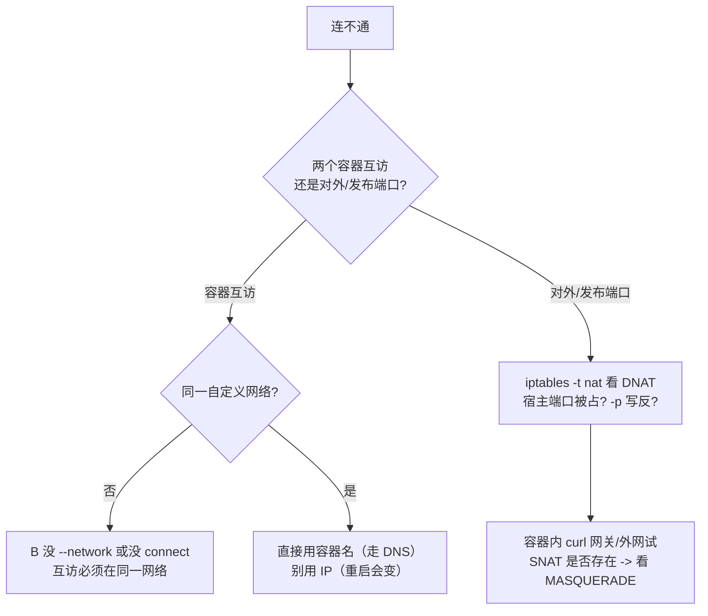

## 四种网络模式

```bash
docker run --network <mode> ...
```

| 模式 | 说明 | 场景 |
|---|---|---|
| `bridge`（默认） | 容器接到 `docker0` 虚拟网桥，NAT 上网 | 绝大多数情况 |
| `host` | 直接共用宿主网络栈，无隔离 | 追求性能、需要监听宿主端口 |
| `none` | 只有 loopback，完全断网 | 安全敏感的离线任务 |
| `container:<name>` | 共享另一容器的网络栈 | k8s Pod 的雏形、sidecar 模式 |

## bridge 模式工作原理



- 每个容器分到一个 bridge 网段内的 IP（`docker inspect` 可查）
- 容器访问外网走 SNAT；外部访问容器需 `-p` 发布端口（本质是 iptables DNAT 规则）
- 同一 bridge 网络内的容器可以直接通过**容器名**互访（内置 DNS），跨默认 bridge 不行

### 用命令验证 NAT 的三个环节

别只信概念，亲手看 iptables 在干什么：

```bash
# 容器出去（SNAT）：查 nat 表的 MASQUERADE/SNAT 规则
iptables -t nat -L -n | grep -i masquerade
# 容器进来（DNAT）：查 -p 发布端口生成的 DNAT 规则（宿主:端口 -> 容器:端口）
iptables -t nat -L DOCKER -n

# 容器 IP 与网关
docker inspect web --format '{{.NetworkSettings.Networks.bridge.IPAddress}}'
ip addr show docker0           # 看 docker0 网桥地址（172.17.0.1）
```

**验证思路**：容器内 `curl baidu.com` 成功但容器 IP 是内网 → 一定有
SNAT；外部 `curl 宿主:8080` 能到容器 → 一定有 DNAT。两条都在 `iptables -t
nat` 里。

## 自定义网络（推荐）

```bash
docker network create app-net

docker run -d --name db --network app-net -e POSTGRES_PASSWORD=secret postgres
docker run -d --name api --network app-net -p 8080:3000 myapp
```

- 自定义 bridge 自带 DNS：`api` 里直接连 `db:5432`，IP 变了也不受影响
- 默认 `bridge` 网络**不支持**按名互访（只能用过时的 `--link`），所以服务互连一律用自定义网络
- `docker network connect app-net extra` 可让运行中容器再加一个网络

## 网络排障清单：连不通时按层查

容器间或对外连不上，按"网络栈 → DNS → 端口/防火墙"顺序排查：



**五条高频现象与答案：**

| 现象 | 原因 | 处理 |
|---|---|---|
| A 容器 `ping db` 解析不到主机名 | 不在同一自定义网络 | 加入同一网络或用容器名 |
| 容器名通、IP 不通 | **重启后 IP 变了** | 一律用容器名，别写死 IP |
| `-p 8080:80` 外部访问失败 | iptables 未生效或宿主端口被占 | `ss -lntp | grep 8080` 查占用；重跑容器让 docker 重建规则 |
| `host` 模式 `-p` 无效 | host 直接监宿主端口，发布规则不适用 | 去掉 `-p`，直接访宿主端口 |
| 宿主机能 ping 网关、容器不通外网 | 容器 dns 或默认网桥 SNAT 被防火墙策略干扰 | 查 `iptables -t nat -L DOCKER` 与系统防火墙（firewalld/ufw）联动 |

## 常用命令

```bash
docker network ls
docker network inspect app-net        # 看网段、网关、容器 IP
docker network create/rm app-net
docker network prune
```

容器内排查网络：`docker exec api ping db`、`wget -qO- db:5432`（镜像一般没 curl）。

## 要点备忘

- `-p 8080:80` 顺序是**宿主:容器**，别记反；本质是 NAT 表里的 DNAT 规则。
- 容器间通信用容器名 + 自定义网络；不要硬编码容器 IP（重启会变）。
- `host` 模式下 `-p` 失效（直接监听宿主端口），端口冲突风险自负。
- 网络不通按"网络栈→DNS→端口/防火墙"分层查，别一上来怀疑代码。
- `docker inspect <c> --format '{{.NetworkSettings.Networks}}'` 是查 IP 的正路。
