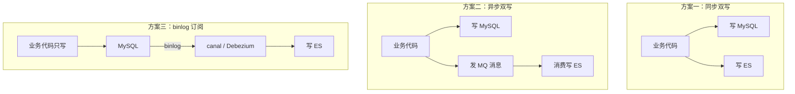

「有了 MySQL 为什么还要 ES」「两边数据怎么保持一致」——这是 ES 落地
必答的两连问，也是系统设计题里出现率最高的架构组合之一。答案分两层：
**先分工，再同步**。

## 分工：不是替代，是各管一段

| | MySQL | Elasticsearch |
| --- | --- | --- |
| 擅长 | 事务、强一致、复杂关联 | 全文检索、相关性排序、多维聚合 |
| 数据模型 | 关系表 + JOIN | 文档 + 倒排索引 |
| 一致性 | ACID | 近实时（refresh 1s）+ 最终一致 |
| 典型问题 | LIKE '%x%' 全表扫 | 不做事务主存储 |

记忆口径：**MySQL 是数据的「真源」（source of truth），ES 是查询加速
层**——所有写入以 MySQL 为准，ES 只是它的可搜索投影。判断要不要引入
ES 的标准也很直接：`LIKE '%关键词%'` 频繁到拖垮数据库、或需要按相关
性排序、或聚合维度爆炸——三者占其一再上 ES，不为技术时髦买单。

## 三种同步方案

| 方案 | 优点 | 代价与风险 |
| --- | --- | --- |
| 同步双写 | 实现直观、延迟最低 | 代码侵入大；两写不原子，一边失败就漂移；拖慢主流程 |
| 异步双写（MQ） | 解耦、削峰、失败可重投 | 毫秒~秒级延迟；消息丢失需兜底；要处理重复消费（幂等） |
| **binlog 订阅** | **业务零侵入**、不会漏写 | 部署 canal/Debezium 的运维成本；秒级延迟；要消费 DDL 变更 |

生产主流是 **binlog 订阅**：业务代码只关心 MySQL，ES 的增删改全部由
binlog 消费端驱动——「写 ES」这件事从业务代码里彻底消失，漏写、双写
不一致这类问题在机制上就不存在了。中间件团队的常见分工：canal 伪装成
MySQL 从库拉 binlog → 投 MQ → 同步服务消费写 ES。

## 一致性预期与兜底

同步链路无论选哪种，**都只能承诺最终一致**：MySQL 提交成功到 ES 可搜
之间有 refresh（1s）加链路的延迟。围绕这个预期设计两层兜底：

- **查询侧**：对强一致敏感的读（如「改完立刻回显」）直接读 MySQL；
  ES 只承接搜索/列表这类容忍秒级延迟的场景；
- **对账修复**：定时比对两边的数量与关键字段（按 update_time 增量
  对账），漂移的记录以 MySQL 为准重新写入 ES——对账是所有最终一致
  系统的最后防线，不是可选项。

删除是高频翻车点：只订阅 insert/update 会造成「MySQL 删了、ES 还
搜得到」——**delete 事件必须一并消费**，物理删除在 binlog 里同样有
记录；软删除（status 字段）则随 update 事件自然同步。

## 小结

- MySQL 是真源、ES 是可搜索投影：事务与关联归 MySQL，检索排序聚合
  归 ES，不为替代而共存。
- 同步三方案：同步双写直观但侵入且易漂移；MQ 异步解耦但要幂等；
  binlog 订阅业务零侵入，是生产主流。
- 一致性预期是最终一致（秒级）：强一致读回 MySQL，对账修复做最后
  防线，delete 事件必须一并订阅。

## 延伸阅读

- [Canal：MySQL binlog 增量订阅组件](https://github.com/alibaba/canal)
- [Elasticsearch 官方：与关系型数据库的概念对照](https://www.elastic.co/docs/manage-data/data-store/mapping)
- [Debezium：变更数据捕获](https://debezium.io/)
