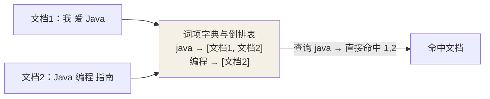

## 为什么要倒排

关系库用 B+ 树按行检索，"LIKE '%关键词%'" 必然全表扫描。ES 反其道而行，
**给"词"建索引**：记录"哪个词出现在哪些文档"——查词即得文档列表，O(1) 级。



## 建索引的三步：分词 → 规范 → 倒排

把一句 "I love Elasticsearch" 变成可检索的词项，过程是 **Analyzer**：

1. **字符过滤**：去 HTML 标签、转义。
2. **分词（Tokenizer）**：按规则切成词，如英文按空格、"爱"、"Java" 成词。
3. **词过滤（Token Filter）**：统一大小写、去停用词、**词干化**（runs/run）。

中文则依赖分词器（如 IK），把句子切成有意义的词。**查询词和索引词用同一个
分析器**才能匹配上——用错分词器是"搜不到"的高发原因。

## 文档级存储：采用与合并

- 文档写入后**不是立刻落盘可见**，先进内存缓冲，周期性 **refresh** 到
  segment 变成可检索（近实时）。
- **删除是伪删除**：打上删除标记，真正的摘除要等 **merge** 合并 segment
  时做——所以"删了"的文档在合并前仍占磁盘。
- 一次查询要跨**多个 segment** 搜，ES 会自动并行处理。

## 映射：类型声明

```json
{
  "mappings": {
    "properties": {
      "title": { "type": "text",  "analyzer": "ik_max_word" },
      "price": { "type": "double" },
      "tags":  { "type": "keyword" }
    }
  }
}
```

| 类型 | 用途 |
|---|---|
| `text` | 全文检索，会被**分词**，支持 `match` 模糊搜索 |
| `keyword` | 精确值/枚举/标签，**不分词**，适合 `term`、过滤、排序、聚合 |
| `date` / `numeric` | 范围查询、排序、桶聚合 |

**text 与 keyword 选错是最常见的坑**：想在详情里做全文用 text，想精确
过滤/排序/聚合用 keyword，对象线要分清楚。

## 一个全文匹配查询怎么走（深入）

把 `match` 从"能搜到"落到内部执行路径，才能真正理解"为什么这样分词、
为什么相关度是这么排的"。

**查询：`match title:"elasticsearch 实战"`**

```text
1. 分析查询串
   title 字段是 text → 查询串也用同一分析器处理
   "elasticsearch 实战" → 词项 [elasticsearch, 实战]

2. 逐词查倒排索引
   elasticsearch → [doc1, doc3, doc5]   （3 篇命中）
   实战          → [doc1, doc2]          （2 篇命中）

3. 并集 = 候选文档 [doc1, doc2, doc3, doc5]

4. 相关度打分排序（默认 BM25）
   doc1 两个词都命中且词频高 → 分最高，排第一
```

**关键收获：**

1. **查询词与索引词必须"分析后一致"才匹配**。若查询走的是英文小写分词、
   doc 里是中文 "elasticsearch"，匹配就落空——"搜不到"九成是分析器不一致。
2. **打分不是固化 SQL 的"命中即 1"**，而是 BM25 综合词频、逆文档频率、
   字段长度算出来——这就是"最相关在上"的来源。
3. 想**理解一条为何排序靠前**：看 `_explain` API 返回的得分拆解，而不是瞎猜。

```json
GET /products/_doc/doc1/_explain
{ "query": { "match": { "title": "elasticsearch" } } }
```

## 小结

- ES 靠倒排索引把"搜词"变成查字典，摆脱全表扫描。
- 分词链 = 过滤 → 分词 → 规范；查询与索引须用同一分析器。
- text 进全文检索、keyword 做精确/排序/聚合，映射别选错。