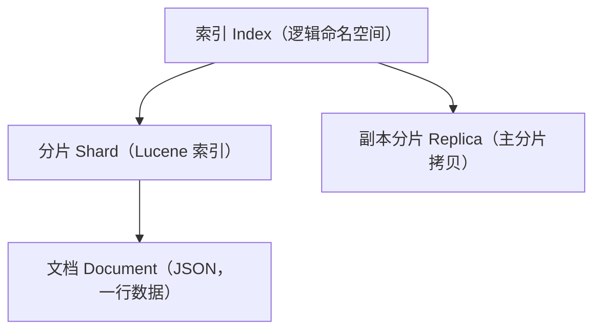

## 一层层拆开



| 概念 | 关系类比（近似） | 要点 |
|---|---|---|
| Index | ≈ 数据库/表 | 一个逻辑命名空间的文档集合 |
| Document | ≈ 一行记录 | JSON，`_id` 定位 |
| Shard | 真正存数据的 Lucene 分片 | **主分片数建索引时定死** |
| Replica | 主分片的副本 | 可动态调整，负责读与容灾 |

## 主分片：为什么建索引时定死

分片数决定数据如何**水平切分**：`_id` 经哈希路由到某个主分片。因此
**创建索引后 `number_of_shards` 不可改**（改了路由全对不上）。要做大得
**reindex** 到新索引。规划时按"数据量 / 单分片期望最大(如 30~50GB)"估，
既别一上来几百片（元数据爆炸、查询放大），也别少到不够扩容。

## 副本：读扩展与容灾

- **每个主分片 + N 个副本**，副本均匀分布在不同节点。
- **读**请求可以落在任何副本 → **加副本 = 横向扩展读**。
- 主分片挂了，副本晋升为主 → 高可用。副本多了写放大（一份写 N 次），
  没事别堆。

主分片扛**写**，主分片 + 副本扛**读与容错**——这就是 ES 的扩展模型。

## 写路径：协调节点与刷盘


- **协调节点**收到请求算出目标分片，转发给主分片所在节点。
- 写进内存 + **translog**（预写日志），崩了可重放；
  **refresh** 让数据近实时可搜（默认 1s）——这就是"近实时"而非严格实时的来源。

## 从写入到可搜索的完整路径（深入）

"近实时"不是一句话，是 **refresh / translog / flush / merge** 四件事在
Lucene 与 ES 分工下的结果。逐步放大一次写入：

```text
写入 doc
  → 进入内存 buffer + 同时写 translog（预写日志，可掉电重放）
  → refresh（默认 1s 一次）：
        buffer 内容变成一段新 segment（不可变文件），放进内存，可被检索
  → 此时 doc 可见 = “近实时”（最多差 1 refresh 周期）
  → 后台 flush：
        把内存 segment 刷到磁盘 + 清空 translog
  → merge：
        多个小 segment 后台合并成大 segment，删掉被标记删除的文档
```

**四个动作别混淆：**

| 动作 | 触发 | 作用 |
|---|---|---|
| refresh | 默认 1s | 让数据**可搜索**（内存→segment） |
| fsync/flush | 周期/手动 | 让数据**可持久**（segment→磁盘 + 清 translog） |
| translog | 每次写 | 崩溃后重放，**保证不丢**（消息可写先于可搜） |
| merge | 后台 | 合并 segment、物理摘除已删文档 |

**几个由此得出的实战点：**

1. **为什么 DELETE 后磁盘没立刻变小**：删除只是标记，真正释放要靠 merge。
   想立刻缩容 → 手动 `POST /index/_forcemerge`（会重写 segment，代价大）。
2. **为什么 ES 丢数据的窗口很小**：崩溃时内存 buffer 丢，但 translog 在，
   重启后重放——丢的是"buffer 里还未 fsync 的，但可由 translog 恢复"，
   所以**几乎不丢**（除非 translog 也丢）。
3. **想更快可见（更低延迟）可以调小 `refresh_interval`**，但别归 0（每次
   写入都 refresh，写放大剧增），需要再恢复默认。

## 小结

- 索引 → 分片（Lucene）→ 文档，主分片定死了要 reindex 才能改。
- 主分片扛写、加副本扛读与容灾；副本多了写放大。
- 写 = 协调节点路由 + translog + refresh，所以是"近实时"。