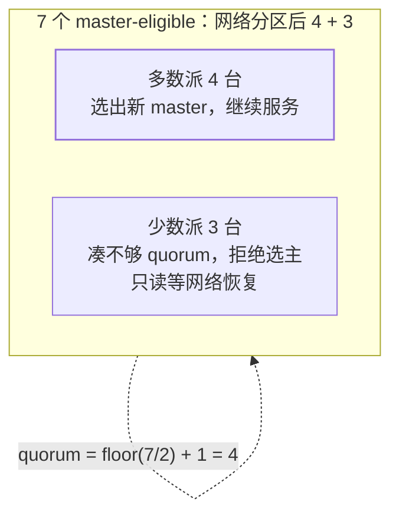

前面各篇都在讲"数据怎么存怎么查"，本篇讲**集群本身怎么活**：节点分工、
master 怎么选、脑裂怎么防——ES 集群运维与故障排查面试的三连问。

## 节点角色：谁管元数据，谁扛数据

| 角色 | 职责 | 面试一句话 |
| --- | --- | --- |
| master | 集群元数据（索引/分片分配）的**唯一决策者** | 管理员，不干数据搬运的活 |
| data | 承载分片，负责 CRUD 与聚合的执行 | 干活的 |
| ingest | 写入前的预处理管道（enrich/改字段） | 加工厂 |
| 协调节点（默认人人都是） | 接请求、scatter-gather 汇总 | 前台接待 |

- 所有请求发到任何节点都可以——它以协调节点身份把请求扇出到各分片再归并
  （Query DSL 篇的执行路径）。专职协调节点用于大集群隔离慢查询的影响。
- 生产建议：小集群角色混部即可；大集群把 master 专职化（3 个 dedicated）
  ——**master 挂了只是不能改元数据，读写照常**，这是"master 不干活"的价值。

## master 选举与 quorum

master 挂了（或集群启动无 master）时，具备 master 资格的节点（master-eligible）
投票选新主。防脑裂的核心是一道算术：

- **quorum（法定多数）**：只有拿到 `floor(N/2)+1` 票的分区能选出 master，
  另一个分区永远选不出来——两个分区内**至多一个**在当主，脑裂被结构性排除。
- 6.x 之前要手工配 `minimum_master_nodes`（配错就是脑裂事故的来源），
  **7.x 起自动按 eligible 数计算**，面试答"7.x 后 quorum 内建，老版本手配易错"。
- 这与 Raft 的多数派是同一思想（见分布式共识篇）——分布式系统的选主都在
  这一道坎上，换个系统换套名词而已。

## 集群健康三色：30 秒速答

- **green**：所有主分片 + 副本分片都就位。
- **yellow**：主分片全好，**有副本没分配**（常见：单节点集群放不下副本）——
  读写不受影响，但容灾能力缺了。
- **red**：**有主分片不可用**——对应索引的数据不完整，查询/写入该索引报错。

排障顺序：red → 先看哪个索引（`_cat/indices?health=red`）→ 哪个分片
（`_cat/shards`）→ 节点挂了还是磁盘水位超限（85%/90% 两档水位会停止分配）。

## 高频追问速答

- **为什么不让 master 干数据活？** 元数据变更（建索引/分片迁移）需要全局
  一致视图，被数据请求拖慢 = 整个集群的控制面抖动。
- **分片为什么建索引时定死？** 路由 `hash(doc) % 主分片数`——改主分片数
  等于全量重分布（分片篇讲过，这里补上集群视角：reindex 或 split 才能改）。
- **磁盘水位为什么有两个阈值？** 85% 低水位停止**分配新分片**，90% 高水位
  把本节点的分片**搬走**——两档分别对应"别再进来"和"请出去"。

## 小结

- 角色：master 管元数据不扛数据，data 干活，协调是人人自带的前台。
- 选主靠 quorum 结构性防脑裂：`floor(N/2)+1`，7.x 内建自动计算。
- 三色健康是排障入口：red 查丢的主分片，yellow 查没分配的副本。
