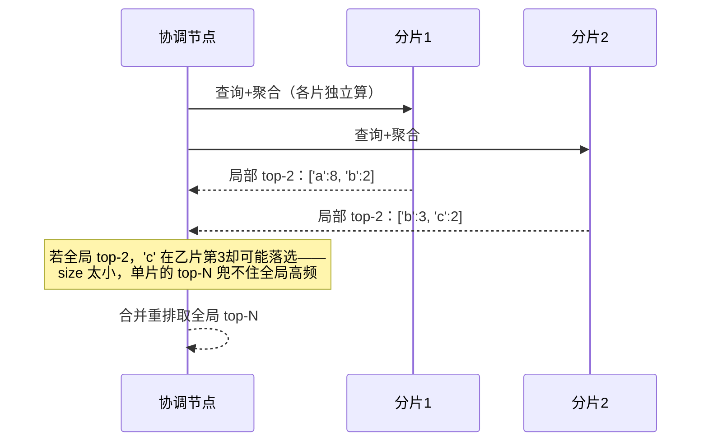

## 聚合 = 对"查询命中的文档"做统计

聚合在查询结果之上做分析，不改变返回的文档，而是附加 `aggregations` 结果。
三大家族各管一摊：

| 类型 | 干什么 | 例子 |
|---|---|---|
| **度量（Metric）** | 单值数值计算 | `avg`、`sum`、`min/max`、`cardinality` |
| **桶（Bucket）** | 把文档**分组** | `terms`、`date_histogram`、`range` |
| **管道（Pipeline）** | 对**聚合结果**再算 | `bucket_script`、`average_bucket` |

```json
{
  "aggs": {
    "by_status": {
      "terms": { "field": "status.keyword", "size": 10 },   // 桶：按状态分组
      "aggs": {
        "avg_price": { "avg": { "field": "price" } }         // 子聚合：每组均价
      }
    }
  }
}
```

## 三个高频聚合

**按类目统计**（terms 桶）：
```json
{ "aggs": { "by_cat": { "terms": { "field": "category.keyword" } } } }
```

**按时间分桶**（date_histogram，做时间趋势/埋点统计最常用）：
```json
{ "aggs": { "per_day": { "date_histogram": { "field": "@timestamp", "calendar_interval": "day" } } } }
```

**去重计数**（cardinality，统计独立用户/UV）：
```json
{ "aggs": { "uv": { "cardinality": { "field": "user_id" } } } }
```

## 聚合的关键前提：字段要 keyword

`terms` 桶对**`keyword` / text 的 `.keyword` 子字段**生效（精确值分组）；
对 `text` 原始字段做 terms 会得到"分词后的词项"而不是整值——先确认映射。
这也是把聚合逻辑建在对的字段上最省心的经验：**聚合字段一律 keyword**。

## 核心规律

- 聚合**建立在查询之上**：查询命中哪些文档，聚合就统计哪些（可加 `size:0`
  只要聚合结果不要列表）。
- 拿多个维度切分 → 用**嵌套桶**（桶里套桶）。
- 性能：大基数 terms 记得给 `size`；时间粗粒度比细粒度省资源。

## terms 桶的分桶与精确度（深入）

别把聚合当 SQL 的 `GROUP BY` 一样"绝对精确"。terms 桶实际跑在**每个分片**
上，结果要汇总，精确度取决于怎么取 top-N。

```text
terms 桶（size=N）
  ↓
每个分片独立算自己的 top-N 桶
  ↓
协调节点合并各分片 top-N → 重排 → 返回全局 top-N
```

把"合并会丢桶"画成图——这就是"近似 top-N"的由来：



**由此得到两个关键事实：**

1. **terms 默认是"近似 top-N"**：`size` 太小时，某些高频词如果没进单个分片
   的局部 top-N，就可能被合并结果丢掉——**想得到可靠的桶统计，`size` 要设
   够大**（官方建议"低估分片数×目标桶数"）。
2. **cardinality（去重计数）本身是近似值**（基数估算算法），大基数时误差
   在 1% 内、极省内存；要**精确**去重请用多值精确或写时维护。

**一个综合聚合：按商品看"每天的平均价 + 总量"（桶套桶 + 度量）**

```json
{
  "aggs": {
    "per_cat": {
      "terms": { "field": "category.keyword", "size": 50 },
      "aggs": {
        "per_day": {
          "date_histogram": { "field": "created_at", "calendar_interval": "day" },
          "aggs": {
            "avg_price": { "avg": { "field": "price" } }
          }
        }
      }
    }
  }
}
```

这段一眼看懂便已掌握聚合 = **桶(分组) → 坑(子分组) → 度量(算值)** 的
组合语言。

**排障：聚合结果"不对"先查三件事**

| 现象 | 原因 |
|---|---|
| 桶数量普遍被截断 | `size` 太小，近似 top-N 丢桶 |
| 聚合字段落在 text 上 | 得到的是分词词项而非整值 → 改用 `.keyword` |
| 同字段排序/聚合结果不符 | 该字段没建 `.keyword` 子字段，映射层就开始错了 |

## 小结

- 度量=算值、桶=分组、管道=对聚合结果再算。
- date_histogram 做时间统计、terms 做分组、cardinality 做 UV。
- 聚合字段用 keyword，聚合在查询结果之上做，子聚合实现多维度切分。