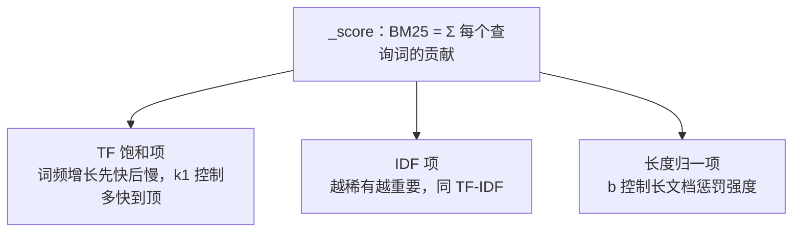

[倒排索引](/elasticsearch/basic/core/01-inverted-index/)篇留了一个尾巴：
命中的文档「按 BM25 打分排序」。这篇把 `_score` 拆开——它是全文检索
面试里最能拉开差距的一题：「ES 怎么决定哪条结果排第一？」

## 搜索的本质是排序，不是查询

SQL 的 `WHERE` 只回答「命中/不命中」，是布尔判断；全文检索回答的是
「**多匹配**」——`match` 查询「分布式系统」时，标题包含它的、正文提到
十次的、短文档里提到的，匹配强度都不一样。每个命中文档都会算出一个
`_score`，结果默认按它降序。**打分函数就是检索引擎的排序标准**。

ES 5.x 之前用 TF-IDF，之后默认换成了 BM25。理解 BM25 的最快路径是先看
TF-IDF 差在哪。

## TF-IDF：两个原型因子

TF-IDF = 词频 × 逆文档频率，两个直觉：

- **TF（词频）**：这个词在本文档出现得越多，越相关；
- **IDF（逆文档频率）**：这个词在全库越稀有，越有区分度——「的」出现
  一万次也不加分，「一致性哈希」出现一次就很说明问题。

但原始 TF 线性增长有两个偏差：

1. **无饱和**：一个词出现 100 次，得分是出现 10 次的 10 倍——实际上
   第 10 次之后的多余出现几乎不增加信息，线性算分会高估堆词的文档
   （关键词堆砌作弊）。
2. **无长度归一**：长文档天然词频高，会系统性压过短文档——一篇 1000 字
   的文档提到「缓存」10 次，未必比一篇 100 字提到 2 次的更相关。

## BM25：给两个因子各装一个调节阀

BM25（Best Matching 25）修正这两个偏差，打分由三个部件构成：



- **TF 饱和**：贡献随词频增长**先快后慢，趋于上限**——10 次之后再加到
  100 次，得分几乎不再涨。`k1`（默认 1.2）控制「多快到顶」：k1 越大，
  高词频还能多挣一点分。
- **IDF 保留**：稀有词权重大，逻辑与 TF-IDF 一致。
- **长度归一**：文档长度与全库平均长度的比值进入公式，`b`（默认 0.75）
  控制惩罚强度：b=0 关闭归一，b=1 完全按长度比例压分；0.75 是留了余地的
  经验值。

一句话记忆：**IDF 决定「什么词值钱」，TF 饱和决定「出现多少次够本」，
长度归一决定「长短文档是否公平」**。

参数什么时候动？绝大多数场景**不动**——默认值覆盖了大多数语料。真要调：
标题字段权重高，可以对 title 单独 `boost`；极端场景（代码搜索不在乎
长度）才去改 `b`。

## 高频追问

**为什么换掉 TF-IDF？** 就是因为上面两个偏差：BM25 的 TF 饱和天然抑制
关键词堆砌，长度归一消除长文档偏置。BM25 是 TF-IDF 的工程修正版，不是
推翻。

**filter 和 must 有什么区别（打分视角）？** `must` 参与打分，`filter`
**不算分且结果可缓存**——「查询谁该进前几名」用 must，只关心「进不进
集合」的条件（时间范围、状态）一律放 filter：省打分开销，还吃 filter
缓存的红利。

```json
{
  "query": {
    "bool": {
      "must":   [{ "match": { "title": "分布式事务" } }],
      "filter": [{ "term": { "status": "published" } }]
    }
  }
}
```

**能人为干预排序吗？** 能，三条路：字段级 `boost`（title 命中比正文值
钱）、`function_score`/`rank_feature`（按热度、时间衰减混合打分）、以及
业务层重排（把 _score 当特征之一）。纯算分解决不了「什么时候看」的问题，
生产搜索几乎都有二次重排。

**分数异常怎么排查？** 用 `_explain` API 看单个文档的分数构成——TF、
IDF、长度归一各贡献多少，分分钟定位「为什么这条排第一」。面试提到
`_explain` 是加分的实操信号。

## 小结

- 全文检索的本质是排序：`_score` 就是排序标准，match 默认按 BM25 打分。
- TF-IDF 的两个偏差是「TF 无饱和、无长度归一」，BM25 各装一个调节阀：
  k1 管饱和速度，b 管长度惩罚。
- IDF 决定什么词值钱；参数默认 k1=1.2、b=0.75，绝大多数场景不动。
- filter 不算分可缓存，纯条件过滤一律 filter；人为排序走 boost /
  function_score / 业务重排；排查分数用 `_explain`。

## 延伸阅读

- [Elasticsearch 官方：相关性介绍](https://www.elastic.co/guide/cn/elasticsearch/guide/current/scoring-theory.html)
- [Elasticsearch：BM25 相似度](https://www.elastic.co/docs/reference/elasticsearch/rest-apis/similarity)
- [Wikipedia：Okapi BM25](https://zh.wikipedia.org/wiki/Okapi_BM25)
