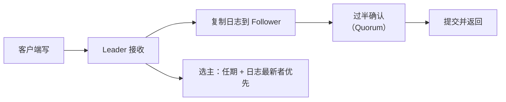

## etcd 是什么

etcd 是一个**分布式强一致键值存储**，是云原生生态的"协调中枢"：Kubernetes
用它存集群全量状态（Pod、Service、配置），CoreDNS、服务网格也大量依赖。它
和 ZooKeeper 定位相似，但共识算法不同——etcd 用 **Raft**。

## KV 存储模型

```text
etcdctl put /config/app/port 8080
etcdctl get /config/app/port
etcdctl get /config/app/ --prefix    # 前缀查询
```

| 特性 | 说明 |
|---|---|
| Key-Value | 层级 key + 小 value |
| MVCC 多版本 | 每次写保留历史版本 |
| Watch 监听 | 订阅 key 变化事件 |
| Lease 租约 | 带 TTL，过期自动删除 key |

## Raft 共识落地

etcd 是 Raft 协议最著名的生产实现之一：



- **Leader 选举**：只有 Leader 处理写，靠"任期（term）"区分领袖更替。
- **日志复制**：Leader 把写追加为日志，同步到多数派后提交。
- **Quorum 过半**：N 个节点容忍 (N-1)/2 个故障，需 2f+1 节点才容 f 个故障。

这与「分布式」方向上篇「Paxos 与 Raft」笔记互为正反两面：那里讲算法，
这里看一个真实系统如何实现。

## MVCC 与 Watch

- **MVCC**：每个 key 的写都带单调递增的版本号（revision），旧版本不立即删，
  可回溯历史、支持按版本读。
- **Watch**：客户端订阅前缀，key 变化时流式推送事件（PUT/DELETE）。K8s 的
  controller 正是靠 etcd Watch 实现的"声明式收敛"——状态一变就触发 reconcile。

## 与 ZooKeeper 对比

| 维度 | etcd | ZooKeeper |
|---|---|---|
| 共识算法 | Raft | ZAB |
| 数据模型 | KV + MVCC | 树形 znode |
| 语言 | Go | Java |
| 生态 | Kubernetes 核心 | Kafka/HBase/Dubbo |

## 小结

- etcd 是云原生基础设施，强一致 KV 存储，Kubernetes 的"真身数据库"。
- Raft：Leader 选举 + 日志复制 + 过半提交。
- MVCC 保证历史可溯，Watch 驱动声明式系统的状态收敛。

## 延伸阅读

- [etcd 官方文档](https://etcd.io/docs/)
- [Raft 论文中文讲解](https://raft.github.io/)