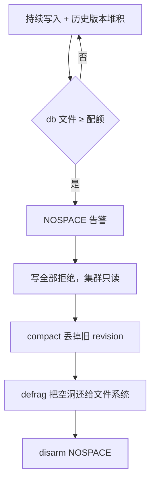

[Lease/Watch 篇](/etcd/basic/core/02-etcd-lease-txn-watch/)提到过
**Compaction 会让落后的 Watch 收到 `compacted`**——那是客户端视角。
本篇从运维视角把同一条机制讲完整：etcd 的磁盘为什么涨、涨满会怎样、
压缩和整理为什么是两步、备份从哪下手。

## 配额：默认 2GiB，满了就只读

etcd 用 `--quota-backend-bytes` 限制 **bbolt 后端文件**大小，默认
**2GiB**。超限后：

1. 触发 `NOSPACE` alarm；
2. **集群拒绝一切写**（包括 Lease KeepAlive 续租、txn、删除）——只留读；
3. 客户端看到 `etcdserver: mvcc: database space exceeded`。

K8s 现场几乎总是这条链：对象太多 + 历史版本没压 → db 顶到配额 →
API Server 写失败 → 整个控制面假死。**不是磁盘真的没空间**，是 etcd
自己的配额闸。



生产把配额调到 4~8GiB 很常见，但**调大只是推迟爆炸**——不配自动压缩，
8GiB 一样会满。etcd 官方也不建议无上限：后端越大，一次 defrag / 一次
snapshot 恢复越慢，故障 RTO 跟着涨。

## Compaction 与 Defrag：两步各干什么

MVCC 每次写都留历史 revision。压缩只删**逻辑版本**，不收缩文件：

| 动作 | 命令 | 做了什么 | 没做什么 |
|---|---|---|---|
| **Compact** | `etcdctl compact $rev` | 丢掉小于 `$rev` 的历史版本，Watch 不能再从更旧位点续 | db 文件体积几乎不变（页变空洞） |
| **Defrag** | `etcdctl defrag` | 把 bbolt 里的空洞页重写，文件真正变小 | 不删历史；必须在 compact 之后才有空间可收 |
| **自动压缩** | `--auto-compaction-retention=1h`（或 revision 模式） | 周期性 compact，生产必开 | 仍然要定期 defrag，尤其是写入密集集群 |

常见误操作：只 compact 不 defrag，监控里 `os` 磁盘占用纹丝不动，于是
误判"压缩没生效"。看对指标：

- `etcd_mvcc_db_total_size_in_use_in_bytes`：逻辑占用（compact 后下降）；
- `etcd_mvcc_db_total_size_in_bytes`：文件实际大小（defrag 后才下降）。

defrag **会阻塞该成员**一段时间（大 db 可达数分钟），生产应对
**follower 逐台**做，不要打 Leader。三台同时 defrag 等于人为制造
多数派丢失。

## 解除 NOSPACE 的标准顺序

```bash
# 1. 看当前 revision 与 db 大小
etcdctl endpoint status -w table --cluster

# 2. 压到「现在」之前（留一点给还活着的 watcher）
rev=$(etcdctl endpoint status --write-out json | jq '.[0].Status.header.revision')
etcdctl compact $rev

# 3. 逐台整理（先 follower）
etcdctl defrag --endpoints=<follower>
# Leader 最后，或先 transfer-leadership 再整理原 Leader

# 4. 解除告警，写路径才恢复
etcdctl alarm disarm
```

只 disarm 不 compact：下一笔写立刻再次 NOSPACE。只 compact 不 defrag：
文件仍顶着配额，同样立刻再炸。

## 快照：备份的最小闭环

etcd 的备份单位是 **snapshot**，不是把数据目录 `cp` 走（运行中拷目录
会拷到半截 bbolt 事务）：

```bash
etcdctl snapshot save /backup/etcd-$(date +%F).db
etcdutl snapshot status /backup/etcd-....db   # 校验 hash / revision / key 数
```

- K8s 场景：**独立于节点磁盘**的定时 snapshot（对象存储 / 另一块盘），
  保留点要覆盖「误删资源被发现」的窗口。
- 恢复是**新集群加载 snapshot 再改 member 列表**，不是把文件丢回旧
  数据目录期望它自己好。
- snapshot 体积 ≈ 压缩后的逻辑数据；长期不 compact 的集群，备份文件
  会大到拷不完——备份失败往往是配额问题的前兆。

## 认证不是空间问题，但同属生产闸门

etcd v3 的 RBAC（`user` / `role` / `auth enable`）一旦打开，没有 root
等价凭证就**连 compact / defrag / snapshot 都做不了**。K8s 的 etcd
通常在安装时就启用了 peer/client TLS + 认证，运维脚本必须走同一套
证书，而不是默认的 `etcdctl` 无认证端口——这是「集群满了却解不了」
的第二现场。

## 小结

- 默认 2GiB 配额打满 → `NOSPACE` → 只读；调大配额不能替代自动压缩。
- Compact 删历史、Defrag 收文件，两步缺一；defrag 逐 follower、避开 Leader。
- 备份用 `snapshot save`，恢复走新集群；认证开启后运维命令与业务读写
  走同一套凭证。

## 延伸阅读

- [etcd 运维指南：维护与备份](https://etcd.io/docs/latest/op-guide/maintenance/)
- [etcd 空间配额与告警](https://etcd.io/docs/latest/op-guide/maintenance/#space-quota)
- [Watch 撞 compacted 的客户端处置](/etcd/basic/core/02-etcd-lease-txn-watch/)
