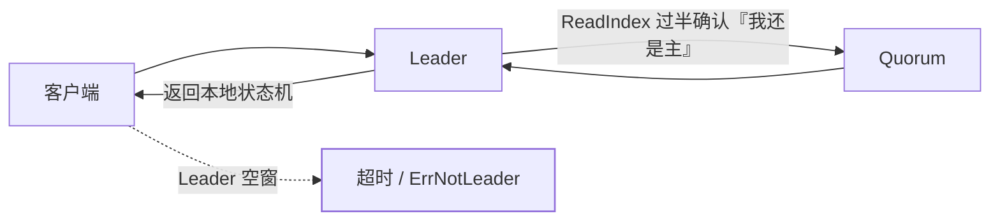

[核心机制](/etcd/basic/core/01-etcd-core/)说清了「只有 Leader 处理写、
过半提交」。[一致性读](/etcd/basic/core/02-etcd-lease-txn-watch/)把
linearizable / serializable 当成配置选项讲过。本篇回答生产追问：
**Leader 一抖，客户端到底会看到什么，以及为什么「读也挂了」。**

## 选举窗口：写停、线性读也停

Leader 失联后，Follower 在 election timeout（通常数百毫秒到 1s 量级，
由 `heartbeat-interval` × 选举倍数决定）后发起投票。新 Leader 产生
之前：

| 请求 | 选举窗口内 | 原因 |
|---|---|---|
| 写 / txn / Lease 续租 | **失败** | 没有 Leader 就没有 Raft 提案 |
| linearizable 读（默认） | **失败** | 要向当前 Leader 做 ReadIndex，确认自己仍持有领导权 |
| serializable 读 | **仍可用** | 直接读本机状态机，不经过 Leader |
| 已建立的 Watch | 短暂中断后由客户端重连到新 Leader 续传 | 位点是 revision，不是连接 |

所以「etcd 不是只写走 Leader 吗，读为什么也超时？」——**默认读是
线性的**，线性读必须证明「我读到的是集群已提交的最新值」。证明方法
是 ReadIndex：Leader 先把一条只读确认复制到多数派（或基于 Lease 确认
自己还是 Leader），再返回本地读。Leader 空窗里这个证明做不出来。

K8s API Server 对 etcd 的 List 多数可以接受短暂过期，但对租约、
EndPoint 更新这类写 + 线性读非常敏感——**控制面 RT 毛刺经常就是一次
Leader 选举**，不是磁盘坏了。

## 客户端该怎么活过这次切换

etcd 官方 Go 客户端（K8s 也走这条）的要点：

- **多 endpoint**：`https://etcd-0:2379,etcd-1:2379,etcd-2:2379`，
  内部 gRPC balancer 会把连接切到还活着的成员。只配一台 Leader
  地址，切换后客户端会硬死到超时。
- **自动同步**：客户端定期向成员问「集群现在有谁」（`Sync`），
  成员列表变化后更新 balancer。这要求**至少能连上一台还活着的
  成员**——三台全写死 Leader DNS 的话，同步也没入口。
- **超时大于选举时间**：`dial-timeout` / 请求 timeout 若小于一次
  选举，客户端会把「正在选主」误判成「etcd 挂了」并疯狂重试，
  反而把新 Leader 打满。经验：请求超时 ≥ 2~3 倍 election timeout。
- 可重试错误：`ErrNotLeader`、`ErrStopped`、gRPC `Unavailable` 应
  退避重试；`ErrCompacted` 不能重试原 revision（见 Watch 篇）。

写路径在切换后由新 Leader 继续：已提交的日志不会丢（Raft 过半持久化），
**客户端没收到成功响应的那一笔要按幂等重试**——Lease 续租、txn 的
Compare 正好能扛这种重试。

## Learner：扩容时不要让它投票

etcd 3.4+ 的 **Raft Learner** 只复制日志、**不进入 quorum**。正确
扩容顺序是：加 Learner → 追上日志 → 提升为投票成员。直接加投票成员
会立刻改变 quorum 分母：原先 3 节点容忍 1 挂，变成 4 节点仍只容忍 1
挂，且新节点日志落后时写延迟被它拖死。

| 角色 | 投票 | 服务读 | 用途 |
|---|---|---|---|
| Voter | 是 | 是 | 构成 quorum，2f+1 |
| Learner | **否** | 可以（serializable） | 安全加节点、异地只读副本 |

Learner 不能当 Leader，客户端若把 Learner 当唯一 endpoint，线性读和
写都会被转发或失败。成员列表里要能区分。

## 切换本身从哪来

生产里 Leader 切换不全是宕机：

- 磁盘抖动让心跳发不出去（etcd 对 fsync 延迟极度敏感，**机械盘 / 满
  载的共享盘**是选主抖动元凶）；
- 人为 `move-leader`（defrag、滚动升级前主动把 Leader 迁走，属于健康
  切换）；
- 网络分区：少数派原 Leader 会步进任期试图连任，多数派选出新主后，
  旧 Leader 的写会被拒——这是 Raft 的 fencing，不是脑裂双写。

排查先看 `etcd_server_leader_changes_seen_total` 和 WAL fsync 的
P99，而不是先怀疑 Raft 实现。

## 小结

- Leader 空窗：写失败，**默认线性读也失败**；serializable 读和本机
  Watch 位点才能扛过去。
- 客户端要配全体 endpoint、超时覆盖选举、对 `ErrNotLeader` 幂等重试。
- 加节点先 Learner 再提升；切换抖动优先查磁盘 fsync，不是先改选举超时。

## 延伸阅读

- [etcd 官方：线性读与 ReadIndex](https://etcd.io/docs/latest/learning/design-client/)
- [etcd Raft 运行时与 Learner](https://etcd.io/docs/latest/learning/design-learner/)
- [一致性读选项（basic）](/etcd/basic/core/02-etcd-lease-txn-watch/)
