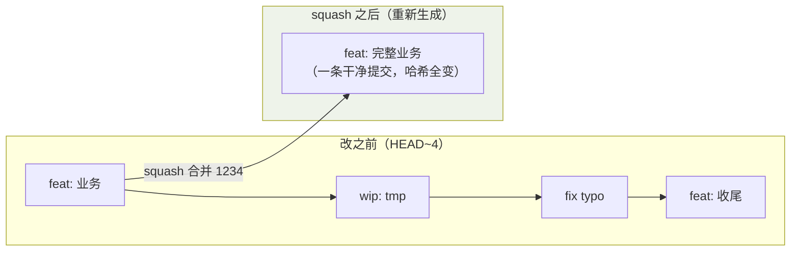
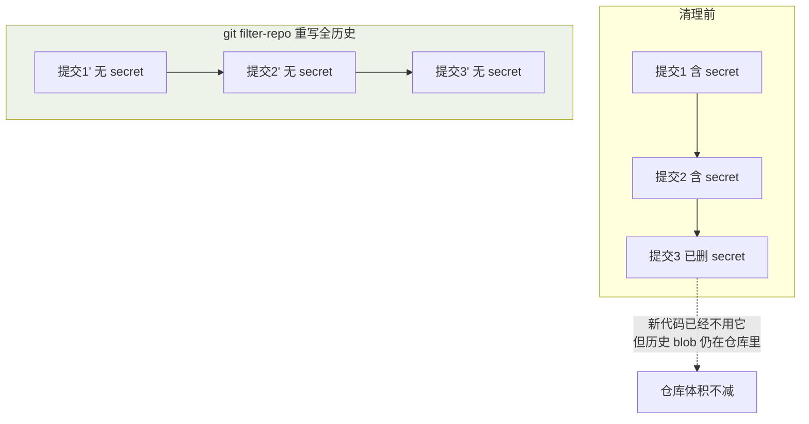

## 前提：什么时候可以改历史

改历史的本质是**用新的哈希重造一批提交**。规则只有一条：

> **只改还没推送到公共分支的提交。** 已推送的历史属于团队，改它的唯一公共安全方式是 revert。

## 修补最近一次提交

```bash
git commit --amend                          # 改提交说明
git commit --amend --no-edit                # 追加漏掉的文件后保留原说明
git add forgotten.txt && git commit --amend --no-edit
```

## 交互式 rebase：整理最近 N 个提交

```bash
git rebase -i HEAD~4
```

编辑器中每行一个提交（从旧到新），左侧动作可改：

| 动作 | 含义 |
|---|---|
| `pick` | 保留原样 |
| `reword` | 保留提交但改说明 |
| `squash` / `fixup` | 合并进上一条提交（fixup 丢弃说明） |
| `drop` | 丢弃该提交 |
| 调整行顺序 | 按新顺序重放提交 |

典型用途：把「wip」「fix typo」的小提交压成一个干净的 feature 提交，再发 PR。

看懂 rebase 到底在干嘛——它**不是"修改"旧提交，而是按新指令重放出一批全新
提交**（哈希全变）：



**这就是"改历史只适用于未推送提交"的原因**：`rebase -i` 之后这 4 条的
哈希全部改变，如果已 push，别人的分支还挂在旧哈希上，两边就对不上了。

## 重放时的冲突

rebase 是逐个提交重放，冲突会按提交依次出现。每次解决后：

```bash
git add <file>
git rebase --continue
```

彻底反悔：`git rebase --abort`，一切回到 rebase 之前。

## 清理历史中的大文件与密钥

文件一旦提交，即使后来删掉，历史里仍占空间；密钥一旦推送，立即作废轮换。清理工具：

```bash
# git-filter-repo（官方推荐，替代 filter-branch）
git filter-repo --path secrets.json --invert-paths   # 从全部历史中删除该文件
git filter-repo --strip-blobs-bigger-than 50M        # 删除所有大 blob
```

filter-repo 的威力在于**把文件从每一层历史中物理剥离**，而不只是删掉最后一次：



> 注意：改写全部历史后所有提交哈希变化，需要 force push（`--force-with-lease`）并通知所有协作者重新克隆。

## 要点备忘

- 改历史前先 `git branch backup` 留个后路，改完满意再删
- PR 评审过程中优先追加新提交，保留评审轨迹；rebase 整理放在合并前做
- 预防大于清理：`.gitignore` + 提交前 `git status` 检查，别让大文件和密钥进历史
