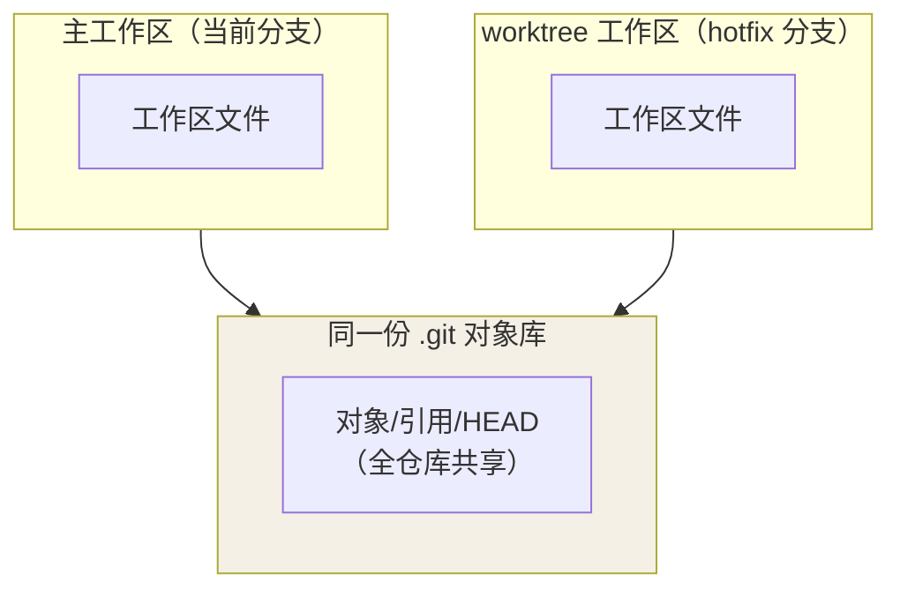

## bisect：二分法定位 bug

面对「不知道哪个提交引入的 bug」，Git 自动二分历史，几步锁定元凶：

```bash
git bisect start
git bisect bad                    # 当前版本有问题
git bisect good v1.2.0            # 这个版本没问题
# Git 切到中间提交 → 测试 → 标记 good 或 bad → 重复
git bisect reset                  # 结束，回到原分支
```

配合脚本可以全自动：`git bisect run make test`。

## worktree：一个仓库多个工作目录

同时开两个分支干活（比如一边修 hotfix 一边继续 feature），不用 clone 第二份：

```bash
git worktree add ../hotfix-dir hotfix
cd ../hotfix-dir     # 独立目录，与主仓库共享同一份 .git 对象
git worktree list
git worktree remove ../hotfix-dir
```

多个工作目录**共享同一份 `.git` 对象**、各有一个独立的工作区文件——这是
它比 clone 省空间的关键：



## submodule：仓库嵌套仓库

主仓库记录子仓库的某个 commit 指针。能用普通依赖就用普通依赖，确需子模块时：

```bash
git submodule add <url> libs/xxx
git clone --recurse-submodules <url>              # 克隆时带上子模块
git submodule update --init --recursive           # 已克隆的补拉子模块
```

## hooks：提交前自动化

`.git/hooks/` 下的脚本在特定时点自动执行，团队实践通常配合 husky / pre-commit 框架管理：

| Hook | 触发时机 | 典型用途 |
|---|---|---|
| `pre-commit` | commit 前 | 格式检查、lint、禁止提交大文件 |
| `commit-msg` | 校验提交说明 | 强制 Conventional Commits 格式 |
| `pre-push` | push 前 | 跑测试 |

## Git LFS：大文件不进主仓库

模型、视频、设计稿等大文件改存指针，仓库不再膨胀：

```bash
git lfs install
git lfs track "*.psd" "*.bin"     # 写入 .gitattributes
git add .gitattributes && git commit -m "chore: track lfs files"
```

## 仓库维护

```bash
git gc                            # 压缩松散对象
git clean -nd                     # 预览将被删除的未跟踪文件（-n 先看）
git clean -fd                     # 真正删除
git branch -d $(git branch --merged)   # 批量清理已合并分支
git archive --format=zip -o out.zip HEAD   # 导出干净源码包
```

## 要点备忘

- `git clean` 先 `-n` 预览再 `-f` 执行，未跟踪文件删了不可恢复
- worktree 的分支不能同时被两个目录 checkout
- hooks 不随仓库同步——团队级自动化要走 husky / pre-commit 这类随仓库管理的方案
