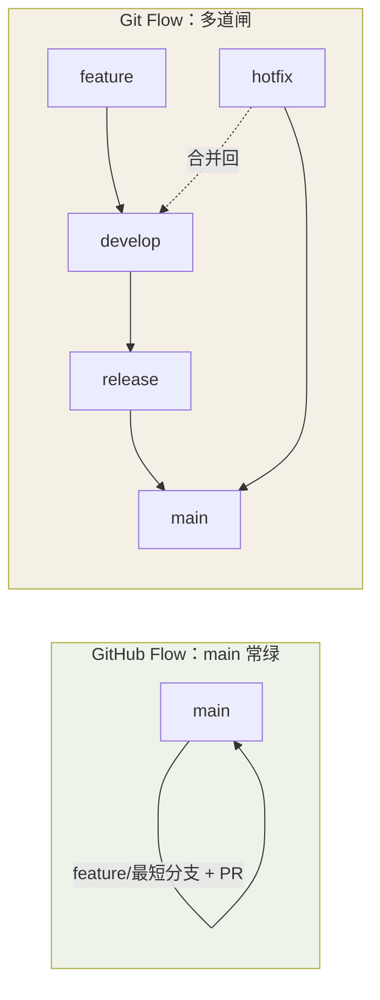

## 提交信息：Conventional Commits

格式：`<type>(<scope>): <subject>`

```text
feat(login): 支持手机号验证码登录
fix(cart): 修复金额为 0 时无法结算的问题
docs: 更新 README 部署说明
refactor(api): 抽取请求拦截器公共逻辑
test(user): 补充登录过期用例
chore: 升级 webpack 到 5.x
```

常用类型：

| type | 用途 |
|---|---|
| `feat` | 新功能 |
| `fix` | 缺陷修复 |
| `docs` | 仅文档 |
| `style` | 格式调整（不影响逻辑） |
| `refactor` | 重构（非新功能、非修 bug） |
| `perf` | 性能优化 |
| `test` | 测试相关 |
| `chore` | 构建、依赖、杂务 |

好处：可自动生成 changelog、可按类型过滤、检索快；配合 `commit-msg` hook 可强制校验。

## 分支模型选型

| 模型 | 分支 | 适用 |
|---|---|---|
| GitHub Flow | main 常绿 + 短命 feature 分支 + PR | 持续部署的 Web 产品（大多数团队够用） |
| Git Flow | main / develop / release / hotfix / feature | 有版本发布周期的客户端、嵌入式 |

两种模型的生命线差异，画成图一眼看清**谁更扁平、谁更多道闸**：



**一条给团队的主心骨**：小团队用 GitHub Flow 滚 main + PR 就行；当真需要
"打 tag 发版 + hotfix 快修"时，再在 GitHub Flow 上加一个 release 分支即可，
不必上家人的 Git Flow 全家桶。从简是趋势。

## 高频踩坑清单

**1. 对公共分支 force push**
同事的工作会被覆盖。必须强推时永远用 `--force-with-lease`。

**2. CRLF 换行符污染**
Windows/macOS/Linux 换行符不同，导致「没改文件却全是 diff」。团队统一 `core.autocrlf`，或加 `.gitattributes`：`* text=auto`。

**3. 提交了大文件 / 密钥**
密钥一旦推送立即作废轮换；大文件即使删掉历史里仍占空间。预防：`.gitignore` + 提交前 `git status`；清理用 `git filter-repo`（见历史改写篇）。

**4. detached HEAD 上干活**
checkout 到历史提交后开发，提交会悬空被回收。确认状态靠 `git status`；补救用 `git switch -c rescue`。

**5. reset --hard 当万能撤销**
未提交的修改一旦被清掉就真没了。改前先 `git stash` 保平安。

## 团队规范清单

- main 分支受保护：禁止直接 push，只接受 PR 合并
- 提交前跑 lint + format（pre-commit hook 自动化）
- PR 保持小而聚焦：单 PR 单主题，几百行以内评审质量最高
- 分支命名：`feature/xxx`、`fix/xxx`、`hotfix/xxx`，用小写中划线

## 要点备忘

- 规范的价值不在条文而在自动化——hook 能查的不要靠自觉
- 一条心法：不确定的时候，先 `git status` 看清自己在哪、再 `git reflog` 想想从哪来。Git 里几乎每一步都有回头路——除了对已经推送的公共历史动刀
