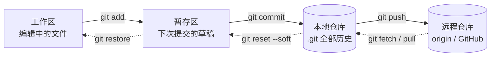

## 三个正确的模型

理解 Git 的关键不是背命令，而是先建立三个模型：

**1. 分布式，而非集中式**

SVN 等集中式系统只有一个中央仓库，断网即瘫痪。Git 每次克隆都得到一个**完整仓库**——包含全部历史。本地就能提交、分支、合并，网络只在同步时需要。所谓「中央仓库」只是大家约定同步的那一份，不是架构上的必需品。

**2. 快照，而非差异**

很多工具存「每个版本相对上一版的差异」，Git 存的是**整个项目的快照**。提交时未变化的文件以指针复用，变化的文件生成新对象。查看任意历史版本都是 O(1) 操作，切分支、看 log 都极快。

**3. 四个区域**



| 区域 | 位置 | 作用 |
|---|---|---|
| 工作区 | 当前目录的文件 | 你正在编辑的内容 |
| 暂存区（staging / index） | `.git/index` | 下一次提交的「草稿清单」，可精细控制提交内容 |
| 本地仓库 | `.git/objects` | 已提交的历史快照 |
| 远程仓库 | `origin`（GitHub 等） | 团队共享的同步节点 |

## 对象模型

Git 底层只有四种对象，全部以**内容哈希**（SHA-1，新版本支持 SHA-256）命名——内容不变，哈希不变，天然防篡改：

| 对象 | 存什么 | 类比 |
|---|---|---|
| `blob` | 文件内容（不含文件名） | 一块原料 |
| `tree` | 目录结构：名字 → blob/tree 的映射 | 一张装箱单 |
| `commit` | 某棵 tree + 父提交 + 作者/时间/说明 | 一次存档记录 |
| `tag` | 附注标签，指向某个 commit | 书签 |

## 分支只是指针

- **分支**就是一个 40 字节文件，内容是它指向的 commit 哈希，所以建分支几乎零成本
- **HEAD** 指向当前分支；`git checkout <commit>` 会进入「分离 HEAD」状态
- **reflog** 记录 HEAD 每次移动，即使「删掉」了分支，90 天内都能靠它找回

```bash
# 查看底层对象
git cat-file -p HEAD              # 查看当前 commit 内容
git log --oneline --graph --all   # 最常用的看历史姿势
git reflog                        # 找回"丢失"的提交
```

## 要点备忘

- 只要提交过，数据就很难真正丢失——reflog 是最后的救命稻草
- 暂存区的价值在于**把一次改动拆成多次提交**（`git add -p` 逐块挑选）
- `.git` 目录就是完整的仓库本身，复制它等于备份了全部历史
