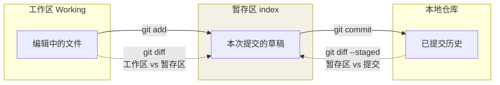
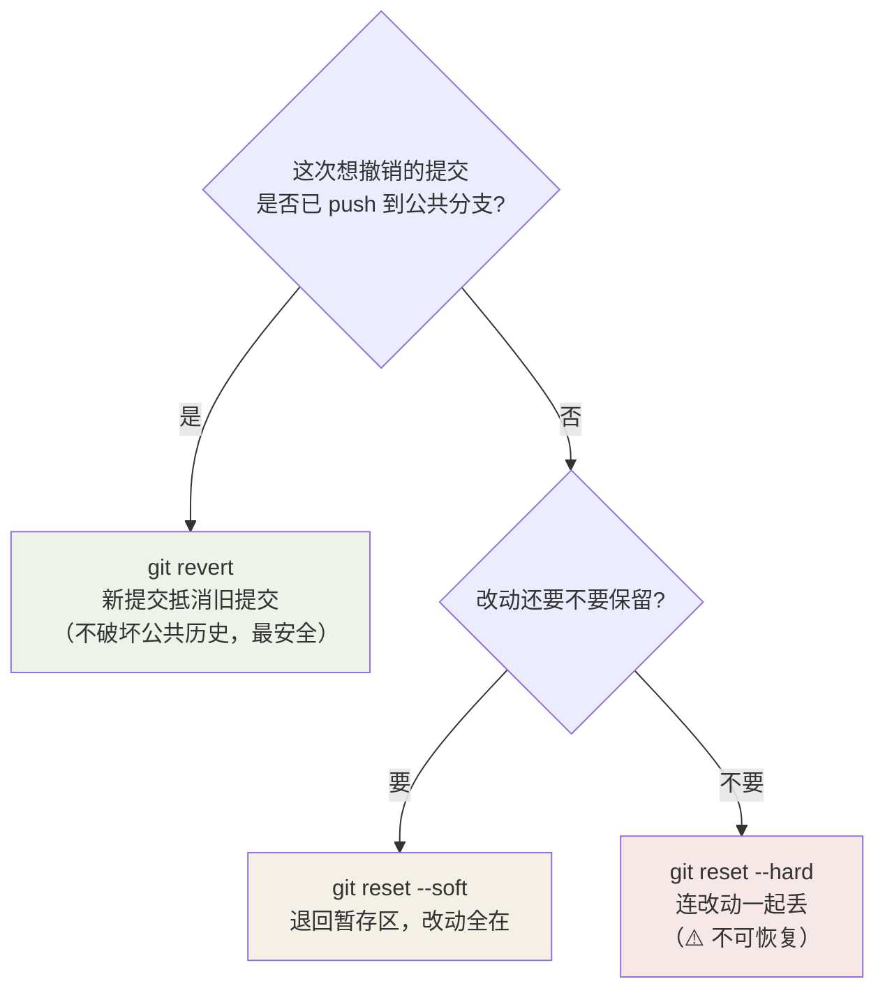

## 新建与获取仓库

```bash
git init                          # 当前目录变成仓库
git clone <url> [目录名]           # 克隆远程仓库
git clone --depth 1 <url>         # 浅克隆，只要最近 1 次提交（大仓救星）
```

## 一张图看懂日常命令指向哪两个区域

`status/diff/add/commit` 都绕不开"工作区 ↔ 暂存区 ↔ 仓库"的流动。记这
张最小的命令地图，比逐个背命令高效应强：



对照下面的命令，能少走很多弯路——**先弄清"此刻改动在哪一层"，才知道用
哪个 diff 看它**。

## 状态与差异

```bash
git status                        # 当前状态（先看再动，肌肉记忆）
git status -s                     # 精简模式
git diff                          # 工作区 vs 暂存区
git diff --staged                 # 暂存区 vs 最近提交
git diff HEAD                     # 工作区 vs 最近提交
```

## 暂存与提交

```bash
git add <file>                    # 暂存指定文件
git add -p                        # 逐块挑选改动（最被低估的功能）
git commit -m "说明"
git commit --amend                # 修补最近一次提交（还没 push 时用）
```

## 查历史

```bash
git log --oneline --graph         # 精简图形化历史
git log -p <file>                 # 某文件的修改历史
git blame <file>                  # 每一行是谁在哪个提交改的
git show <commit>                 # 查看某次提交的完整改动
```

## 推荐全局配置

```bash
git config --global user.name "你的名字"
git config --global user.email "you@example.com"
git config --global pull.rebase true          # pull 默认 rebase，历史更干净
git config --global push.autoSetupRemote true # push 自动建跟踪，省去 -u
git config --global init.defaultBranch main
git config --global core.autocrlf input       # macOS/Linux；Windows 用 true
git config --global alias.lg "log --oneline --graph --all"
```

## 临场出错的定位思路（深入）

git 的报错信息很"不友好"，但**报错 → 一句话翻译 → 对应命令**是可背的：

| 报错 / 现象 | 发生了什么 | 对症命令 |
|---|---|---|
| `You are in 'detached HEAD' state` | HEAD 不指向分支，指向某个提交 | `git switch -c fix-back <commit>` 把它挂回分支 |
| `Changes not staged for commit` | 有改动但没 `git add` | `git add <file>` 或 `git diff` 确认 |
| 想回退自己的工作区 | 丢弃未暂存改动 | `git checkout -- <file>`（**慎用，改动就没了**） |
| 提交信息写错了 | 内容对、说明错 | 未 push：`git commit --amend -m "新说明"` |
| `--amend` 了还想再改 | 上一步没 push | 再来一次 `--amend`，别往里加新提交 |
| `pull` 有本地修改冲突 | 本地改动与远端冲突 | 先 `git stash` → `git pull` → `git stash pop` |

**两次「救场复位」的边界（最易背错）**：

```bash
git reset --soft HEAD~1   # 撤销"最后一次提交"，改动留在暂存区（还能恢复，推荐）
git reset --hard HEAD~1   # 撤销提交且丢弃改动（⚠️ 不可恢复，别对大库用）
git revert <commit>       # 产生一个"反向提交"来抵消目标提交（已推送到远端时用它）
```

一张图帮你决定这次该用哪个：



判断用哪个：**还没 push** → `reset`（soft 优先）；**已 push 且要保留历史**
→ `revert`。revert 不改历史，最安全，唯一缺点是历史里有两次提交。

**大脑里的保险丝**：不确定「会不会丢东西」的命令（`reset --hard`、
`checkout --`、`clean -f`）——**先 `git stash` 或先 `git log` 确认**再动手。
git 几乎所有"惨剧"都来自这几种不可逆操作。

## 要点备忘

- 把 `git status` 和 `git log --oneline --graph` 当成「仪表盘」——任何不确定的时刻，先看这两个命令再操作
- 提交粒度：一个提交只做一件事，说明写得能让人不看代码就明白动机
- `--amend` 只能修补**尚未推送**的提交，已推送的历史不要动
