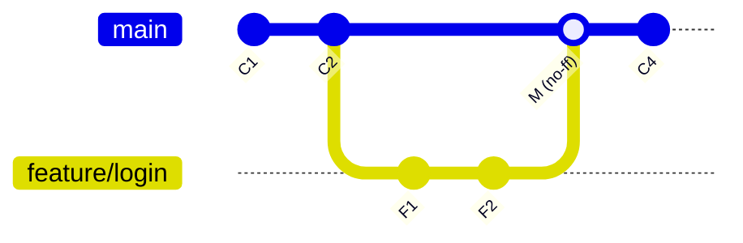

## 分支的本质

分支只是一个**指向某个 commit 的可移动指针**，HEAD 指向当前分支。因此创建、切换、删除分支都是 O(1) 操作——Git 鼓励小步多分支。

```bash
git branch                       # 列出分支
git switch -c feature/login      # 创建并切换（新语法）
git branch -d feature/login      # 删除已合并分支
git branch -D feature/login      # 强制删除（未合并也删）
git branch -m old new            # 重命名
git merge feature/login          # 把 feature 合入当前分支
```

## 合并后的历史形态



## merge 的三种形态

| 方式 | 命令 | 效果 | 适用 |
|---|---|---|---|
| fast-forward | `git merge feat` | 直接把指针前移，无新提交 | 目标分支无新提交时默认发生 |
| no-ff | `git merge --no-ff feat` | 强制生成合并提交，保留分支拓扑 | 想保留「曾有一个 feature 分支」的事实 |
| squash | `git merge --squash feat` | 把分支全部改动压成一个待提交 | feature 中间过程太乱、只想要结果 |

## rebase：变基

把当前分支的提交「摘下来」，重新嫁接到目标分支顶端，得到一条直线历史，更好读、好 bisect：

```bash
git switch feature/login
git rebase main          # 以 main 为新基底
# 解决冲突后
git rebase --continue
git switch main && git merge feature/login   # 此时必是 fast-forward
```

> **rebase 黄金法则：不要对已经推送到公共分支的提交做 rebase。**
> rebase 会重写提交（哈希全变），别人的历史会和你彻底分叉。

## merge 还是 rebase？

| | merge | rebase |
|---|---|---|
| 历史 | 保留真实拓扑 | 直线、干净 |
| 安全性 | 不改历史 | 重写私有提交 |
| 适用 | 合入公共分支（main） | 同步自己分支的基底、整理未推送提交 |

实践惯例：**自己分支上 rebase，合入 main 时用 merge（或 PR 的 merge 按钮默认 no-ff）**。

## 要点备忘

- `git merge --abort` / `git rebase --abort` 随时可以反悔，回到操作前
- squash 合并后的分支不能再用 `-d` 删除（Git 认为未合并），需 `-D`
- rebase 冲突可能逐个提交反复出现，提交越碎越麻烦——这正是 rebase -i 的用武之地
