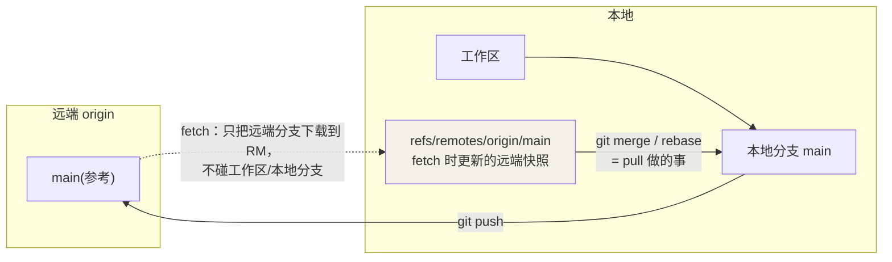

## 远程仓库管理

```bash
git remote -v                        # 查看远程地址
git remote add origin <url>          # 添加远程
git remote add upstream <url>        # 常用于 fork 工作流加原仓库
git remote set-url origin <new-url>  # 修改地址
```

## 同步：fetch / pull / push

```bash
git fetch origin                     # 只下载，不动本地分支（安全）
git pull                             # = fetch + merge
git pull --rebase                    # = fetch + rebase（避免无意义合并提交）

git push                             # 推送当前分支
git push -u origin feat              # 首推并建立跟踪关系
git push --force-with-lease          # 比裸 force 安全的强推
```

> **永远用 `--force-with-lease` 替代 `--force`**：它会在远端被别人更新过时拒绝执行，防止覆盖同事的工作。

## 跟踪分支

本地分支可「跟踪」一个远程分支（如 `main` 跟踪 `origin/main`）。建立跟踪后：

- `git pull` / `git push` 不用再写参数
- `git status` 会提示你领先/落后多少提交
- `git branch -vv` 查看所有分支的跟踪关系

## 典型 PR / MR 工作流

1. fork 或从最新 main 切出 feature 分支
2. 小步提交，推送分支
3. 发起 PR，描述动机与测试方式，指定 reviewer
4. 按评审意见修改：小意见追加新提交，对方要求时可 rebase 后强推（`--force-with-lease`）
5. 合并后删除远程分支，本地 `git switch main && git pull` 同步

## 冲突解决

冲突标记长这样：

```
<<<<<<< HEAD
你的版本
=======
对方的版本
>>>>>>> feature/xxx
```

处理流程：手动编辑保留正确内容 → 删除标记 → `git add <file>` → `git merge --continue`（或 `rebase --continue`）。反悔用 `git merge --abort`。

降低冲突频率的 practices：分支生命周期短、勤 pull 同步、避免在同一个文件大范围重排格式。

## fetch / pull / push 的关系（深入）

很多冲突和"垃圾提交"都源于没分清三者的模型。用一张图钉死它：



- **fetch**：只更新 `origin/main` 这份"远端快照"，工作区不动 —— 安全看发生了什么。
- **pull** = fetch + merge（默认）或 + rebase（`--rebase`）。
- **push**：把本地分支推到远端，需本地先吸收远端（避免分叉）。

**merge vs rebase 的分叉对比**（决定历史长啥样/冲突怎么来）：

```text
       本地 commit A       本地 commit A'
merge ─┬── main: ...M1 M2 ──┴── M3（多一个"合并提交"，历史有分叉线）
        └── 功能提交 F1 F2 ──┘

rebase：把功能提交重放到 main 顶端：...M1 M2 F1 F2（线性，干净）
```

rebase 换来的是干净线性历史，代价是**重写本地提交**（已有仓库勿对公共分支
rebase）。所以团队内"我拉下来 rebase 再推"是常态。

## 冲突的本质与化解（深入）

冲突不是"文件坏了"，而是**两个提交改了同一处的合并不了**。化解的本质是
"我来裁决这行该留谁"。除手动编辑标记外，还有几个实用工具：

```bash
# 想看冲突全貌 / 用工具解决
git diff --name-only --diff-filter=U   # 列出所有冲突文件
git mergetool                          # 唤起 vimdiff 等图形工具
git checkout --ours <f>                # 直接采用"我的"版本
git checkout --theirs <f>              # 直接采用"对方的"版本（慎用，看清是 merge 还是 rebase 语境）
```

> `--ours/--theirs` 在 merge 里"ours=当前分支"，在 rebase 里会**互换**——语义反转是经典坑，用时先 `git status` 确认处于 merge 还是 rebase。

## 要点备忘

- `fetch` 只取不改，是「先看看远端发生了什么」的安全操作
- fork 工作流中 `upstream` 用来同步原仓库，`origin` 是自己的 fork
- push 前先 `git pull --rebase`，能消掉 90% 的「Merge branch 'main' of ...」噪音提交
