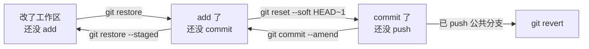

## 选型逻辑：按错误传播到的区域选命令

Git 的「撤销」不是一个命令，关键问题是：**改动现在走到哪一步了？**



## 场景对照表

| 场景 | 命令 | 影响 |
|---|---|---|
| 改了工作区，还没 add | `git restore <file>` | 丢弃修改（不可恢复） |
| add 了，还没 commit | `git restore --staged <file>` | 移出暂存区，修改保留 |
| commit 了，还没 push | `git reset --soft HEAD~1` | 退回暂存区，修改全保留 |
| 同上，连暂存区也清掉 | `git reset --mixed HEAD~1`（默认） | 退回工作区 |
| 同上，彻底丢弃 | `git reset --hard HEAD~1` | 修改消失（慎用） |
| **已经 push 到公共分支** | `git revert <commit>` | 生成一个「反向提交」，不改历史 |
| 想要另一个分支的某次提交 | `git cherry-pick <commit>` | 把该提交复制到当前分支 |
| commit 信息写错了 | `git commit --amend` | 未 push 时修补 |

> **reset vs revert**：reset 是「移动指针装作没发生」（改历史，只能用于私有分支）；revert 是「新提交抵消旧提交」（不改历史，公共分支唯一正解）。

## reflog：最后的救命稻草

reflog 记录 HEAD 的每一次移动，即使分支被删、reset --hard，「丢失」的提交依然能找回：

```bash
git reflog                          # 查看 HEAD 移动历史
git reset --hard HEAD@{2}           # 回到两步前的位置
git branch rescue <commit-hash>     # 或直接把可疑提交固定成分支
```

## stash：临时存档

写到一半要切分支修 bug，又不想提交半成品：

```bash
git stash                    # 收起工作区+暂存区修改，回到干净状态
git stash -u                 # 连未跟踪文件一起收
git stash list               # 查看所有存档
git stash pop                # 恢复最近一次并删除存档
git stash apply stash@{2}    # 恢复指定存档但保留
git stash drop stash@{0}     # 删除某条
```

## 要点备忘

- 未提交的修改一旦被 `reset --hard` 清掉就真没了——执行前先 `git stash` 保平安
- `revert` 一个 merge 提交需要 `-m 1` 指定保留哪条主线，且之后想再合回该分支需先 revert 那个 revert
- cherry-pick 是多版本维护（hotfix 回合）的主力工具
