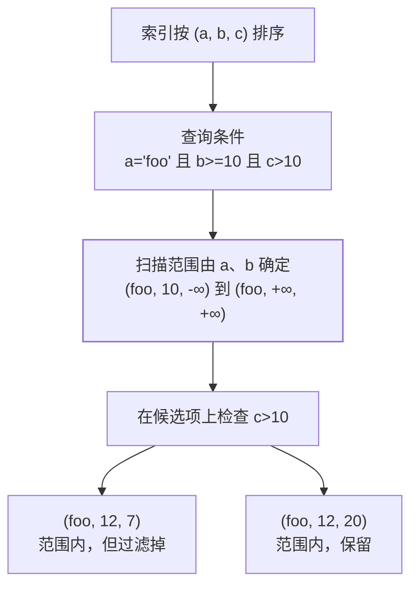

import AlgorithmVizIsland from '../../../components/viz/AlgorithmVizIsland.astro';

import { Tabs, TabItem } from '@astrojs/starlight/components';

写笔记时直接在正文用 ` ```mermaid ` 代码块即可，构建时自动渲染为 SVG，
手机端零额外加载。常用图表类型的模板如下，复制改就行。

## 质量红线：一切图表以教学为出发点

图表（mermaid / FlowViz / SummaryViz）与一切知识总结、架构图、流程图是
**教学内容本身**，不是版面装饰。动笔前先吃透笔记正文，落笔时守住四条：

1. **准确第一，严禁误导**：图中每个节点、每行结论都必须能在笔记正文或
   官方文档中找到出处——**严禁凭印象编造、靠模糊记忆缩写**。一个错误的
   节点比缺一张图危害大得多，那是直接误导读者。
2. **教学价值**：每张图都要回答一个明确的学习问题（它怎么运作？怎么选？
   怎么记？），而不是把正文原句机械搬进框里凑数；术语、命名与正文一致，
   读者不需要在图和文之间来回翻译。
3. **结构闭环**：流程有始有终、分支有出口、循环有回边；对比逐行同维度
   对齐；总结卡每栏 3~5 行「结论 + 理由」——空泛凑数的一行不如不放。
4. **自我验收**：画完以「新读者只看这张图」的视角走一遍——能否据此建立
   正确的心智模型？拿不准的事实回去查证后再画，**宁缺毋滥**。

发现已有图表与正文或事实冲突时，以查证结果为准同步修正，并在提交说明里写明。

## 结构图与知识图谱：先定问题，再安排信息

单篇笔记的结构图与方向首页的知识图谱用途不同，不要让一张图同时承担
「解释完整机制」和「展示全方向关系」两项任务：

| 图的落点 | 要回答的问题 | 适合呈现 | 不适合承担 |
|---|---|---|---|
| 单篇笔记结构图 | 这一个机制怎样运作？关键边界在哪里？ | 顺序、判断、因果，以及紧贴节点的例子和短说明 | 把整篇笔记缩成一张图、罗列所有相关主题 |
| 方向首页知识图谱 | 这些知识点怎样组织、依赖或延伸？ | 分组、学习主线、跨主题关系；节点链接到具体笔记 | 复述每篇笔记的完整机制和全部例子 |

### 组织单篇结构图

1. 先写出一句要回答的问题，再选择最能表达它的布局：过程用顺序，判断用
   分支，层级用分层，因果用有向关系。不要为了统一外观把不同内容都画成同一种流程。
2. 先画主干，再补能解释关键节点的例子、条件或结果。例子可以直接放图里；
   用短注释连到它所解释的节点或连线，不必一律挪到图外。
3. 节点文字优先写结论或动作。若一个节点需要塞进多句正文、包含多个不同判断，
   就拆成相邻节点、分组或第二张图。节点数量没有固定上限；以入口明确、阅读路径
   连贯、窄屏不拥挤为准。
4. 默认使用中文写标题、节点、分组和关系说明。SQL、代码、字段名、命令、产品名及
   必要的官方术语保留原文；术语首次出现时补中文解释，例如「索引条件下推（ICP）」。
5. 连线要表达真实语义。必要时直接在连线上写「导致」「依赖」「过滤」「验证」等关系，
   不让读者猜测两个相连节点之间是什么关系。

以下例子把扫描范围与残余过滤放在一张图里。短样例直接标在图中，用来展示
`INDEX(a, b, c)` 与查询 `a='foo' AND b>=10 AND c>10` 的关键区别：`c` 不收紧
由 `a`、`b` 确定的范围，但仍可过滤扫描到的候选项。



### 组织方向首页知识图谱

方向图以主题分组与学习主线为骨架。优先连出最重要的依赖、因果或实践关系，
并让节点链接到展开讲解的笔记；不必在总览图中重画笔记内的全部推导。某组知识
关系过密时，可通过分类页或笔记继续展开，不要靠缩小文字把所有内容挤在首页。

例如，索引方向可以呈现「排序机制 → 最左前缀 → 范围断点 → 后续过滤」，再连接
到「索引设计」和「执行计划验证」。这条主线说明概念怎样推导；详细的元组样例、
索引条件下推边界和 `key_len` 算法仍由对应笔记及其结构图解释。

### 生成后的读图检查

- 不读正文，能否说出图要回答的问题、从哪里开始，以及关键结论是什么？
- 图内例子是否真的支持对应结论？范围、分支和过滤结果是否闭环？
- 每条连线的含义是否明确？图中是否混入了与核心问题无关的第二条主线？
- 中文说明是否自然、简洁？保留的英文是否确为代码、标识符或必要术语？
- 桌面和窄屏下阅读路径是否清楚？亮暗主题的文字对比度是否达标？

不通过时优先删去无关信息、缩短节点文字或拆分图表，不以缩小字号和堆叠长段说明补救。

## 流程图（flowchart）

<Tabs>
  <TabItem label="效果">
    ```mermaid
    flowchart TD
        A[学习新知识] --> B{已经理解?}
        B -- 否 --> C[记笔记 + 画图]
        C --> A
        B -- 是 --> D[输出总结]
        D --> E[定期回顾]
    ```
  </TabItem>
  <TabItem label="源码">
    `````text
    ```mermaid
    flowchart TD
        A[学习新知识] --> B{已经理解?}
        B -- 否 --> C[记笔记 + 画图]
        C --> A
        B -- 是 --> D[输出总结]
        D --> E[定期回顾]
    ```
    `````
  </TabItem>
</Tabs>

## 动画流程（edge animate）

给连线加 `id@` 前缀和 `@{ animate: true }` 元数据，连线会有流动效果（纯 CSS，
构建时烘焙进 SVG，零运行时开销）。适合表达请求链路、数据流向等有方向性的流程；
静态知识笔记不建议滥用。

<Tabs>
  <TabItem label="效果">
    ```mermaid
    flowchart LR
        U[用户] r@--> N[网关]
        N s@--> A[应用服务]
        A q@--> D[(数据库)]
        r@{ animate: true }
        s@{ animate: true }
        q@{ animate: true, animation: slow }
    ```
  </TabItem>
  <TabItem label="源码">
    `````text
    ```mermaid
    flowchart LR
        U[用户] r@--> N[网关]
        N s@--> A[应用服务]
        A q@--> D[(数据库)]
        r@{ animate: true }
        s@{ animate: true }
        q@{ animate: true, animation: slow }
    ```
    `````
  </TabItem>
</Tabs>

要点：边 id（如 `r@`）紧跟在起点之后、箭头之前；`@{...}` 元数据行写在图末尾。
`animate: true` 为常规流速，加 `animation: slow` 为慢速（适合次要链路）。

## 呼吸节点（node pulse）

给关键节点（链路入口、核心服务）加 `:::pulse` 标记，节点保持略粗的边框，
琥珀辉光渐亮渐暗地呼吸（纯 CSS 动画，构建时烘焙；辉光色自动适配亮/暗主题，
系统开启「减弱动态效果」时自动静止）。

<Tabs>
  <TabItem label="效果">
    ```mermaid
    flowchart LR
        U[用户] --> N[网关]:::pulse --> A[应用服务]:::pulse
        A --> D[(数据库)]
        classDef pulse stroke-width:2px
    ```
  </TabItem>
  <TabItem label="源码">
    `````text
    ```mermaid
    flowchart LR
        U[用户] --> N[网关]:::pulse --> A[应用服务]:::pulse
        A --> D[(数据库)]
        classDef pulse stroke-width:2px
    ```
    `````
  </TabItem>
</Tabs>

要点：`:::pulse` 跟在节点文本之后；`classDef pulse` 行必须存在（内容任意，
仅作打标，配色由站点主题统一接管）。也可用 `class 节点ID pulse` 语法
给已有节点补标。可与连线动画组合使用。

## 语义强调节点（good / bad / hl）

要突出「正向 / 负向 / 中性强调」节点时，用语义类打标，**不写任何颜色**：
绿（good）、红（bad）、暖金（hl）三套配色由站点主题按亮/暗模式提供，
两种主题下文字都保证可读。

<Tabs>
  <TabItem label="效果">
    ```mermaid
    flowchart LR
        A[瞬时洪峰] --> MQ[MQ 缓冲池]:::good --> B[DB 按节奏消化]
        A -.没有 MQ.-> C[DB 被打死]:::bad
        classDef good stroke-width:1.5px
        classDef bad stroke-width:1.5px
    ```
  </TabItem>
  <TabItem label="源码">
    `````text
    ```mermaid
    flowchart LR
        A[瞬时洪峰] --> MQ[MQ 缓冲池]:::good --> B[DB 按节奏消化]
        A -.没有 MQ.-> C[DB 被打死]:::bad
        classDef good stroke-width:1.5px
        classDef bad stroke-width:1.5px
    ```
    `````
  </TabItem>
</Tabs>

要点：

- 打标可用 `节点ID:::good` 内联或 `class 节点ID bad` 补标；中性强调用 `hl`。
- 用到的每个语义类都要有一行 `classDef good stroke-width:1.5px`（仅作打标，
  配色由主题接管，`1.5px` 略粗边框作强调）。
- 红黑树等「节点色即语义」的特例用 `rb-black` / `rb-red`（固定深底白字，
  亮暗主题都可读）。
- **严禁在图表里硬编码颜色**：`style X fill:#…`、`classDef … fill:#…`、
  `%%{init}%%` 主题指令等一律不允许——Mermaid 会把颜色烘焙成行内 `!important`，
  压过站点主题 CSS，另一种主题下必然出现浅底浅字看不清。需要新语义时在
  `src/styles/custom.css` 加主题变量与类规则，图表里只引用类名。

## 悬停交互（hover focus）

全站流程图默认开启：**悬停**节点、子图或连线，高亮关联链路并淡出其余部分；
**点击**可固定当前焦点（再点一次或点空白处取消）。在复杂架构图里追踪某条
链路时很好用——试试把鼠标放到下面任意节点上。

节点还可以挂链接，点击直接跳转相关笔记或外部文档（构建时渲染为 SVG 内
锚点，链接经安全过滤）：

<Tabs>
  <TabItem label="效果">
    ```mermaid
    flowchart LR
        M[Mermaid 官方文档] --> G[语法总览]
        G --> D[流程图详解]
        click M "https://mermaid.js.org/" "打开 Mermaid 官网"
    ```
  </TabItem>
  <TabItem label="源码">
    `````text
    ```mermaid
    flowchart LR
        M[Mermaid 官方文档] --> G[语法总览]
        G --> D[流程图详解]
        click M "https://mermaid.js.org/" "打开 Mermaid 官网"
    ```
    `````
  </TabItem>
</Tabs>

要点：`click 节点ID "链接" "悬停提示"`；站内跳转需带 base 前缀
（如 `/java/advanced/jvm/`）。交互为渐进增强，脚本加载失败时图表仍正常
静态展示。

所有图表（含时序图、脑图等）都有**悬浮工具条**：鼠标悬浮图表，右上角出现
三个按钮——**复制**（把图以 PNG 图片写入剪贴板，浏览器不支持图片剪贴板时
自动降级为复制 SVG 源码）、**下载**（2 倍清晰度白底 PNG，文件名取自页面标题）、
**放大**（或直接**双击图表**进入全屏）——滚轮 / 双指捏合缩放，拖拽平移，
双击在「放大 ↔ 适屏」间切换，`Esc` 或点击空白退出。导出的 PNG 固定使用
亮色基准配色（构建期烘焙），贴白底文档不会花。大图看细节、窄屏读宽图时
特别有用。

## 步进式流程动画（FlowViz）

讲「过程」而非「结构」时（请求链路、协议握手、状态迁移、生命周期），给笔记加一段
可播放的步进动画：数据包沿线行进、节点状态翻转、状态徽标随步迁移、逐帧讲解。
播放器与算法动画共用（进入视野自动循环、暂停单步、五档倍速、进度条拖拽、
键盘 `←` `→` 单步 / 空格播放暂停）：

<AlgorithmVizIsland demo="mysql-2pc" />

新增一个演示三步：

1. 在 `src/data/viz/flows.ts` 写一个 `FlowVizConfig` 并注册进 `flowDemos`（key 用短横线）：
   - `nodes`：固定布局，`x`/`y` 为 0~1 归一化中心坐标，形状可选 `rect`（组件）、
     `cylinder`（存储）、`doc`（日志/文件）；
   - `edges`：可选 `bend`（弧度，同两点双向时正负各一条）、`dashed`（异步/后台动作）、
     `both`（双端箭头）、`label` + `labelAt`（连线文字及其位置）；
   - `frames`：每步给 `active`（当步动作，琥珀高亮）/ `done`（已完成）/ `dim`（弱化）、
     `hotEdges`（本步有数据流动的连线）、`packets`（沿线数据包，`at` 为 0~1 位置，
     `tone` 分 `req`/`resp`/`data`）、`badges`（节点下的状态徽标，如 `prepare`、TCP 状态）
     与 `note`（本步讲解，一句话把「为什么」说清）。
2. 笔记改为 `.mdx`（`.md` 不支持 import），在合适的小节里
   `<AlgorithmVizIsland demo="key" />` 引用，正文一句话交代怎么读图。
3. 配色全部走 `--algo-*` 主题令牌（与算法动画同源），数据里不允许写颜色；
   亮暗主题与「减弱动态效果」自动适配。

选型原则：**mermaid 讲结构，FlowViz 讲过程**——静态关系、层次、分类仍用 mermaid；
只有「按时间推进、状态会翻转」的内容才上步进动画，一篇笔记两者混用不冲突。
对比结论、分区速记类的收尾图另见下方「彩色总结卡」。

## 彩色总结卡（SummaryViz）

一篇笔记读完，把「对比 / 分层」类的结论压缩成一张彩色速记卡：标题是一句话结论，
彩色面板各管一方，底部放结论胶囊——复习时 10 秒扫完全篇骨架。纯静态渲染，
不带任何客户端脚本：

<AlgorithmVizIsland demo="string-family" />

新增一张卡三步：

1. 在 `src/data/viz/summaries.ts` 写一个 `SummaryVizConfig` 并注册进 `summaryDemos`
   （key 用短横线）：
   - `title` 写**结论**而不是话题名（「Spring 是底层能力框架，Spring Boot 是
     工程化脚手架」✓，「Spring 和 Spring Boot 的区别」✗）；`badge` 是标题下的
     胶囊副标；
   - 对比用 `panels`（2~3 个）：每个面板 `title` + `sub`（一句定位）+ `icon`
     （表情图标，画进标题前的圆角色块）+ `cells`；`cells` 尽量按**同一组维度**
     对齐行（HashMap 卡五栏都是「结构 / 并发写 / 读 / null / 扩容」），每栏
     `label` 短标题 + `desc` 一行说明 + 可选 `tag`（右侧小徽标，放复杂度、
     版本、「并发」「默认选它」这类点睛词）；
   - 分层用 `layers`：自上而下每层 `title` + `sub` + `icon` + `cells`，适合
     「线程私有 / 共享」「四大家族」这类分区总结；
   - 每栏 3~5 行、内容具体（给结论也给理由）——空泛的一句话行不如不放；
   - `takeaways` 放底部结论胶囊，`caption` 是卡片外的一句话总结，两者挑一个够用。
2. 笔记改为 `.mdx`（`.md` 不支持 import），在合适的小节里
   `<AlgorithmVizIsland demo="key" />` 引用，正文一句话交代这张卡总结什么。
3. 颜色只允许写语义色调名 `tone`（blue / teal / green / amber / rose / violet /
   slate），实际配色由 `custom.css` 的 `--sum-*` 令牌按亮暗主题接管，
   数据里不允许出现具体颜色值；新增或调整色调时，双主题下所有文字
   （标题 / 副标 / 单元格 / 徽标）对所在底色的对比度必须 ≥ 4.5:1。

选型原则：**mermaid 讲结构，FlowViz 讲过程，SummaryViz 讲总结**——静态关系、
层次、分类用 mermaid；按时间推进、状态会翻转的内容用 FlowViz；一篇笔记读完
「谁和谁怎么分工、分几块各管什么」的收尾用总结卡。别用总结卡复述 mermaid
已画清的结构，也别拿它替代正文论述——它是速记，不是教材。

## 配音短片与图卡（影像资产）

同一份教学内容可以有第二种载体：**配音视频**让读者不看屏幕也能把一条链路听完
（通勤、复习场景），**导出图卡**给要贴进文档、打印、发群里的画面。两者都是
「派生物」，不产生新事实——只从已有的 FlowViz 动画与笔记正文导出，画完照旧
受上面四条质量红线约束。

下面这条短片就是站内 `mysql-2pc` 动画录出来的，逐帧口播与动画帧一一对应：

<AlgorithmVizIsland demo="mysql-2pc-video" />

同一支动画的最后那一帧，导出成可带走的静图：

<AlgorithmVizIsland demo="mysql-2pc-card" />

新增一条影像资产四步：

1. 先在 `src/data/viz/media.ts` 登记资产：`src` 写站内绝对路径
   （`/videos/<key>.mp4`、`/images/<key>.png`），`alt` 是屏读与图裂时的替代文本、
   必须自带信息量，`caption` 写一句结论而不是「示意图」，`source` 指向派生来源的
   FlowViz key。视频还要写 `narration`：**逐帧口播文稿，一帧一句**，事实取自
   源动画那一帧的说明文字与笔记正文。
2. 逐帧截图（需 `pnpm preview` 在跑）与合成：

   ```bash
   # 帧序列：自动隐藏播放器外设、把逐帧说明区钉成等高
   node scripts/media-capture.mjs \
     --page /guide/diagrams/ --figure 0 --demo <key>
   # 口播用 macOS 自带 say（离线零额度），画面时长严格跟随音轨
   node scripts/media-encode.mjs --demo <key>
   ```

3. 按脚本末尾打印的真实宽高与秒数**回填 `media.ts`**——尺寸写错会让暗色主题下
   的卡片比例失真。
4. 笔记改为 `.mdx`，与动画同一写法 `<AlgorithmVizIsland demo="<key>" />`，
   正文一句话交代这支短片讲什么。

硬约束（`node scripts/media-verify.mjs` 会拦，已并入 `pnpm verify:docs`）：

- 一条资产只讲一件事：**帧数 ≤ 12、成片 ≤ 60 秒**，口播每句 ≤ 36 字（约 7 秒）；
  讲不完是正文该拆篇，不是把片子拉长。
- **禁止无稿口播**：`narration` 段数必须与源动画帧数相等，逐帧对齐，
  不允许另起一套说法——读者对着动画听，两套事实就会互相打脸。
- 画面固定**亮色底**（与构建期 mermaid 基准一致），暗色主题下读成一张卡片；
  控制条、进度条、帧码这些播放器外设一律不入画。
- 体积闸门：MP4 ≤ 4 MB、PNG ≤ 300 KB、封面 ≤ 150 KB、`public/` 总量 ≤ 60 MB。
  站点托管在 GitHub Pages（源码仓建议 ≤ 1 GB），影像资产是进 git 的，
  超预算就减帧、缩短口播，不要偷偷提上限。
- 视频必须有同名封面（`<key>.poster.png`）与音轨，`preload="metadata"`
  由组件统一给，别让首屏去拉几十 MB 的流。

选型补一句：**能看动画就别做视频**——站内动画可暂停、可单步、跟主题变色，
体验和体积都优于短片。短片只在「读者需要脱离屏幕听一遍」时才做，
图卡只在「这张图要出现在站外的文档里」时才导。

## 时序图（sequenceDiagram）

<Tabs>
  <TabItem label="效果">
    ```mermaid
    sequenceDiagram
        autonumber
        participant U as 用户
        participant A as 应用
        participant D as 数据库
        U->>A: 发起请求
        A->>D: 查询数据
        D-->>A: 返回结果
        A-->>U: 响应渲染
    ```
  </TabItem>
  <TabItem label="源码">
    `````text
    ```mermaid
    sequenceDiagram
        autonumber
        participant U as 用户
        participant A as 应用
        participant D as 数据库
        U->>A: 发起请求
        A->>D: 查询数据
        D-->>A: 返回结果
        A-->>U: 响应渲染
    ```
    `````
  </TabItem>
</Tabs>

## 思维导图（mindmap）

<Tabs>
  <TabItem label="效果">
    ```mermaid
    mindmap
      root((Linux))
        基础
          文件操作
          用户与权限
          文本处理
        进阶
          Shell 脚本
          进程管理
          系统服务
          网络
    ```
  </TabItem>
  <TabItem label="源码">
    `````text
    ```mermaid
    mindmap
      root((Linux))
        基础
          文件操作
          用户与权限
          文本处理
        进阶
          Shell 脚本
          进程管理
          系统服务
          网络
    ```
    `````
  </TabItem>
</Tabs>

## 架构图（flowchart + subgraph）

<Tabs>
  <TabItem label="效果">
    ```mermaid
    flowchart LR
        subgraph Client[客户端]
            B[浏览器]
        end
        subgraph Server[服务端]
            N[Nginx 反向代理]
            A[应用服务]
            D[(数据库)]
        end
        B -->|HTTPS| N
        N --> A
        A --> D
    ```
  </TabItem>
  <TabItem label="源码">
    `````text
    ```mermaid
    flowchart LR
        subgraph Client[客户端]
            B[浏览器]
        end
        subgraph Server[服务端]
            N[Nginx 反向代理]
            A[应用服务]
            D[(数据库)]
        end
        B -->|HTTPS| N
        N --> A
        A --> D
    ```
    `````
  </TabItem>
</Tabs>

## 类图（classDiagram）

<Tabs>
  <TabItem label="效果">
    ```mermaid
    classDiagram
        class KnowledgeBase {
            +String title
            +String[] tags
            +addNote() void
            +search(keyword) Result
        }
        class Note {
            +String title
            +render() void
        }
        KnowledgeBase "1" o-- "0..*" Note : 包含
    ```
  </TabItem>
  <TabItem label="源码">
    `````text
    ```mermaid
    classDiagram
        class KnowledgeBase {
            +String title
            +String[] tags
            +addNote() void
            +search(keyword) Result
        }
        class Note {
            +String title
            +render() void
        }
        KnowledgeBase "1" o-- "0..*" Note : 包含
    ```
    `````
  </TabItem>
</Tabs>

## 状态图（stateDiagram）

<Tabs>
  <TabItem label="效果">
    ```mermaid
    stateDiagram-v2
        [*] --> 草稿
        草稿 --> 复习中: 开始复习
        复习中 --> 已掌握: 连续答对
        复习中 --> 草稿: 遗忘
        已掌握 --> [*]
    ```
  </TabItem>
  <TabItem label="源码">
    `````text
    ```mermaid
    stateDiagram-v2
        [*] --> 草稿
        草稿 --> 复习中: 开始复习
        复习中 --> 已掌握: 连续答对
        复习中 --> 草稿: 遗忘
        已掌握 --> [*]
    ```
    `````
  </TabItem>
</Tabs>

## 交互式知识图谱

各方向首页的力导图由 `src/data/graphs/<方向>.json` 驱动，格式：

```json
{
  "nodes": [
    {
      "id": "jvm",
      "label": "JVM 内存",
      "href": "/java/jvm/memory/",
      "group": "JVM"
    }
  ],
  "edges": [
    { "source": "jvm", "target": "gc", "label": "依赖" }
  ]
}
```

| 字段 | 说明 |
|---|---|
| `id` | 节点唯一标识，边通过它引用 |
| `label` | 节点显示文本 |
| `href` | 可选；填写后点击节点跳转到对应笔记 |
| `group` | 可选；分组决定节点颜色，同组同色 |
| `source` / `target` | 边的两端节点 `id` |
| `label`（边） | 可选；边上的关系说明 |

维护流程：新增笔记后，在对应方向的 JSON 里加一个节点，`href` 填笔记路径，
再补上与已有知识点的关联边即可。

另有全站级的「[知识全景](/panorama/)」图谱（同时展示在首页）：由 `src/lib/notes.ts`
在构建期自动聚合全部方向与分类生成（`src/components/GlobalGraphIsland.astro`），
圆点大小代表该方向/分类收录的知识点数量，无需手工维护数据。
