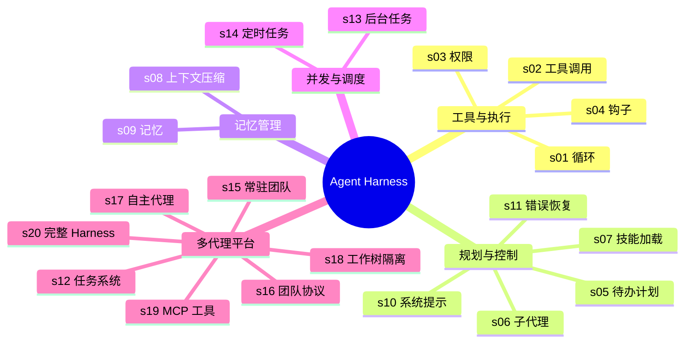
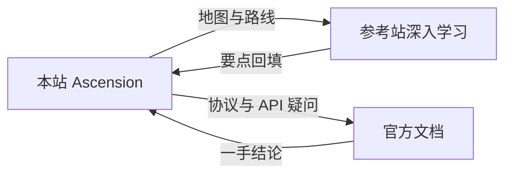

本站定位是**知识地图 + 汇总笔记**，不是系统教程的替代品。深入学习时以下列站点
和官方文档为准：它们经过大量读者校验、持续维护，比自己从零摸索可靠得多。

## 使用原则

- **原理与体系** → 优先看开源书与社区知识库（下表），它们经过社区校验
- **协议与 API 细节** → 永远以官方文档为准，社区内容可能滞后
- **本站的用法** → 记录学习路线、要点提炼与个人理解，作为导航层和复习层

## Agent / AI 应用开发

| 站点 | 定位 | 适合 |
|---|---|---|
| [Learn Claude Code](https://learn.shareai.run/zh/) | 从 0 到 1 构建 nano Claude Code 式 Agent，20 课渐进式（102 行 → 1708 行完整 Harness） | 动手实现：每课只加一个机制，附生产级源码对照 |
| [深入理解 AI Agent](https://bojieli.github.io/ai-agent-book/) | 开源书《深入理解 AI Agent：设计原理与工程实践》，10 章 + 100 余个配套实验 | 系统学习：围绕 Agent = LLM + 上下文 + 工具 |
| [JavaGuide · AI 应用开发](https://javaguide.cn/ai/) | 面试视角的 AI 知识体系：大模型基础、Prompt、Agent、RAG、MCP、AI 系统设计 | 快速梳理高频知识点 |

两个 Agent 主力参考站视角互补，配合使用效果最好：

| 视角 | Learn Claude Code | 深入理解 AI Agent |
|---|---|---|
| 组织方式 | 20 课，每课在上一课代码上叠加一个机制 | 10 章，按知识域展开 |
| 核心线索 | 一个循环长成生产形态 Harness | Agent = LLM + 上下文 + 工具 |
| 代码规模 | 每课百行级，全部可运行 | 章章有独立实验仓库 |
| 回答的问题 | 生产级 Harness 为什么要这些机制 | 每类机制背后的设计原理 |

### 20 课的五个架构层次

Learn Claude Code 把 20 课归为五个正交关注点，是理解 Agent 全景的最好地图：

## Java / 后端

| 站点 | 定位 | 适合 |
|---|---|---|
| [JavaGuide](https://javaguide.cn/) | 156K+ Star 的 Java 面试与后端知识体系 | Java 基础 / 集合 / 并发 / JVM / Spring / MySQL / Redis / 分布式 |
| [计算机基础面试指南](https://javaguide.cn/cs-basics/) | 网络、操作系统、数据结构与算法 | 补齐后端底层基础 |
| [学习路线合集](https://javaguide.cn/roadmap/) | Java 后端、AI 应用开发、AI Agent 等方向的系统学习建议 | 不知道从哪开始时先看这组 |

## 官方文档

| 主题 | 链接 | 说明 |
|---|---|---|
| MCP 协议 | [modelcontextprotocol.io](https://modelcontextprotocol.io/) | Model Context Protocol 官方规范、SDK 与概念文档 |
| Anthropic 文档 | [docs.anthropic.com](https://docs.anthropic.com/) | Messages API、工具使用、上下文工程等一手资料 |
| OpenAI 文档 | [platform.openai.com/docs](https://platform.openai.com/docs) | Chat Completions、函数调用、Embedding 系列 API |

## API Key 平台

跑 Agent 实验需要模型 API，常用平台（来自 ai-agent-book 的推荐表）：

| 平台 | 链接 | 说明 |
|---|---|---|
| DeepSeek | [platform.deepseek.com](https://platform.deepseek.com/) | 官方 API，性价比高 |
| 智谱 GLM | [open.bigmodel.cn](https://open.bigmodel.cn/) | GLM 系列，Coding / Agent 能力强 |
| Moonshot Kimi | [platform.moonshot.cn](https://platform.moonshot.cn/) | Kimi 系列 |
| SiliconFlow | [siliconflow.cn](https://siliconflow.cn/) | 开源模型聚合（DeepSeek、Qwen 等） |
| OpenRouter | [openrouter.ai](https://openrouter.ai/) | 一站式访问全球主流模型 |

## 与本站的配合

典型学习循环：在本站看方向路线图 → 跳到参考站学对应章节 → 回来把要点提炼成
笔记并更新知识图谱。站内 AI 方向的笔记均附「延伸阅读」注明素材出处。
