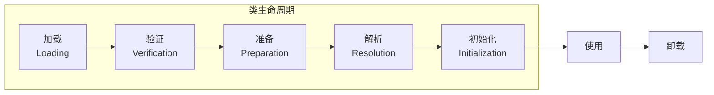
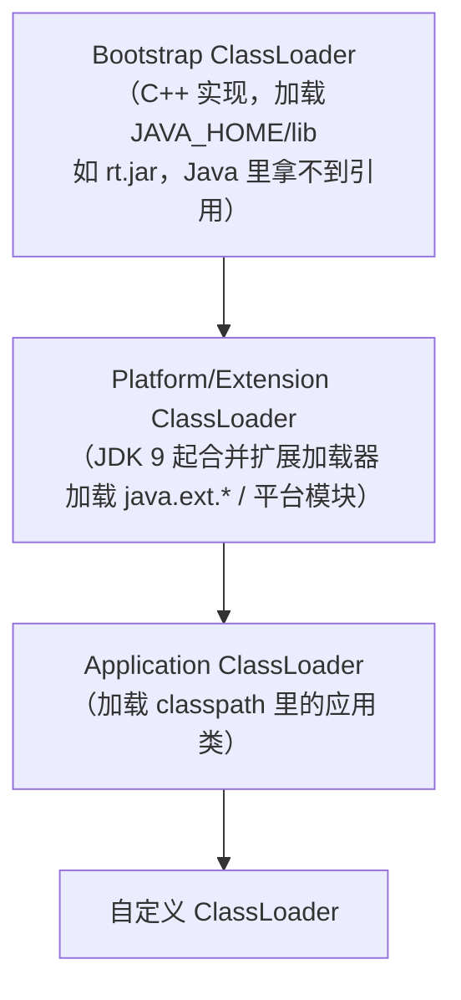

## 类加载的全过程



| 阶段 | 做什么 | 关键细节 |
|---|---|---|
| 加载 | 字节流 → 方法区类结构，堆里造 Class 对象 | 来源：磁盘 class / jar / 网络 / 动态生成（动态代理） |
| 验证 | 格式/语义/字节码/符号引用四道安检 | 防"恶意字节码"弄垮 JVM |
| 准备 | 静态变量**分配内存 + 设零值** | `static int a=1` 此刻 a=0，赋值在初始化才做 |
| 解析 | 常量池符号引用 → 直接引用 | 可发生在初始化之后（运行期绑定） |
| 初始化 | 执行 `<clinit>`：静态变量赋值 + static 块 | JVM 加锁保证只跑一次 |

准备阶段的反直觉题：

```java
static int a = 1;
// 准备后 a = 0（零值），初始化时才 = 1
static final int B = 2;
// 准备后 B = 2：ConstantValue 属性让 final 常量直接在准备期赋值
```

**初始化的触发时机（六种，主动引用）**：new、读写非 final 静态字段、调
静态方法、反射调用、初始化子类先初始化父类、main 所在类。其余（定义
类数组、引用 final 常量、子类引用父类字段）不触发。

## 四层类加载器



JDK 9 模块化后 Extension Loader 变身 Platform Loader（合并了原来
Bootstrap 委派给 Ext 的职责边界）。

## 双亲委派模型

`ClassLoader.loadClass()` 的逻辑：**先问爹加载过没有，爹加载不了自己再上**。

```java
protected Class<?> loadClass(String name, boolean resolve) {
    synchronized (getClassLoadingLock(name)) {          // 并行加载：锁的是类名不是全局
        Class<?> c = findLoadedClass(name);             // ① 缓存里找
        if (c == null) {
            try {
                if (parent != null) {
                    c = parent.loadClass(name, false);  // ② 委派给爹
                } else {
                    c = findBootstrapClassOrNull(name); // ②' 到顶了问 Bootstrap
                }
            } catch (ClassNotFoundException e) { /* 爹抛了不管 */ }
            if (c == null) {
                c = findClass(name);                    // ③ 爹们都没有 → 自己找
            }
        }
        return c;
    }
}
```

```mermaid
flowchart LR
    REQ["loadClass(\"com.demo.App\")"] --> APP["Application"]
    APP -->|"①先委派"| PLAT["Platform"]
    PLAT -->|"②再委派"| BOOT["Bootstrap"]
    BOOT -->|"③java.* 找得到<br/>rt.jar 里的类在这收尾"| OK["返回 Class"]
    PLAT2["Platform"] -->|"④找不到<br/>ClassNotFoundException 往回抛"| APP2["Application"]
    APP2 -->|"⑤自己加载<br/>classpath 找到了"| OK2["返回 Class"]

    style BOOT fill:#f5f0e6
```

三个目的：

1. **防篡改**：用户自己写个 `java.lang.String`，永远轮不到加载（Bootstrap
   先命中 rt.jar 的）——核心类库的边界就是安全性边界。
2. **防重复**：同一个类只加载一次，JVM 里"类相等" = 类加载器 + 类全名
   都相同。
3. **层次清晰**：核心类看得见应用类（通过线程上下文加载器），反之不能
   乱越级。

## 类的唯一性

两个不同加载器加载同一个 class 文件，得到的 Class **不相等**：

```java
ClassLoader l1 = new MyClassLoader();
ClassLoader l2 = new MyClassLoader();
Class<?> c1 = l1.loadClass("com.demo.Foo");
Class<?> c2 = l2.loadClass("com.demo.Foo");
System.out.println(c1 == c2);              // false
System.out.println(c1 == Foo.class);       // false
Foo f = (Foo) c1.newInstance();           // ClassCastException：不是同一个"类"
```

**JVM 里类的身份证 = (类加载器, 全限定名)**。这是热部署、容器隔离
（Tomcat 每个 webapp 一套 WebappClassLoader，互不串类）的理论基础。

## 打破双亲委派的三个场景

| 场景 | 做法 | 原因 |
|---|---|---|
| SPI / JDBC | 线程上下文类加载器（Thread Context ClassLoader） | Bootstrap 加的 java.sql.DriverManager 要加载 classpath 里的驱动——爹必须"反向"用儿子的加载器 |
| 热部署 / OSGi / Tomcat | 覆写 loadClass，先自己找再委派 | 隔离与替换：同 war 版本共存、改完即刻重载 |
| 动态代理 | `Proxy` 在委托类可见的加载器里生成 $Proxy0 | 生成的代理类要能看见业务接口 |

JDBC 的经典死结：`Class.forName("com.mysql.Driver")` 里 DriverManager 在
rt.jar（Bootstrap 加载），按双亲委派**它看得见的类 MySQL 驱动看不见**。
解法：驱动注册时用 `Thread.currentThread().getContextClassLoader()`
（默认是 Application）反向加载——双亲委派的"例外出口"。

## 自定义类加载器

```java
public class DiskClassLoader extends ClassLoader {
    private final String dir;

    @Override
    protected Class<?> findClass(String name) throws ClassNotFoundException {
        byte[] bytes = Files.readAllBytes(Path.of(dir, name + ".class"));
        return defineClass(name, bytes, 0, bytes.length);   // 必须调 defineClass
    }
}
// 约定：只覆写 findClass（loadClass 的委派骨架保留），除非你明确要打破委派
```

Tomcat 打破委派的真实写法（WebappClassLoader 简化逻辑）：先查本地缓存
→ 是 java.* 核心类则委派 → 否则**自己 webapp/WEB-INF/classes 和 lib 先找**
→ 找不到才委派父级 shared/server 加载器——隔离优先，兼容核心类。

## 小结

- 七阶段里"验证/准备/解析"合称连接；准备设零值、初始化才跑 `<clinit>`
  （JVM 加锁保证一次）。
- 双亲委派 = 先爹后己：防篡改、防重复；类身份 = 加载器 + 全名。
- JDBC（上下文加载器）、Tomcat（覆写 loadClass）、动态代理是打破它的
  三大经典场景。
