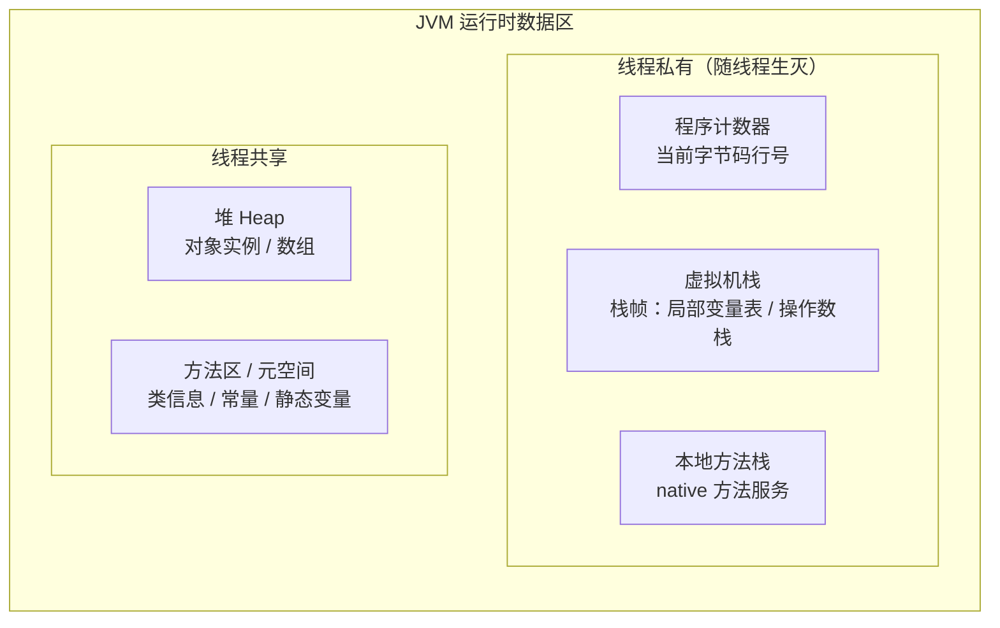
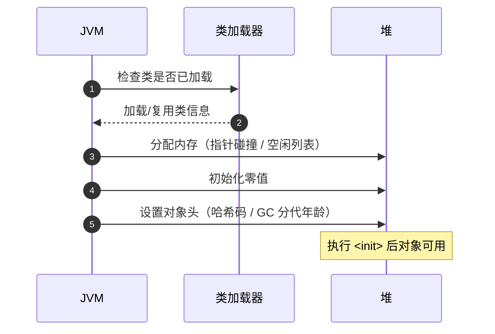

## 总体结构

## 各区域要点

| 区域 | 线程 | OutOfMemory 类型 | 要点 |
|---|---|---|---|
| 程序计数器 | 私有 | 唯一不会 OOM 的区域 | 字节码解释器靠它恢复执行位置 |
| 虚拟机栈 | 私有 | `StackOverflowError` | 递归过深是主因；`-Xss` 调大小 |
| 本地方法栈 | 私有 | SOE / OOM | 服务 native 方法，HotSpot 与虚拟机栈合一 |
| 堆 | 共享 | `Java heap space` | `-Xms`/`-Xmx`；GC 主战场 |
| 元空间 | 共享 | `Metaspace` | 使用本地内存；动态生成类（CGLib）易溢出 |

## 对象创建流程（类加载到分配）

## 要点备忘

- 新对象优先在 **Eden** 分配，TLAB 让分配做到指针碰撞级别的快
- 判断对象可达性用 **GC Roots**（栈帧局部变量、静态变量、常量等），不是引用计数
- `-XX:+HeapDumpOnOutOfMemoryError` 留现场，MAT 分析 dump
- 元空间溢出优先排查：动态代理类是否无限生成、是否大量加载重复类
