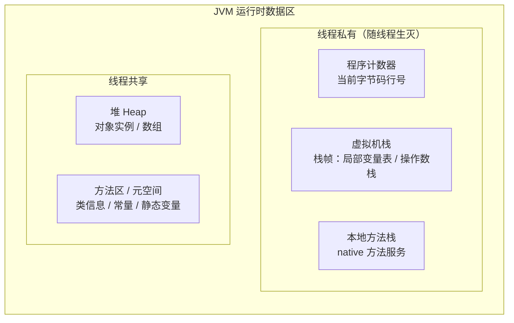
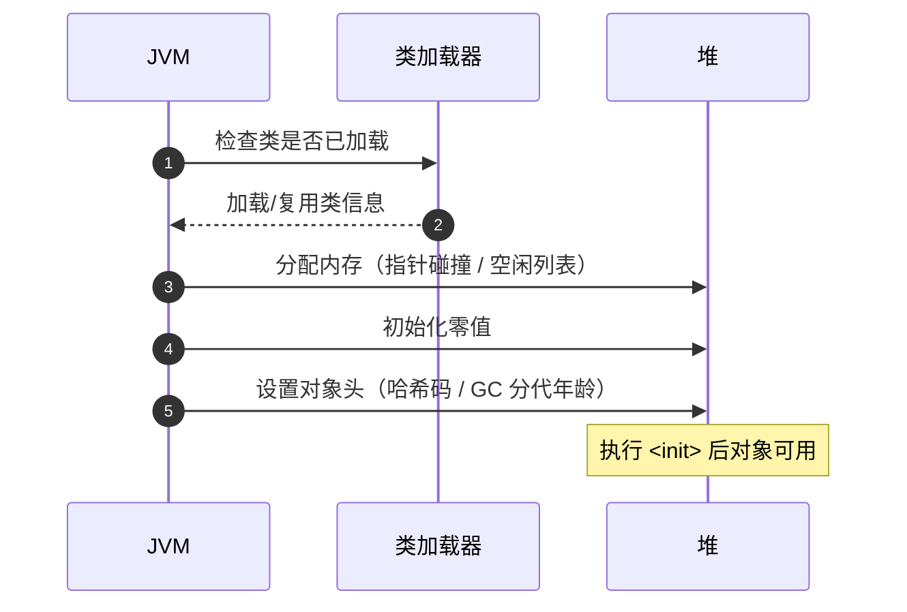

## 总体结构



## 各区域要点

| 区域 | 线程 | OutOfMemory 类型 | 要点 |
|---|---|---|---|
| 程序计数器 | 私有 | 唯一不会 OOM 的区域 | 字节码解释器靠它恢复执行位置 |
| 虚拟机栈 | 私有 | `StackOverflowError` | 递归过深是主因；`-Xss` 调大小 |
| 本地方法栈 | 私有 | SOE / OOM | 服务 native 方法，HotSpot 与虚拟机栈合一 |
| 堆 | 共享 | `Java heap space` | `-Xms`/`-Xmx`；GC 主战场 |
| 元空间 | 共享 | `Metaspace` | 使用本地内存；动态生成类（CGLib）易溢出 |
| 直接内存 | 共享 | `OutOfMemoryError`（无堆标记） | 堆外；NIO/Netty 走 `-XX:MaxDirectMemorySize` |

## 栈帧内部：一次方法调用都在栈上放什么

每个方法调用压入一个**栈帧**，包含四块：

| 区域 | 作用 |
|---|---|
| 局部变量表 | 方法参数 + 局部变量（含 `this`），以**槽 slot** 为最小单位 |
| 操作数栈 | 算数/调用时的**临时工作区**（如 `1+2` 先把 1、2 压栈再算） |
| 动态链接 | 指向运行时常量池中该方法的引用（解析依赖关系） |
| 返回地址 | 调用结束后回到调用者的位置 |

```text
参考执行 "int c = a + b;" 的心智：
  local=0 → a，local=1 → b
  iload_0（把 a 压操作数栈）→ iload_1（把 b 压栈）
  iadd（弹出两数相加，结果压栈）→ istore_2（结果存到局部变量表）
```

**递归为什么爆栈**：每次递归都压一个新栈帧，`-Xss` 决定了最大栈深度。
量化一下：

```bash
# 递归深度 ≈ -Xss 栈大小 / 每个栈帧大小
java -Xss1m   # 常见默认/较小；调大允许更深递归（也多吃线程内存）
```

每个线程**独立一个栈**，所以 `-Xss` 要乘以线程数算总内存——**起满线程池**
（如 `Executors.newFixedThreadPool(500)`）时，栈内存不容小觑。

## String 常量池：JDK7 的一次迁移

`String`（还有基本类型的包装常量）存在 **运行时常量池**，其位置经历了
两代变化：

- **JDK7 之前**：常量池在**方法区**（永久代 PermGen）→ 那代 `-XX:MaxPermSize`
  一满就 OOM。
- **JDK7 起**：String 常量池**移入堆** → 归 GC 管，且能被 `String.intern()`
  复用。JVM 8 的方法区（元空间）用**本地内存**，容量不再受堆上限约束。

```java
String a = new String("ab") + "c";   // 动态拼出，不在常量池
a.intern();                          // 尝试放入常量池并返回池中实例
String b = "abc";                    // 编译期常量，直接取自常量池
System.out.println(a == b);          // JDK7+ intern 后可能 true（版本相关）
```

> 关键字：**动态拼接不被 intern 默认入池，字面量天然入池**；`intern()`
> 而是把堆上字符串"规范化"进常量池以复用内存的手段——滥用 intern 反而
> 撑大常量池（常量池是永久驻留的集合，可能反而加剧 OOM），别乱用。

## 直接内存（堆外）

`ByteBuffer.allocateDirect()` 或 Netty 底层分配的内存**不在堆上**，由本地
内存提供。优点是**减少一次堆→堆外的拷贝**（NIO 网络读写直接操作这块），
缺点是**身板更脆**：

- 不占 `-Xmx`，用的是**进程地址空间** + `-XX:MaxDirectMemorySize`（默认约等于
  堆上限）。
- **它不算堆 OOM**，报的仍是 `OutOfMemoryError` 但**没有 "Java heap space"**
  字样；排查时看不到堆被占满，进程却被杀——**别忘了堆外这个大分项**。

## 对象创建流程（类加载到分配）



**分配内存的两个路径**：堆连续时用**指针碰撞**（把指针往前拨），堆碎片化
用**空闲列表**（找合适空隙）。为消除并发分配竞争，HotSpot 给每个线程一个
**TLAB**（线程本地分配缓冲）——高并发下多数对象在 TLAB 里分配，避免抢锁。

## OOM 排查工具链：从"报错"到"定位谁"

别只看报错，用工具把"谁撑爆了哪个区"挖出来：

| 工具 | 干什么 | 典型用法 |
|---|---|---|
| `jps` | 找 Java 进程 PID | `jps -l` |
| `jstat` | 看堆/GC 实时统计 | `jstat -gcutil <pid> 1000` |
| `jmap` | dump 堆快照 / 看堆概览 | `jmap -dump:format=b,file=h.hprof <pid>` |
| `jcmd` | 综合诊断（GC 日志、VM 参数） | `jcmd <pid> VM.flags` |
| MAT / jvisualvm | 离线分析 dump，找大对象与引用链 | MAT 打开 hprof，看 Leak Suspects |

**标准动作序列：**

```bash
# 1. 启动时就准备好现场（生产强烈建议加，几乎零开销）
java -Xmx3g -XX:+HeapDumpOnOutOfMemoryError -XX:HeapDumpPath=/data/dump \
     -Xlog:gc*:file=/data/gc.log -jar app.jar

# 2. OOM 已发生：若是正在跑，先 dump 活在的现场
jmap -dump:live,format=b,file=/data/current.hprof <pid>

# 3. 用 MAT 打开 hprof → Leak Suspects 看嫌疑对象 →
#    沿引用链（Dominator Tree）找到"谁一直持有它"，通常是某个缓存/静态集合/未关闭连接
```

**高频 OOM 归因速查：**

| 现象 | 大概率原因 | 处理 |
|---|---|---|
| `Java heap space` 且为库/缓存类 | 集合无限增长、缓存不清 | 设容量上限 / 引入淘汰 / `ThreadLocal` 内存泄漏 |
| `Java heap space` 且为大数据操作 | 一次性加载全量到内存 | 分页/流式/+Xmx |
| `Metaspace` | 动态代理/CGLib 无限生成类 | 查反射/字节码增强池化 |
| 直接内存 OOM、堆正常 | Netty/NIO 缓冲堆积 | 调 `MaxDirectMemorySize`、查泄漏 |
| 进程直接没了（无 Java OOM 报错） | 堆外/本地内存或被 OS / cgroup OOM Killer | 看 `dmesg` / cgroup 统计 |

> 排查第一铁律：**先留现场再处理**。没有 dump / GC 日志的 OOM 复盘基本靠猜，
> 只有东一块西一块的内存图能定位真凶。

## 要点备忘

- 新对象优先在 **Eden** 分配，TLAB 让分配做到指针碰撞级别的快。
- 判断对象可达性用 **GC Roots**（栈帧局部变量、静态变量、常量等），不是引用计数。
- 字符串常量池 JDK7 起在堆；元空间用本地内存——分别对应两类"不是 heap 的 OOM"。
- **堆 + 堆外（直接内存、元空间）一起算资源预算**，别只看 `-Xmx`。
- `-XX:+HeapDumpOnOutOfMemoryError` 留现场，MAT 分析 dump；进程突然消失先查
  OS/cgroup 的 OOM Killer。