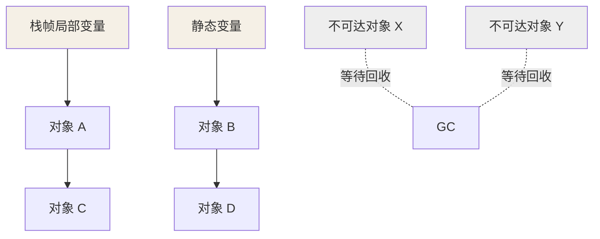
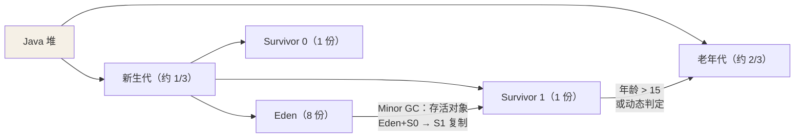
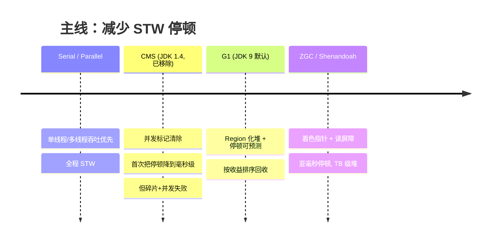
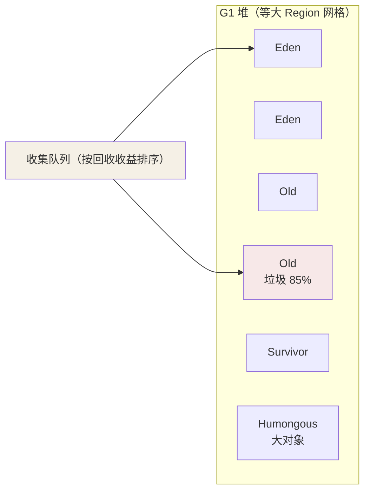

## 判定垃圾：可达性分析

引用计数（互相引用成环即泄漏，JVM 不用）之外，主流方案是从 **GC Roots**
出发做可达性图遍历，不可达即垃圾：

GC Roots 包括：

- 各线程栈帧中的局部变量表引用（正在执行的方法里的对象）
- 方法区/元空间中的类静态变量、字符串常量池引用
- JNI 全局/局部引用（Native 持有的对象）
- 跨代引用记忆集（Card Table / RSet，虚拟机内部结构）

## 分代假说与堆布局

**弱分代假说**：绝大多数对象朝生夕死；熬过多次 GC 的对象会活得很久。
堆按存活周期切两块，各自用最合适的算法：

- 对象优先在 Eden 分配（TLAB 线程私有分配缓冲，分配只需指针碰撞）。
- Eden 满触发 **Minor GC**：存活对象复制到另一块 Survivor，年龄 +1。
- 年龄到 15（`-XX:MaxTenuringThreshold`）晋升老年代；大对象直接进老年代。
- 老年代满触发 **Major/Full GC**，全堆回收，最慢。

## 三个基础算法

| 算法 | 思路 | 代价 | 用在 |
|---|---|---|---|
| 标记-清除 | 标记垃圾 → 直接清 | 内存碎片、分配慢 | CMS 的老年代 |
| 标记-复制 | 存活对象复制到另一半，整块清空 | 浪费一半空间 | **新生代**（存活少，复制成本极低） |
| 标记-整理 | 存活对象向一端挪，清边界外 | 挪对象要更新引用，慢 | 老年代（无碎片、无空间浪费） |

 Survivor 复制交换能同时解决碎片与效率——但只有"存活对象少"时才划算，
这正是分代的意义：**不同区域用不同算法**。

## 三色标记与并发漏标

并发标记（GC 线程与业务线程同跑）时对象引用关系在变，用三色描述：

- **白**：未被扫描（最终白 = 垃圾）。
- **灰**：自己扫过了，成员还没扫完。
- **黑**：自己与成员都扫完（活跃）。

**漏标**条件（同时发生）：灰→白的引用被删 + 黑新增了到这个白对象的路径。
被漏标的活对象被当垃圾清掉——致命。解法两大流派：

| 方案 | 思路 | 代价 | 采用者 |
|---|---|---|---|
| 增量更新 | 黑色新增引用时记录，重新标记扫一遍 | 只需重扫黑对象新增引用 | CMS |
| 原始快照 SATB | 灰→白删除引用时记录快照，按旧图重标 | 可能多标浮着垃圾（下轮再收） | G1 |

## 收集器演进主线

### CMS（已谢幕，思想仍在）

初始标记（STW，只标 GC Roots 直连）→ 并发标记（与业务同跑）→ 重新标记
（STW，修增量更新记录）→ 并发清除。四阶段中只有两个短 STW。

四大问题：CPU 敏感（并发占核）、浮动垃圾（并发清除时新产生的垃圾只能
下轮收）、**标记-清除的碎片**（碎片满了退化 Serial Old 全停）、
Concurrent Mode Failure。JDK 14 被移除。

### G1（JDK 9 起默认）

堆切成约 2048 个等大 **Region**，每个 Region 动态扮演 Eden/Survivor/Old/
Humongous（大对象独占连续 Region）。回收按"**收益**"排序：优先回收
垃圾占比高、回收性价比高的 Region——Garbage First 名字由来。

核心能力：`-XX:MaxGCPauseMillis=200` **软目标停顿预测**——基于历史
回收耗时建模，动态决定这轮收几个 Region。Remembered Set（堆外，每
Region 一份）记录跨 Region 引用，避免整堆扫描。整堆走 SATB 并发标记，
回收阶段存活对象复制到空 Region（本质是标记-复制，无碎片）。

### ZGC（JDK 15 转正）

- **染色指针**：在 64 位指针里留 4 个 bit 存标记位，GC 元数据跟着指针走
  而不是跟着对象头走。
- **读屏障**：业务线程每次从堆读引用都插入一小段检查，发现指针"过期"
  就地自愈（load 屏障转发）。
- 效果：标记、转移、重定位几乎全并发，**停顿 < 1ms 且与堆大小无关**
  （TB 级堆依旧亚毫秒）。

## 怎么选

- JDK 8：Parallel GC（吞吐）或 G1（延迟）。
- JDK 11+：默认 G1，堆 > 8G 且对延迟极端敏感再上 ZGC。
- 吞吐型离线任务（跑得越快越好，停顿无所谓）：Parallel。

## 小结

- 可达性分析判垃圾；分代按存活周期分区，各自用复制/整理最合适的算法。
- 并发标记的漏标催生增量更新（CMS）与 SATB（G1）两大修正流派。
- 主线：全程 STW → CMS 并发清除 → G1 Region 化可预测停顿 → ZGC 染色
  指针 + 读屏障亚毫秒。
