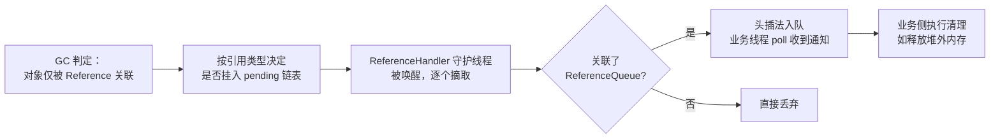

## 先想清楚：为什么引用要分级

JDK 1.2 之前，引用的定义是二元的：一块内存要么被引用、要么没有，
对应的对象**要么绝不回收、要么直接回收**。但缓存类场景想要的其实是
中间态：**内存充裕时留着，内存紧张时可以扔**——传统引用模型表达不
了这种"弹性"。

于是 JDK 1.2 把引用按强度分成四级，本质是**给 GC 提供不同的回收
裁量权**：

| 引用类型 | 回收时机 | 典型用途 | 生命周期 |
|---|---|---|---|
| 强引用 StrongReference | **宁抛 OOM 也不回收** | 普通对象赋值 `Object o = new Object()` | 从创建到程序结束 |
| 软引用 SoftReference | 内存不足时（OOM 前的第二次回收） | 有用但非必须的缓存 | 创建 → 内存不足触发 GC |
| 弱引用 WeakReference | **只要发生 GC 就回收**（不看内存够不够） | WeakHashMap、ThreadLocal 的 Entry key | 创建 → 下一次 GC |
| 虚引用 PhantomReference | 不影响对象生命周期，`get()` 恒返回 null | 回收通知：堆外内存清理（Cleaner） | — |

注意两点：

- 没有显式的 `StrongReference` 类——默认引用就是强引用；
- `SoftReference` / `WeakReference` / `PhantomReference` 都继承自
  `Reference<T>`，差异体现在 **GC 判定策略**，机制（入队、通知）
  是同一套。

## Reference 机制：一条 pending 链与一个后台线程

`Reference` 的核心字段：

```java
public abstract class Reference<T> {
    private T referent;                                // 关联的目标对象
    volatile ReferenceQueue<? super T> queue;          // 关联的引用队列
    volatile Reference next;                           // ReferenceQueue 链表的下一个
    private transient Reference<T> discovered;         // pending 链表的下一个

    Reference(T referent, ReferenceQueue<? super T> queue) {
        this.referent = referent;
        this.queue = (queue == null) ? ReferenceQueue.NULL : queue;
    }
}
```

**JVM 在 GC 时**，发现某对象只被 Reference 关联，就按引用类型
决定是否把该 Reference 挂到静态的 **pending 链表**上，并唤醒一个
在 `Reference` 类加载时就启动的最高优先级守护线程
**ReferenceHandler**：

```java
// ReferenceHandler.run() —— 死循环
while (true) { tryHandlePending(true); }

static boolean tryHandlePending(boolean waitForNotify) {
    synchronized (lock) {
        if (pending != null) {
            r = pending;
            pending = r.discovered;      // 下一个 pending 接棒
            r.discovered = null;
        } else {
            lock.wait();                 // 无事可做，挂起等 GC 唤醒
            return waitForNotify;
        }
    }
    ReferenceQueue<? super Object> q = r.queue;
    if (q != ReferenceQueue.NULL) q.enqueue(r);   // 入队
    return true;
}
```

容易误解的一处：**ReferenceQueue 名为队列，实际不存引用**——它只
保存链表头 `head`；被回收对象对应的 Reference 通过 `next` 字段串
成单向链表，每次入队就是头插法换个 head。



两个关键结论：

1. **入队的元素是 Reference 对象本身，不是 referent**（后者已经被
   回收了）；
2. **入队时机 = 关联对象被回收时**——这就是"回收通知"的全部实现。

`poll()` 出队同理：已知 head，摘下头节点、`queueLength--`，
`r.queue` 置回 NULL。

## 虚引用与 Cleaner：堆外内存的守门员

虚引用 `get()` 恒返回 null，唯一作用就是**配合 ReferenceQueue 拿到
回收通知**。最经典的使用者是 NIO 的 `DirectByteBuffer`：堆内的
`Cleaner`（虚引用子类）关联堆外的 memory address，当 ByteBuf 这个
referent 被回收时，ReferenceHandler 发现 pending 是 Cleaner，直接
执行 `clean()` 释放堆外内存——不依赖 GC 直接管理堆外，这就是
`-XX:MaxDirectMemorySize` 一族问题的底层机制。

## finalize：能跑但别用

`Object.finalize()` 的底层同样是这套机制——`Finalizer` 继承
`FinalReference`，对象注册在静态的 unfinalized 双向链表上：

- GC 标记分两步：第一次标记不可达对象；第二次筛出**重写了
  finalize() 且未执行过**的对象，放入 F-Queue，由低优先级的
  **FinalizerThread** 逐个"尝试执行" `finalize()`；
- 执行期间对象若重新挂上引用链（self-resurrection），就能"复活"。

它的问题比价值多：执行时机不确定（OOM 可能先来）、异常会被吞、
复活能力破坏 GC 模型、Finalizer 链滞留会拖垮老年代回收。JDK 9 起
已被标记 `@Deprecated`——**清理逻辑请改用 try-with-resources 或
`Cleaner`（虚引用机制）**，后者把"回收通知"限制在资源释放这一
件事上，语义清晰得多。

## 这些引用在框架里长什么样

- **ThreadLocal 的内存泄漏链**：`ThreadLocalMap.Entry` 的 key 是
  **弱引用**——ThreadLocal 实例没有强引用后，下次 GC key 变 null，
  但 value 仍被 Entry 强引用，线程不死就泄漏，所以用完要 `remove()`；
- **WeakHashMap**：key 弱引用，适合做"对象活着就有映射、死了就
  自动清"的附加元数据容器；
- **软引用缓存**：图片/页面缓存的兜底——内存够就命中，不够就被
  GC 收走重建，代价是命中率不可控；
- **Guava Cache / Caffeine**：内部对弱软引用的封装（weakKeys、
  softValues），把这套机制产品化。

## 小结

- 四种引用的强度递减，本质是给 GC 的**回收裁量权**递增：强引用
  宁死不收，弱引用见 GC 就收，虚引用只管通知。
- 统一机制：GC 挂 pending 链 → ReferenceHandler 入 ReferenceQueue
  （实为 head 单链表）→ 业务线程 poll 感知；入队的是 Reference
  本身。
- finalize 依托 FinalReference + FinalizerThread，因时机不确定、
  可复活对象而废弃，替代方案是 Cleaner 与 try-with-resources。
- 读框架源码时看到 WeakReference/SoftReference，先想到"它在用
  回收时机做资源管理"。

## 延伸阅读

- [JAVA几种引用及源码简析——Atomic，掘金](https://juejin.cn/post/5ef63b6b6fb9a07e8a1983d0)——本篇母本，含 ReferenceHandler/Finalizer 完整源码走读
- [深入理解 Java 虚拟机·第 3 版](https://book.douban.com/subject/34907413/) 第 3 章——对象存活判定与 finalize 两次标记
- [JDK 源码 · java.lang.ref 包](https://github.com/openjdk/jdk/tree/master/src/java.base/share/classes/java/lang/ref)
