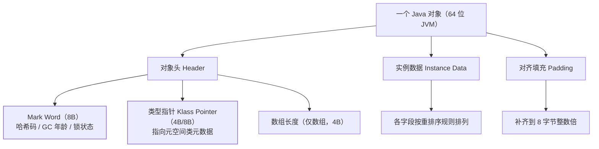

## 对象在堆里的三段式

`new` 出来的对象在堆上不是一团黑盒，是固定三段式：



创建流程（TLAB 分配、零值初始化、设对象头）见
[运行时数据区](/java/advanced/jvm/02-memory/)，本篇看"分配好之后长什么样"。

## Mark Word：一个字段当五用

64 位下 Mark Word 固定 8 字节，但内容随**锁状态**复用切换（这就是
[synchronized 锁升级](/java/intermediate/concurrent/04-synchronized/)的
物理载体）：

| 锁状态 | 61~62 位 | 内容（低位在右） |
|---|---|---|
| 无锁 | 01 | unused:25 + **hashcode:31** + unused:1 + **分代年龄:4** + 偏向位:0 + 锁标志:01 |
| 偏向锁 | 01 | 线程 ID:54 + epoch:2 + unused:1 + 年龄:4 + 偏向位:1 + 01 |
| 轻量级锁 | 00 | 指向栈上 Lock Record 的指针:62 + 00 |
| 重量级锁 | 10 | 指向 ObjectMonitor 的指针:62 + 10 |
| GC 标记 | 11 | 空（被 GC 转发时复用） |

两个反直觉推论：

1. **分代年龄只有 4 bit**——对象晋升上限天生是 15
   （`MaxTenuringThreshold` 最大值 15 的出处，见
   [垃圾回收](/java/advanced/jvm/03-garbage-collection/)）。
2. **调用过 `hashCode()` 就无法进偏向态**——哈希和偏向线程 ID 抢同一
   段空间，Mark Word 只有一份。

## 指针压缩：为什么 32G 是分水岭

64 位 JVM 里引用如果老老实实用 8 字节指针，对象纯"指针税"就吃掉
大量内存。**压缩指针**（`-XX:+UseCompressedOops`，8 起默认堆 ≤ 32G 开启）
把 8 字节引用存成 **4 字节偏移量**：对象都按 8 字节对齐，真实地址 =
偏移 × 8 + 基址——**用对齐换地址空间**。这就是所有对象必须 8 字节
对齐的另一个原因。

推论（面试高频）：

- 堆 < 32G：引用 4 字节；**堆一旦超过 32G，压缩自动失效**，引用膨胀
  回 8 字节——"把堆从 31G 加到 33G，实际可用内存反而可能变少"。
- 想用 32G+ 又要压缩：`-XX:ObjectAlignmentInBytes=16` 提高对齐粒度，
  上限推到 64G（对象更浪费，得不偿失，不如直接上 ZGC/大堆方案）。
- 类型指针单独压缩（`UseCompressedClassPointers`），指向元空间里的
  **压缩类空间**（容量受限，疯狂动态生成类会先炸这里）。

## 实例数据：字段重排序

HotSpot 不按声明顺序摆字段，而是**按宽度聚堆**减少对齐空洞：

```
引用(4B压缩) → long/double(8B) → int/float(4B)
→ short/char(2B) → byte/boolean(1B)
```

（同宽按声明序；父类字段先于子类。目标：一个字段跨两个 8 字节块
的情况最少。）想看真实排布用 **JOL**：

```java
// org.openjdk.jol:jol-core
System.out.println(ClassLayout.parseInstance(new Object()).toPrintable());
// OFFSET  SIZE   TYPE DESCRIPTION
//      0     8        (object header: Mark Word)
//      8     4        (object header: Klass Pointer)   ← 压缩后 4B
//     12     4        (loss due to next object alignment) ← 填充
// Instance size: 16 bytes
```

## 算一遍：常见对象多大

| 对象 | 计算（64 位 + 压缩开启） | 大小 |
|---|---|---|
| `new Object()` | 8（MarkWord）+ 4（类型指针）+ 4（填充） | **16B** |
| `new Integer(1)` | 8 + 4 + 4（int） | **16B**（净 payload 4B，开销 4 倍） |
| `int[10]` | 8 + 4 + 4（长度）+ 40（数据） | **56B** |
| `new String("ab")` | 对象 24B + char 数组（旧版另算） | 24B+ |

推论：**包装类型是内存刺客**——`ArrayList<Integer>` 存 100 万个 1~100
的小整数，数字本身 4B，包装对象 + 引用开销 5~6 倍；这正是
`long[]` 换 `ArrayList<Long>`、Elastic/Protobuf 用原始类型数组的原因。
IntBoxing 也是 JIT 优化（标量替换）的重点收拾对象，见下一篇。

## 小结

- 对象 = 对象头（Mark Word 8B + 类型指针 4/8B + 数组长度）+ 实例数据
  + 8 字节对齐填充。
- Mark Word 按锁状态复用：哈希、分代年龄（4 bit → 晋升上限 15）、
  锁指针挤同一格。
- 压缩指针用"8 字节对齐 + 4 字节偏移"省一半引用空间，**堆 > 32G 自动
  失效**是扩容前的必算题。
- 字段按宽度重排序；用 JOL 实测布局；包装类型开销 4~6 倍是集合
  内存优化的第一刀。
