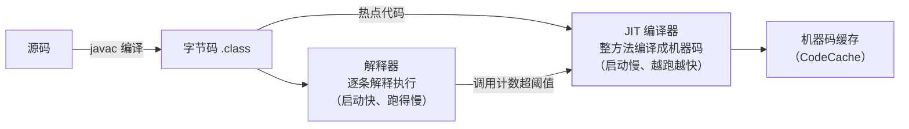

## 字节码是怎么跑起来的

javac 只把源码编译成字节码，**真正把字节码变机器码的是运行时的执行
引擎**，HotSpot 名字的由来也在这：解释器按"热点"逐个把方法编译成
本地机器码缓存起来。



**为什么不全提前编译（像 C++）**：字节码里带着运行时才能知道的
信息——哪个分支真的会被走、哪个方法只被一个类调用（单态）。JIT
基于这些**运行时画像**做的优化比静态编译更激进；代价是预热和
偶尔的回退。

## 热点探测与分层编译

热点判定用**计数器**（不是采样）：方法调用计数器 + 回边计数器
（循环体），相加超阈值触发编译。循环热但方法只被调一次的情况走
**OSR**（On-Stack Replacement）：方法还在栈上就地换掉解释帧。

分层编译（2 起默认）把编译器分成两级协作：

| 层 | 谁 | 特点 |
|---|---|---|
| 0 | 解释器 | 刚启动，顺便收集画像 |
| 1~3 | **C1**（Client） | 快速编译 + 不同强度画像采集 |
| 4 | **C2**（Server） | 深度优化，拿 C1 攒的画像下狠手 |

典型路径：解释 → C1（3 层，全画像）→ C2（4 层）。启动敏感的服务
可调 `-XX:TieredStopAtLevel=1`（只用 C1，牺牲峰值换预热）；Graal
编译器（C2 的替代品）已在 GraalVM 生态独立发展，AOT 编译
（GraalVM Native Image）把"预热"问题整个绕掉，代价是放弃部分
运行时画像优化。

## 方法内联：一切优化之母

C2 最重要的一步：把被调方法体**复制进调用点**，消除调用开销，并让
后续优化看到更大的优化单元——逃逸分析、常量传播都靠内联铺路：

```java
private int square(int x) { return x * x; }
int r = square(4) + square(5);
// 内联后 → int r = 4 * 4 + 5 * 5; → 常量折叠 → r = 41
```

内联有预算限制：小方法（默认 ≤ 35 字节码，`-XX:MaxInlineSize`）随手
内联；大方法要足够热（默认 ≤ 325 字节码，`-XX:FreqInlineSize`）。
**性能优化顺口溜：为内联而写小方法**——热路径上 35 字节以内最理想。

## 逃逸分析：对象可以不存在

`-XX:+DoEscapeAnalysis`（6u23 起默认开）：分析对象的作用域会不会
"逃出"方法/线程：

| 逃逸级别 | 例子 | 能做的优化 |
|---|---|---|
| 不逃逸 | 对象只在方法内用，不返回不被外部引用 | 标量替换、锁消除 |
| 参数逃逸 | 被传给别的方法（但没存全局） | 递归分析后再看 |
| 全局逃逸 | 存进静态字段/堆集合、被覆写方法接收 | 优化无效，老实堆分配 |

**标量替换**（HotSpot 的实际做法，不是教科书式"栈上分配"）：对象
不被逃出时，**干脆不创建对象**，把字段拆成局部变量（标量）直接放
寄存器/栈帧——分配和随后的 GC 都省了：

```java
public long sum() {
    Point p = new Point(1, 2);   // p 没逃出方法
    return p.x + p.y;
}
// 标量替换后 ≈ int a = 1, b = 2; return a + b;   —— new 消失了
```

**锁消除**：不逃逸对象上的同步直接删（StringBuffer 局部变量、
`Vector` 临时用）。配合上一篇[对象布局](/java/advanced/jvm/05-object-layout/)：
逃逸分析最常收拾的就是包装类型、迭代器这类短命小对象——它们在
热代码里"被优化得不存在"，这是 Java 抽象不贵的真正底气。

## 去优化：激进优化的另一面

C2 的激进假设（"这个虚调用只有一种实现"）可能被后来的类加载推翻，
此时**去优化**：丢掉机器码、退回解释器重新画像再编译。常见的
"服务冷启动后偶发抖动"多与去优化、CodeCache 满了
（`-XX:ReservedCodeCacheSize`）有关。

**验证手段**：

```bash
java -XX:+PrintCompilation -jar app.jar  # 看 JIT 编译日志（queued/made not entrant = 去优化）
# 微基准必用 JMH：手动写循环测耗时，会被死代码消除 + 内联搞得全错
```

JMH 的存在本身就是 JIT 力量的注脚：**你写的基准测试可能被 JIT 优化
没了**，不隔离计算结果、不消费返回值，测的是空转。

## 小结

- 执行引擎 = 解释器（启动快）+ JIT（越跑越快），分层编译让 C1 采集
  画像、C2 深度优化，编译产物进 CodeCache。
- 内联是一切优化之母：热路径小方法（≤ 35B 字节码）是免费的性能。
- 逃逸分析 → 标量替换（不建对象）/ 锁消除（不设锁），短命小对象
  在热代码里近乎零成本；逃出去就全部作废。
- 激进优化有回退（去优化）与预算（内联阈值、CodeCache）；测性能
  必须用 JMH，手写循环测的是 JIT 的脸色。
